## Lab: Xv6 and Unix utilities

#### 0. 目录

[TOC]

#### 1. Boot xv6 (easy)

##### 1.1. 实验目的

* 启动 xv6 操作系统
* 调试各种工具

##### 1.2. 实验步骤

* 抓取 GitHub 资源，检查 util 分支

  

* 查看日志（部分截图）

  

  

* 熟悉 Git 指令（已经测试）

* 搭建并运行 xv6

  

* 输入 ls 指令查看当前目录下的文件，通过运行其中一个文件 ls 来打印目录项

  

* 按下 Ctrl-p 内核会打印每个进程的信息，当前显示一个进程是 init，另一个是 sh

  

* 退出 qemu

  

##### 1.3. 实验中遇到的问题和解决办法

* 对于 Linux 指令不熟悉，对于 Git 指令不熟悉，需要多加学习和练习

##### 1.4. 实验心得

* 学到了基础的 Linux 和 Git 相关知识


#### 2. sleep (easy)

##### 2.1. 实验目的

* 实现 xv6 的 UNIX 程序`sleep`，睡眠应该暂停一段用户指定的时间
* `tick`是xv6内核定义的时间概念，即来自定时器芯片的两次中断之间的时间
* 解决方案在`user/sleep.c`文件中

##### 2.2. 实验步骤

* 首先，阅读书籍，查看系统调用函数及其描述，没有错误返回0，有错误返回-1

* 接下来，需要向一个程序传入参数。在参考了`echo.c`、`grep.c`、`rm.c`等程序后，发现应该向`main`函数传入参数，其中`argc`是传入参数的个数，`*argv[]`是指令的内容

  ```c
  int
  main(int argc, char *argv[])
  ```

* 统计指令长度的个数，如果是1个，说明只有`sleep`指令，这时要提醒传入参数，并且返回异常；如果是2个以上，说明`sleep`指令后面有参数，这时候把参数转化为整型，进行系统调用

* 在`user`目录下面新建`sleep.c`文件，使用 Linux 自带文本编辑器`nano`打开并且编写程序

  

* 启动`make qemu`运行`sleep`，测试无误

  

* 测试点AC

  

##### 2.3. 实验中遇到的问题和解决办法

* 对于文件描述符（file descriptor）的学习：函数`write`的调用方式是传入三个参数，分别是文件描述符、缓冲区和字节长度，其中文件描述符就是一个小整数，Linux 进程默认情况下会有3个缺省打开的文件描述符，分别是标准输入0，标准输出1，标准错误2；0,1,2对应的物理设备一般是：键盘，显示器，显示器
* `write()`会把参数`buf`所指的内存写入 count 个字节到参数`fd`所指的文件内

##### 2.4. 实验心得

* 学到了如何与系统内核交互
* 学到了文件描述符

```c
#include "kernel/types.h"
#include "kernel/stat.h"
#include "user/user.h"

int
main(int argc, char *argv[])
{
  if(argc == 1)
  {
    write(1, "Please pass an argument!\n", strlen("Please pass an argument!\n"));
    exit(1);
  }
  else if(argc >= 2)
  {
    int sec = atoi(argv[1]);
    sleep(sec);
  }
  exit(0);
}
```


#### 3. pingpong (easy)

##### 3.1. 实验目的

* 编写一个程序，使用 UNIX 系统调用在一对管道上的两个进程之间“乒乓”一个字节，每个方向一个
* 父级应该向子级发送一个字节；子级应该打印`＜pid＞：received ping`，其中`＜pid＞`是其进程 ID，将管道上的字节写入父级，然后退出；父级应该读取子级的字节，打印`＜pid＞：received-pong`，然后退出
* 解决方案在文件`user/pingpong.c`中

##### 3.2. 实验步骤

* `pipe()`函数可用于创建一个管道，以实现进程间的通信

* `pipe()`函数定义中的`fd`参数是一个大小为2的数组类型指针。通过`pipe()`函数创建的这两个文件描述符`fd[0]`和`fd[1]`分别构成管道的两端，往`fd[1]`写入的数据可以从`fd[0]`读出，并且`fd[1]`一端只能进行写操作，`fd[0]`一端只能进行读操作，不能反过来使用。要实现双向数据传输，可以使用两个管道

* 默认情况下，这一对文件描述符都是阻塞的。此时，如果我们用`read()`系统调用来读取一个空的管道，则`read()`将被阻塞，知道管道内有数据可读；如果我们用`write()`系统调用往一个满的管道中写数据，则`write()`也将被阻塞，直到管道内有足够的空闲空间可用（`read()`读取数据后管道中将清楚读走的数据）。当然，用户可以将`fd[0]`和`fd[1]`设置为非阻塞的

* 由于管道是半双工的，所以要创建两套管道，即从父到子和从子到父。借助管道读写传递字节，在读取成功时输出提示

* 程序运行过程大致如下：父进程向子进程写 => 子进程向父进程读 => 子进程向父进程写 => 父进程向子进程读

* 使用`nano`文本编辑器编写代码

  

* 测试未发现问题

  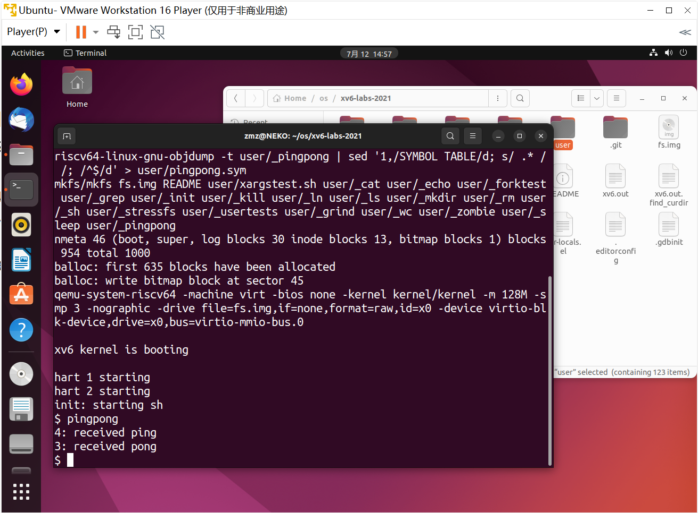

* 判题器AC

  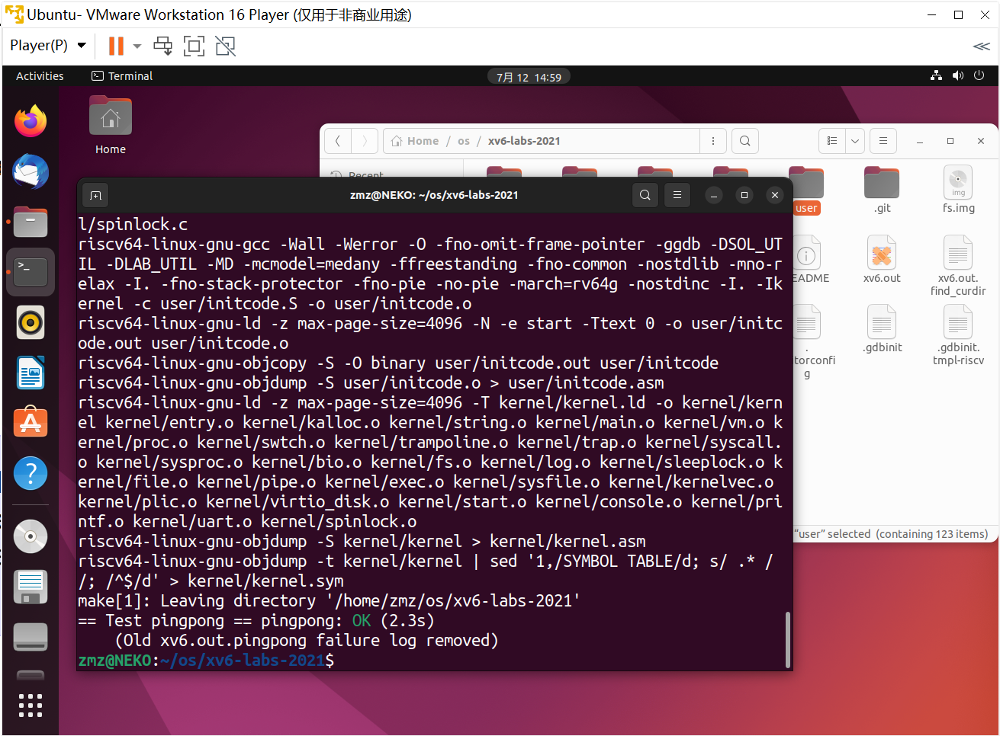

  ```c
  #include "kernel/types.h"
  #include "kernel/stat.h"
  #include "user/user.h"
  
  int
  main(int argc, char* argv[])
  {
    char ball = 'A';  //ping-pong ball
    int fd_c2p[2];    //child->parent
    int fd_p2c[2];    //parent->child
    pipe(fd_c2p);     //pipe for child->parent
    pipe(fd_p2c);     //pipe for parent->child
    int pid = fork(); //process id
    int status = 0;   //exit status
  
    if (pid < 0)
    {
      fprintf(2, "There is an error when fork()!\n");
      close(fd_c2p[0]);
      close(fd_c2p[1]);
      close(fd_p2c[0]);
      close(fd_p2c[1]);
      exit(1);
    }
    else if (pid == 0)  //child process
    {
      close(fd_p2c[1]);
      close(fd_c2p[0]);
  
      if (read(fd_p2c[0], &ball, sizeof(char)) != sizeof(char))
      {
        fprintf(2, "There is an error when child read()!\n");
        status = 1;
      }
      else
      {
        fprintf(1, "%d: received ping\n", getpid());
      }
  
      if (write(fd_c2p[1], &ball, sizeof(char)) != sizeof(char))
      {
        fprintf(2, "There is an error when child write()!\n");
        status = 1;
      }
  
      close(fd_p2c[0]);
      close(fd_c2p[1]);
  
      exit(status);
    }
    else    //parent process
    {
      close(fd_p2c[0]);
      close(fd_c2p[1]);
  
      if (write(fd_p2c[1], &ball, sizeof(char)) != sizeof(char))
      {
        fprintf(2, "There is an error when parent write()!\n");
        status = 1;
      }
  
      if (read(fd_c2p[0], &ball, sizeof(char)) != sizeof(char))
      {
        fprintf(2, "There is an error when parent read()!\n");
        status = 1;
      }
      else
      {
        fprintf(1, "%d: received pong\n", getpid());
      }
  
      close(fd_p2c[1]);
      close(fd_c2p[0]);
  
      exit(status);
    }
  }
  ```

##### 3.3. 实验中遇到的问题和解决办法

* 深入理解了管道

##### 3.4. 实验心得

* 体会到了管道之美


#### 4. primes (moderate)/(hard)

##### 4.1. 实验目的

* 使用管道编写一个素数筛的并发版本，这个想法要归功于Unix管道的发明者Doug McIlroy
* 使用`pipe()`和`fork()`来设置管道
* 第一个进程将数字2到35输入到管道中，对于每个素数，安排创建一个进程，该进程通过一个管道从其左邻居读取，并通过另一个管道向其右邻居写入
* 由于xv6具有有限数量的文件描述符和进程，因此第一个进程可以在35处停止。
* 解决方案在`user/primes.c`文件中

##### 4.2. 实验步骤

* 通过执行以下伪代码来实现埃拉托色尼法筛选素数：

  ```basic
  p = get a number from left neighbor
  print p
  loop:
      n = get a number from left neighbor
      if (p does not divide n)
          send n to right neighbor
  ```

  示意图：

  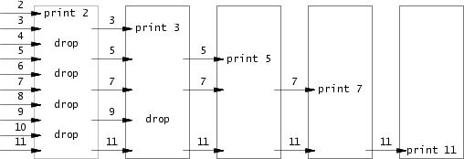

* 如图所示，第一个管道存放了所有在范围内的数字，每次取当前管道左边的第一个管道里的数字，用第一个管道里的数字与当前管道里的数字做取模运算，无法整除，将当前数字传送到右侧管道

* 递归运算，分别取每个管道左侧第一个数字，在一个新的进程中运算，然后判断是否放入右侧

* 最后筛选出来的数字被打印，剩下的都不是素数

* 每次对数字并发进行判断，确保能筛掉所有倍数，并且提高效率，但是先计算出来的进程要保持等待，不能提前释放，否则顺序会混乱，也会造成资源访问错误

* 编写程序

  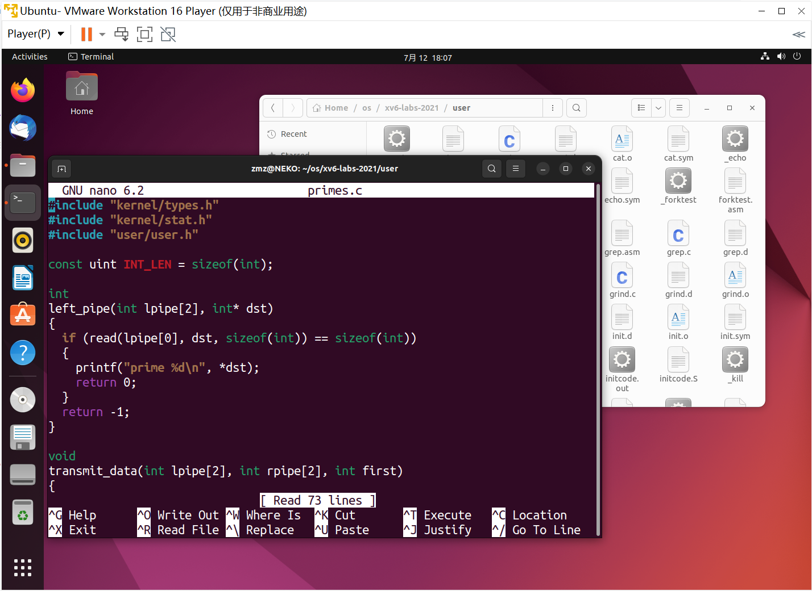

* 正常运行

  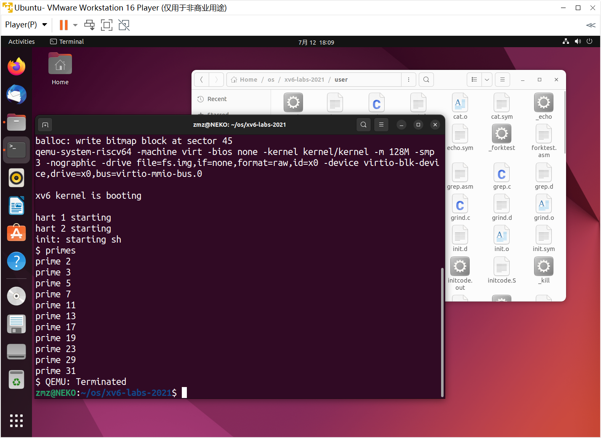

* 测试点AC

  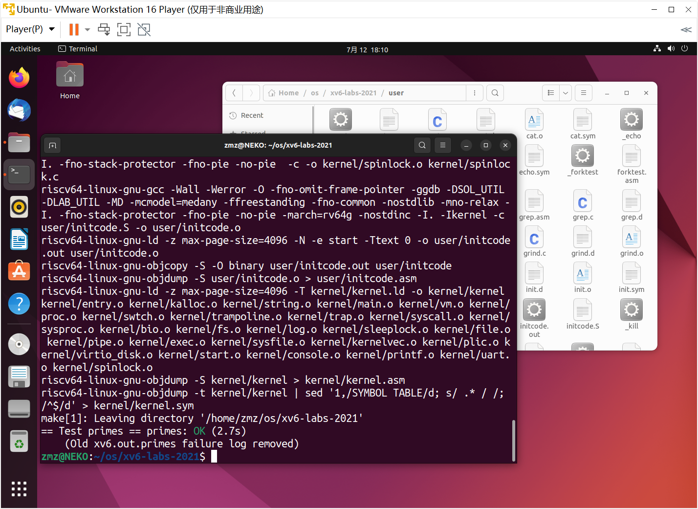

  ```c
  #include "kernel/types.h"
  #include "kernel/stat.h"
  #include "user/user.h"
  
  const uint INT_LEN = sizeof(int);
  
  int
  left_pipe(int lpipe[2], int* dst)
  {
    if (read(lpipe[0], dst, sizeof(int)) == sizeof(int))
    {
      printf("prime %d\n", *dst);
      return 0;
    }
    return -1;
  }
  
  void
  transmit_data(int lpipe[2], int rpipe[2], int first)
  {
    int data;
    while (read(lpipe[0], &data, sizeof(int)) == sizeof(int))
    {
      if (data % first) write(rpipe[1], &data, sizeof(int));
    }
    close(lpipe[0]);
    close(rpipe[1]);
  }
  
  void
  primes(int lpipe[2])
  {
    close(lpipe[1]);
    int first;
    if (left_pipe(lpipe, &first) == 0)
    {
      int p[2];
      pipe(p);
      transmit_data(lpipe, p, first);
  
      if (fork() == 0)
      {
        primes(p);
      }
      else
      {
        close(p[0]);
        wait(0);
      }
    }
    exit(0);
  }
  
  int
  main(int argc, char* argv[])
  {
    int p[2];
    pipe(p);
  
    for (int i = 2; i <= 35; i++) write(p[1], &i, INT_LEN);
  
    if (fork() == 0)
    {
      primes(p);
    }
    else
    {
      close(p[1]);
      close(p[0]);
      wait(0);
    }
    exit(0);
  }
  ```

##### 4.3. 实验中遇到的问题和解决办法

* 概念复杂，理解起来困难，反复观摩示例代码，琢磨原理
* 对管道的概念不熟悉，用法不熟练，多写管道

##### 4.4. 实验心得

* 对并发的素数筛算法产生了极大兴趣


#### 5. find (moderate)

##### 5.1. 实验目的

* 编写一个简单版本的UNIX查找程序：查找目录树中具有特定名称的所有文件
* 解决方案在文件`user/find.c`中
* 查看`user/ls.c`以了解如何读取目录
* 使用递归使`find`可以下降到子目录中
* 不要重复出现“.”和“..”

##### 5.2. 实验步骤

* 大致逻辑：输入指令 => 解析地址串 => 递归查找 => 打印

* 主要参考 xv6 操作系统的`ls.c`来实现此功能，不同点在于传入参数数量不同，还有加入递归查询目录下所有文件，并且使用字符串匹配函数匹配文件名

* 程序编写

  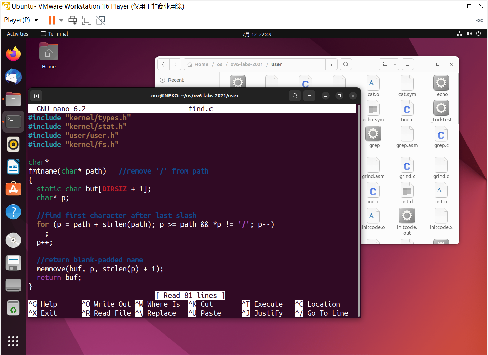

* 调试正确

  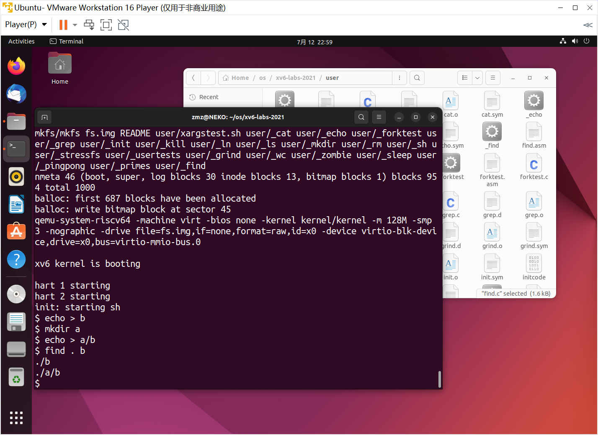

* 测试点AC

  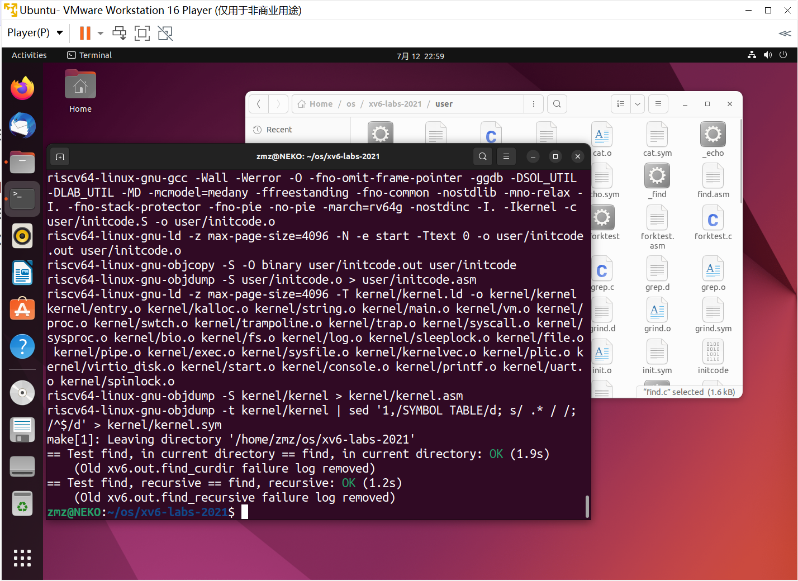

  ```c
  #include "kernel/types.h"
  #include "kernel/stat.h"
  #include "user/user.h"
  #include "kernel/fs.h"
  
  char*
  fmtname(char* path)   //remove '/' from path
  {
    static char buf[DIRSIZ + 1];
    char* p;
  
    //find first character after last slash
    for (p = path + strlen(path); p >= path && *p != '/'; p--)
      ;
    p++;
  
    //return blank-padded name
    memmove(buf, p, strlen(p) + 1);
    return buf;
  }
  
  void
  find(char* path, char* target)
  {
    char buf[512], *p;
    int fd;
    struct dirent de;
    struct stat st;
  
    if ((fd = open(path, 0)) < 0)
    {
      fprintf(2, "find: cannot open %s\n", path);
      return;
    }
  
    if (fstat(fd, &st) < 0)
    {
      fprintf(2, "find: cannot stat %s\n", path);
      close(fd);
      return;
    }
  
    switch(st.type)
    {
      case T_DEVICE:
      case T_FILE:
        if (strcmp(fmtname(path), target) == 0) printf("%s\n", path);
        break;
      case T_DIR:
        if (strlen(path) + 1 + DIRSIZ + 1 > sizeof buf)
        {
          printf("find: path too long\n");
          break;
        }
        strcpy(buf, path);
        p = buf + strlen(buf);
        *p++ = '/';
        while (read(fd, &de, sizeof(de)) == sizeof(de))
        {
          if (de.inum == 0) continue;
          memmove(p, de.name, DIRSIZ);   //link directory with file name
          *(p + strlen(de.name)) = 0;    //end of name
          if (strcmp(de.name, ".") == 0 || strcmp(de.name, "..") == 0) continue;
          find(buf, target);
        }
        break;
      }
      close(fd);
  }
  
  int
  main(int argc, char* argv[])
  {
    if (argc < 3)
    {
      printf("usage: find <directory> <name>\n");
      exit(0);
    }
    find(argv[1], argv[2]);
    exit(0);
  }
  ```

##### 5.3. 实验中遇到的问题和解决办法

* 不熟悉目录的数据结构，查阅资料
* 指针操作会有小错误，多debug

##### 5.4. 实验心得

* 熟悉了文件系统


#### 6. xargs (moderate)

##### 6.1. 实验目的

* 编写一个简单版本的 UNIX `xargs`程序：从标准输入中读取行，并为每行运行一个命令，将该行作为命令的参数提供
* 解决方案在文件`user/xargs.c`中

##### 6.2. 实验步骤

* xargs（英文全拼： eXtended ARGuments）是给命令传递参数的一个过滤器，也是组合多个命令的一个工具

* xargs 可以将管道或标准输入（stdin）数据转换成命令行参数，也能够从文件的输出中读取数据

* xargs 也可以将单行或多行文本输入转换为其他格式，例如多行变单行，单行变多行

* xargs 默认的命令是 echo，这意味着通过管道传递给 xargs 的输入将会包含换行和空白，不过通过 xargs 的处理，换行和空白将被空格取代

* xargs 是一个强有力的命令，它能够捕获一个命令的输出，然后传递给另外一个命令。之所以能用到这个命令，关键是由于很多命令不支持|管道来传递参数，而日常工作中有有这个必要，所以就有了 xargs 命令。xargs 一般是和管道一起使用

* 参考文献：[`xargs`命令教程](https://www.ruanyifeng.com/blog/2019/08/xargs-tutorial.html)

* 原生 Linux 系统输入指令

  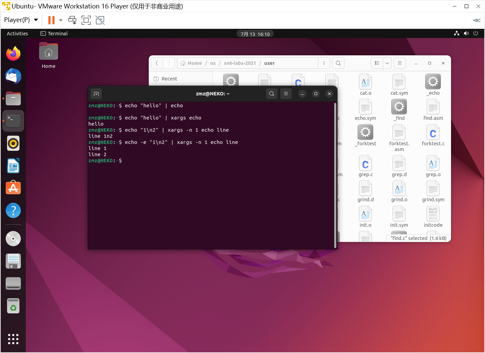

* 有限状态自动机是一种具有离散输入/输出系统的数学模型，简称有限自动机。这一系统具有任意有限数量的内部“状态”。状态是一个标识，能区分自动机在不同时刻的状况。有限状态系统具有任意有限数目的内部“状态”。自动机接受一定的输入，执行一定的动作，产生一定的结果。自动机的本质是根据状态、输入和规则决定下一个状态，参考文献：[有限状态自动机](blog.csdn.net/weixin_61777209/article/details/124144818)

* 使用有限状态自动机，首先要确定输入集；然后绘制状态迁移图（确定状态，在每一个状态下对输入进行分类，针对每一类输入，确定下一个状态）；最后确定状态转移函数（在某状态下，接收到某一字符后，自动机要执行的操作，以及迁移到的下一状态）

* 输入集：T={字符，空格，换行}

  状态迁移图：

  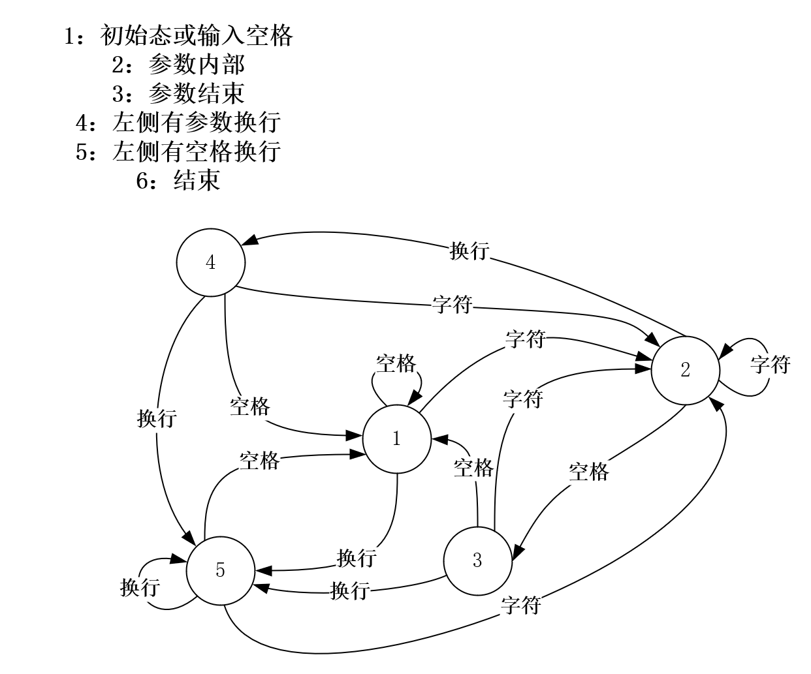

* 编写程序

  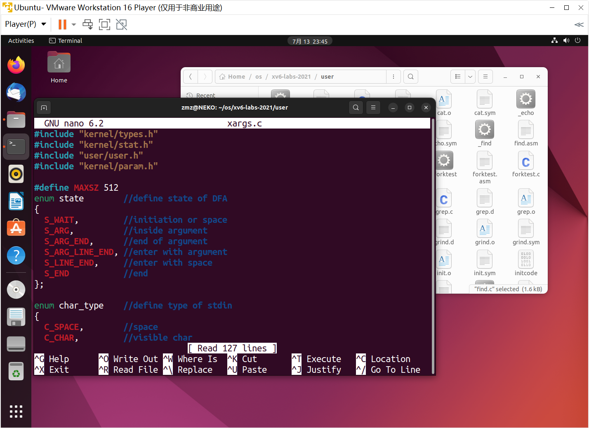

* 运行顺利

  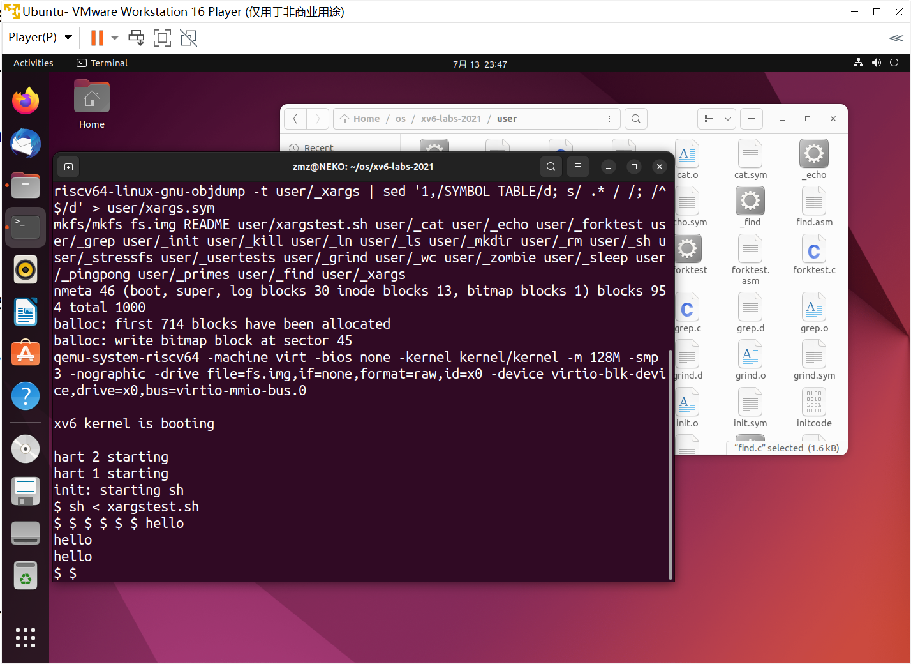

* 测试点AC

  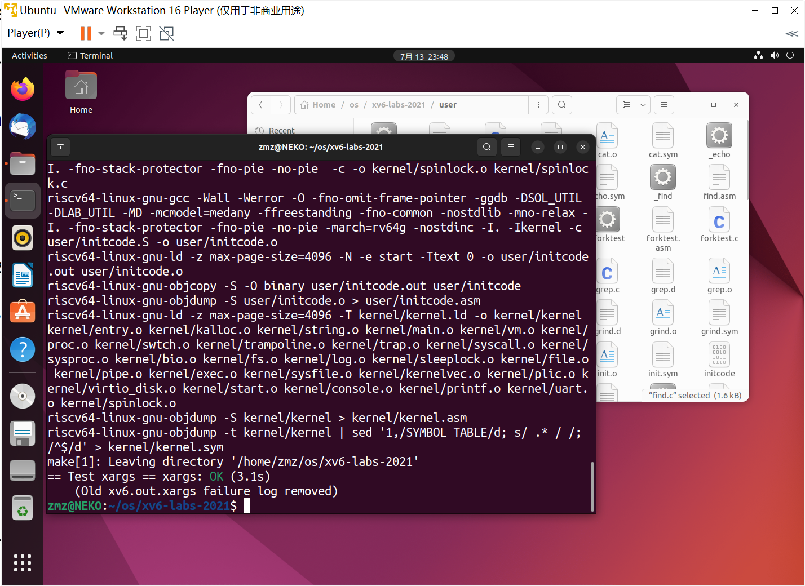

  ```c
  #include "kernel/types.h"
  #include "kernel/stat.h"
  #include "user/user.h"
  #include "kernel/param.h"
  
  #define MAXSZ 512
  enum state        //define state of DFA
  {
    S_WAIT,         //initiation or space
    S_ARG,          //inside argument
    S_ARG_END,      //end of argument
    S_ARG_LINE_END, //enter with argument
    S_LINE_END,     //enter with space
    S_END           //end
  };
  
  enum char_type    //define type of stdin
  {
    C_SPACE,        //space
    C_CHAR,         //visible char
    C_LINE_END      //enter
  };
  
  enum char_type
  get_char_type(char c)
  {
    switch (c)
    {
      case ' ':
        return C_SPACE;
      case '\n':
        return C_LINE_END;
      default:
        return C_CHAR;
    }
  }
  
  enum state
  transform_state(enum state cur, enum char_type ct)
  {
    switch (cur)
    {
      case S_WAIT:
        if (ct == C_SPACE) return S_WAIT;
        if (ct == C_LINE_END) return S_LINE_END;
        if (ct == C_CHAR) return S_ARG;
        break;
      case S_ARG:
        if (ct == C_SPACE) return S_ARG_END;
        if (ct == C_LINE_END) return S_ARG_LINE_END;
        if (ct == C_CHAR) return S_ARG;
        break;
      case S_ARG_END:
      case S_ARG_LINE_END:
      case S_LINE_END:
        if (ct == C_SPACE) return S_WAIT;
        if (ct == C_LINE_END) return S_LINE_END;
        if (ct == C_CHAR) return S_ARG;
        break;
      default:
        break;
    }
      return S_END;
  }
  
  void
  clearArgv(char* x_argv[MAXARG], int beg)
  {
    for (int i = beg; i < MAXARG; i++) x_argv[i] = 0;
  }
  
  int
  main(int argc, char* argv[])
  {
    if (argc - 1 >= MAXARG)
    {
      fprintf(2, "xargs: too many arguments!\n");
      exit(1);
    }
    char lines[MAXSZ];
    char* p = lines;
    char* x_argv[MAXARG] = {0};
  
    for (int i = 1; i < argc; i++) x_argv[i - 1] = argv[i];
    int arg_beg = 0;
    int arg_end = 0;
    int arg_cnt = argc - 1;
    enum state st = S_WAIT;
  
    while (st != S_END)
    {
      if (read(0, p, sizeof(char)) != sizeof(char)) st = S_END;
      else st = transform_state(st, get_char_type(*p));
  
      if (++arg_end >= MAXSZ)
      {
        fprintf(2, "xargs: arguments too long!\n");
        exit(1);
      }
  
      switch (st)
      {
        case S_WAIT:
          ++arg_beg;
  	break;
        case S_ARG_END:
  	x_argv[arg_cnt++] = &lines[arg_beg];
  	arg_beg = arg_end;
  	*p = '\0';
  	break;
        case S_ARG_LINE_END:
  	x_argv[arg_cnt++] = &lines[arg_beg];
        case S_LINE_END:
  	arg_beg = arg_end;
  	*p = '\0';
  	if (fork() == 0) exec(argv[1], x_argv);
  	arg_cnt = argc - 1;
  	clearArgv(x_argv, arg_cnt);
  	wait(0);
  	break;
        default:
  	break;
      }
      p++;
    }
    exit(0);
  }
  ```

##### 6.3. 实验中遇到的问题和解决办法

* 对指令不熟悉，反复尝试

##### 6.4. 实验心得

* 理解了管道传送指令的关系


#### Submit

整体程序评分AC，因为没写时间，所以`time.txt`那一项报了 error，希望可以谅解！

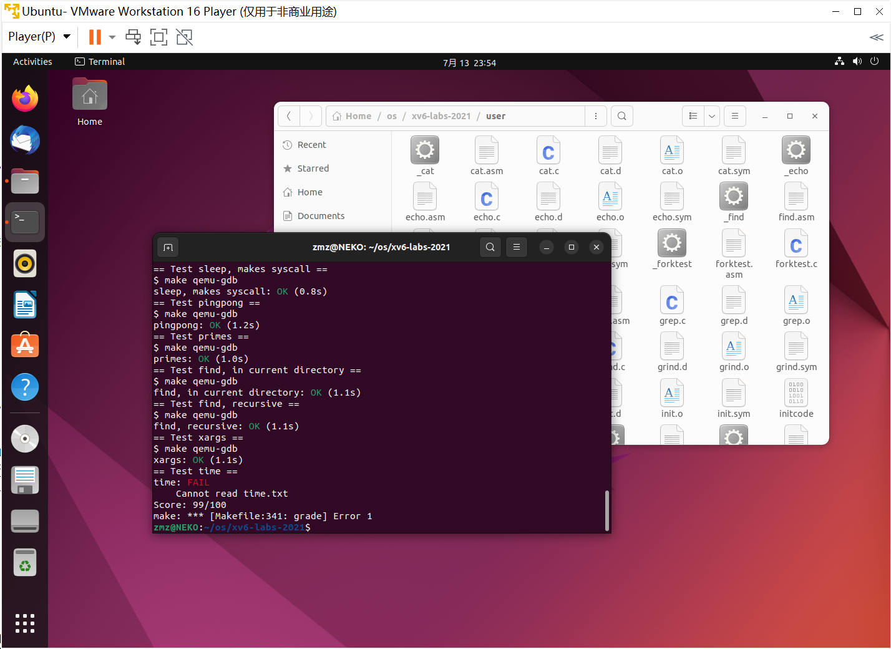


#### Optional challenge exercises

* Write an uptime program that prints the uptime in terms of ticks using the uptime system call. (easy)

* ```c
  #include "kernel/types.h"
  #include "kernel/stat.h"
  #include "user/user.h"
  
  int
  main()
  {
    printf("%d\n",uptime());
    exit(0);
  }
  ```

* 运行结果

  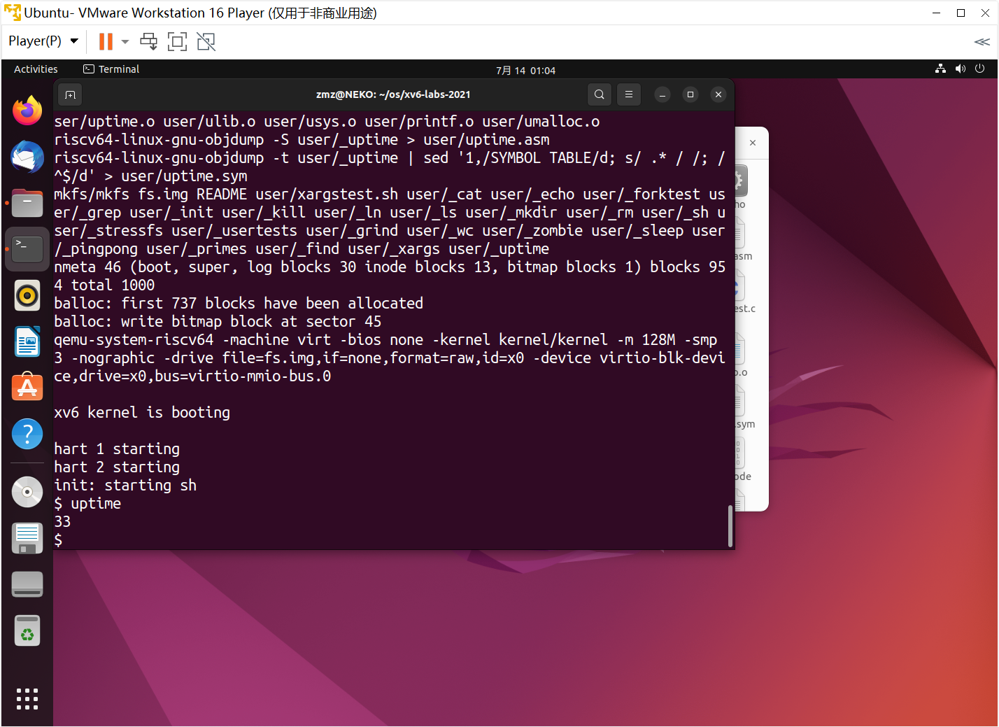