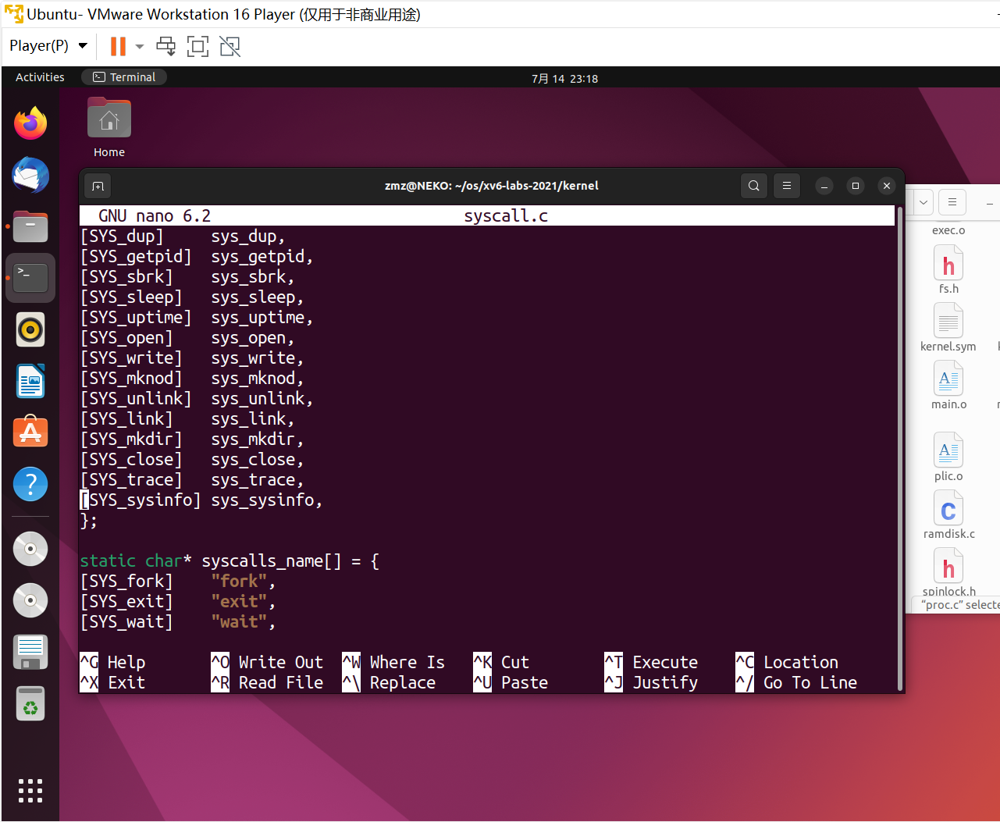

## Lab: system calls

#### 0. 目录

[TOC]

#### 1. System call tracing (moderate)

##### 1.1. 实验目的

* 添加一个系统调用跟踪功能，该功能可能会在以后调试实验室时有所帮助
* 创建一个新的`trace`系统调用来控制跟踪。它应该有一个参数，一个整数“掩码”，其位指定要跟踪的系统调用。例如，要跟踪`fork`系统调用，程序调用`trace（1<<SYS_fork）`，其中`SYS_fork`是`kernel/syscall.h`中的系统调用编号
* 如果系统调用的编号在掩码中设置，则必须修改 xv6 内核，以便在每个系统调用即将返回时打印出一行。该行应包含进程 id、系统调用的名称和返回值；不需要打印系统调用参数
* `trace`系统调用应启用对调用它的进程及其随后分支的任何子进程的跟踪，但不应影响其他进程

##### 1.2. 实验步骤

* 当 RISC-V 计算机通电时，它会初始化自己并运行存储在只读存储器中的引导加载程序。引导加载程序将 xv6 内核加载到内存中。然后，在机器模式下，CPU 从`_entry`（kernel/entry.S:6）开始执行 xv6。RISC-V 从禁用分页硬件开始：虚拟地址直接映射到物理地址

* 加载程序将 xv6 内核加载到物理地址`0x80000000`的内存中。它将内核设置为`0x80000000`而不是`0x0`的原因是因为地址范围`0x0:0x80000000`包含I/O设备

* `_entry`中的指令设置了一个堆栈，以便 xv6 可以运行 C 代码。Xv6 在文件`start.c`（kernel/start.c:11）中为初始堆栈`stack0`声明了空间。`_entry`处的代码加载堆栈指针寄存器`sp`，地址为堆栈顶部`stack0+4096`，因为 RISC-V 上的堆栈会变小。现在内核有了一个堆栈，`_entry`在开始时调用 C 代码（kernel/start.C:21）

* 功能`start`执行一些仅在机器模式下允许的配置，然后切换到监控模式。为了进入监管模式，RISC-V 提供指令`mret`。此指令最常用于从以前的调用中从主管模式返回到机器模式。`start`并没有从这样的调用中返回，而是将事情设置为曾经有过：它在寄存器`mstatus`中将以前的特权模式设置为supervisor，通过将`main`的地址写入寄存器`mepc`将返回地址设置为`main`，通过将`0`写入页表寄存器`satp`禁用supervisor模式下的虚拟地址转换，并将所有中断和异常委托给主管模式

* 在进入监控模式之前，`start`再执行一项任务：对时钟芯片进行编程，以生成定时器中断。有了这个内务处理，`start`通过调用`mret`“返回”到supervisor模式。这导致程序计数器更改为`main`（kernel/main.c:11)

* `main`（kernel/main.c:11）初始化了几个设备和子系统后，通过调用`userinit`（kernel/proc.c:212）创建了第一个进程。第一个进程执行一个用 RISC-V 汇编编写的小程序`initcode.S`（user/initcode.S:1），该程序通过调用`exec`系统调用重新进入内核。正如我们在第1章中看到的，`exec`用一个新程序（在本例中为`/init`）替换当前进程的内存和寄存器。一旦内核完成`exec`，它就会返回`/init`进程中的用户空间。如果需要，`Init`（user/Init.c:15）会创建一个新的控制台设备文件，然后将其作为文件描述符0、1和2打开。然后它在控制台上启动一个shell。系统已启动

* 将`$U/_trace`添加到`Makefile`中的`UPROGS`。运行`make qemu`，看到编译器无法编译`user/trace.c`，因为系统调用的用户空间存根还不存在

  

* 查看`user/trace.c`的源代码，它首先调用`trace(int)`，然后将命令行中的参数`argv`复制到`nargv`中，同时删去前两个参数

  ```c
  if (trace(atoi(argv[1])) < 0) {
      fprintf(2, "%s: trace failed\n", argv[0]);
      exit(1);
    }
    
    for(i = 2; i < argc && i < MAXARG; i++){
      nargv[i-2] = argv[i];
    }
    exec(nargv[0], nargv);
  ```

* 向`user/user.h`添加系统调用的原型

  

  ```c
  int trace(int);
  ```

* 向`user/usys.pl`添加存根

  

  ```c
  entry("trace");
  ```

* 向`kernel/syscall.h`添加syscall编号

  

  ```c
  #define SYS_trace 22
  ```

* `Makefile`调用perl脚本`user/usys.pl`，它生成`user/usys.S`，即实际的系统调用存根，使用RISC-V `ecall`指令转换到内核。修复编译问题后，运行`trace 32 grep hello README`；它将失败，因为还没有在内核中实现系统调用

* 在`kernel/sysproc.c`中添加一个`sys_trace()`函数，该函数通过在`proc`结构中的一个新变量中记住其参数来实现新的系统调用（参阅`kernel/proc.h`）。从用户空间检索系统调用参数的函数位于`kernel/sycall.c`中，可以在`kernel/sysproc.c`上看到它们的使用示例

  

  ```c
  uint64
  sys_trace(void)
  {
    uint64 p;
    if (argaddr(0, &p) < 0) return -1;
    myproc()->mask = p;
    return 0;
  }
  ```

  

  ```c
  int mask;
  ```

* 修改`fork()`（参阅`kernel/proc.c`）让`trace`复制父进程的`mask`到子进程

  

  ```c
  np->mask = p->mask;
  ```

* 修改`kernel/syscall.c`中的`syscall()`函数以打印`trace`输出。需要添加一个系统调用名称数组，以便对其进行索引

  

  ```c
  if ((1 << num) & p->mask) printf("%d: syscall %s -> %d\n", p->pid, syscalls_name[num], p->trapframe->a0);
  ```

  

  ```c
  extern uint64 sys_trace(void);
  ```

  ```c
  static uint64 (*syscalls[])(void) = {
  ...
  [SYS_trace]   sys_trace,
  }
  ```

  ```c
  static char* syscalls_name[] = {
  [SYS_fork]    "fork",
  [SYS_exit]    "exit",
  [SYS_wait]    "wait",
  [SYS_pipe]    "pipe",
  [SSYS_read]    "read",
  [SYS_kill]    "kill",
  [SYS_exec]    "exec",
  [SYS_fstat]   "fstat",
  [SYS_chdir]   "chdir",
  [SYS_dup]     "dup",
  [SYS_getpid]  "getpid",
  [SYS_sbrk]    "sbrk",
  [SYS_sleep]   "sleep",
  [SYS_uptime]  "uptime",
  [SYS_open]    "open",
  [SYS_write]   "write",
  [SYS_mknod]   "mknod",
  [SYS_unlink]  "unlink",
  [SYS_link]    "link",
  [SYS_mkdir]   "mkdir",
  [SYS_close]   "close",
  [SYS_trace]   "trace",
  };
  ```

* 测试结果

  

* 测试结果

  

##### 1.3. 实验中遇到的问题和解决方法

* 对内核的部分仍不熟悉，参考源代码，勤加思考

##### 1.4. 实验心得

* 熟悉了内核


#### 2. Sysinfo (moderate)

##### 2.1. 实验目的

* 添加一个系统调用`sysinfo`，用于收集有关正在运行的系统的信息
* 系统调用采用一个参数：指向`struct sysinfo`的指针（参阅`kernel/sysinfo.h`）
* 内核应该填写此结构的字段：`freemem`字段应该设置为可用内存的字节数，`nproc`字段应该设为`state`不是`UNUSED`的进程数。使用测试程序`sysinfotest`；如果它打印“sysinfotest:OK”，那么就通过

##### 2.2. 实验步骤

* 在`Makefile`中将`$U/_sysinfotest`添加到`UPROGS`

* 运行`make-qemu`；`user/sysinfotest.c`将无法编译

  

* 按照与上一次分配中相同的步骤添加系统调用`sysinfo`。要在`user/user.h`中声明`sysinfo()`的原型，需要预先声明`struct sysinfo`的存在

  

  ```c
  struct sysinfo;
  int sysinfo(struct sysinfo *);
  ```

  

  ```c
  entry("sysinfo");
  ```

  

  ```c
  #define SYS_sysinfo 23
  ```

* 一旦修复了编译问题，请运行`sysinfotest`；它将失败，因为您还没有在内核中实现系统调用

  

* `sysinfo`需要将`struct sysinfo`复制回用户空间；参阅`sys_fstat()`（`kernel/sysfile.c`）和`filestat()`（`kernel/file.c`），了解如何使用`copyout()`实现这一点

  

  ```c
  uint64
  sys_sysinfo(void)
  {
    struct sysinfo info;
    freebytes(&info.freemem);
    procnum(&info.nproc);
  
    uint64 dstaddr;
    argaddr(0, &dstaddr);
  
    if (copyout(myproc()->pagetable, dstaddr, (char*)&info, sizeof info) < 0) return -1;
  
    return 0;
  }
  ```

* 要收集可用内存量，向`kernel/kalloc.c`添加一个函数

  

  ```c
  void
  freebytes(uint64* dst)
  {
    *dst = 0;
    struct run* p = kmem.freelist;
  
    acquire(&kmem.lock);
    while (p)
    {
      *dst += PGSIZE;
      p = p->next;
    }
    release(&kmem.lock);
  }
  ```

* 要收集进程数，在`kernel/proc.c`中添加一个函数

  

  ```c
  void
  procnum(uint64* dst)
  {
    *dst = 0;
    struct proc* p;
    for (p = proc; p < &proc[NPROC]; p++) if (p->state != UNUSED) (*dst)++;
  }
  ```

* 在`kernel/defs.h`里面添加声明

  

  ```c
  void	freebytes(uint64 *dst);
  void    procnum(uint64 *dst);
  ```

* 在`kernel/syscall.c`里面添加声明

  

  ```c
  extern uint64 sys_sysinfo(void);
  [SYS_sysinfo]	sys_sysinfo,
  [SYS_sysinfo]	"sys_sysinfo",
  ```

* 运行正确

  

##### 2.3. 实验中遇到的问题和解决方法

* 对系统调用不熟悉，代码反复修改，直到正确

##### 2.4. 实验心得

* 改 bug 要有恒心，要有耐心，还要勇敢


#### Submit

* 所有测试点AC（还是忽略`time.txt`）

  