## Lab: page tables

#### 0. 目录

[TOC]

#### 1. Speed up system calls (easy)

##### 1.1. 实验目的

* 创建每个进程时，在 USYSCALL（在`memlayout.h`中定义的 VA）映射一个只读页。在该页的开头，存储一个`struct usyscall`（也在`memlayout.h`中定义），并对其进行初始化以存储当前进程的 PID
* 对于这个 lab，`ugetpid()`已经在用户空间端提供，并将自动使用 USYSCALL 映射
* 如果`ugetpid`测试用例在运行`pgtbltest`时通过，您将获得 lab 这一部分的全部学分
* 使用此共享页面可以更快地进行其他哪些xv6系统调用？解释如何

##### 1.2. 实验步骤

* 查看`PGSIZ`和`USYSCALL`的定义

  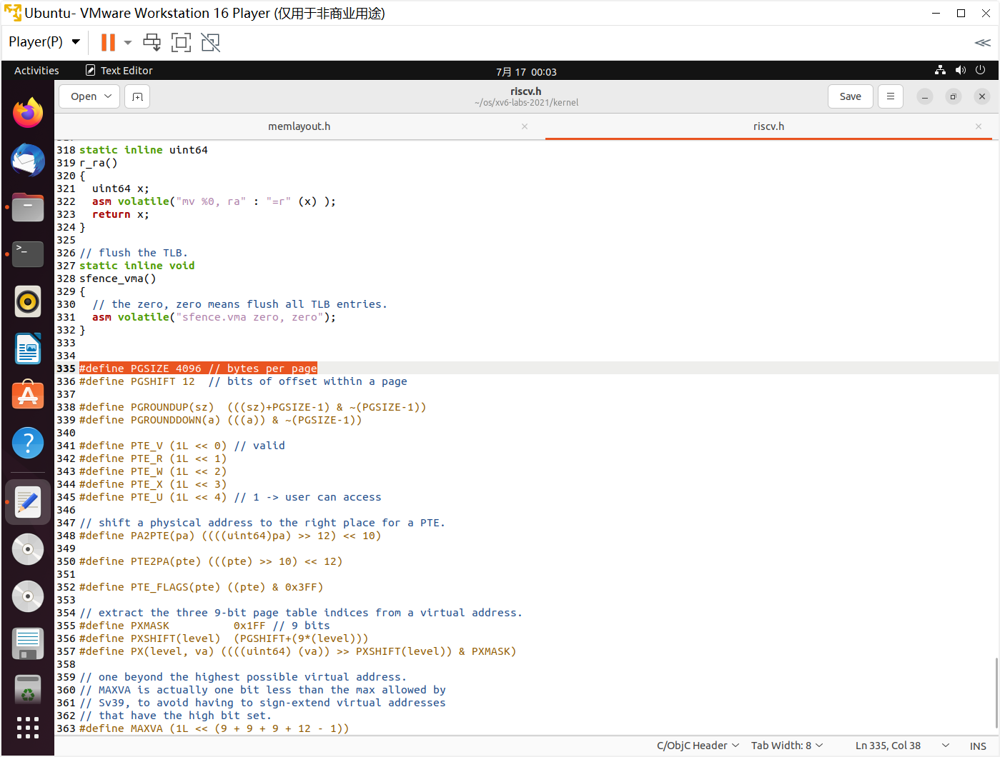

  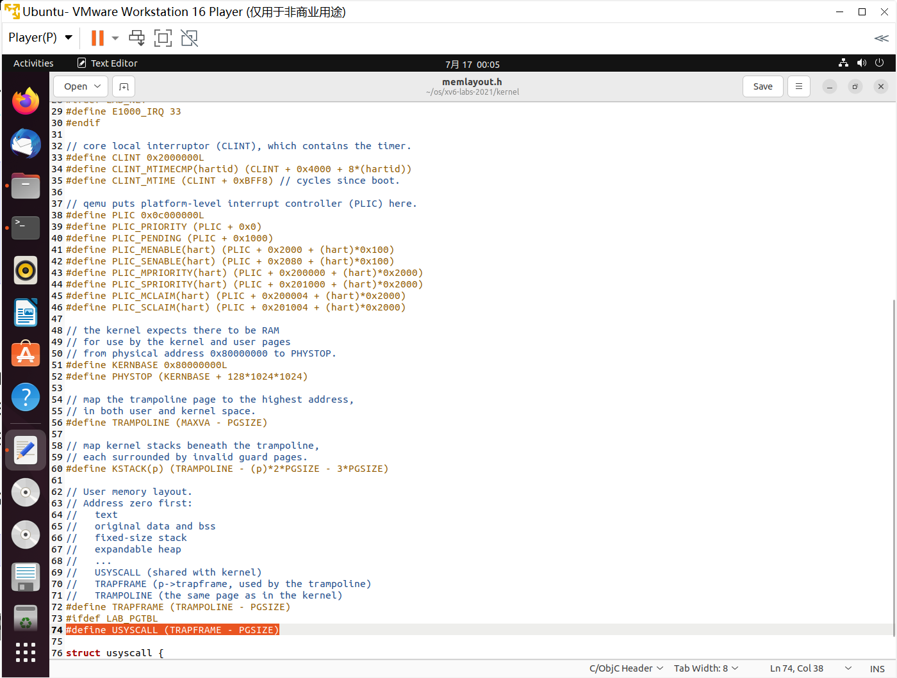

* 打开`kernel/proc.h`，在进程结构体里添加一个`struct usyscall*`类型的变量，用来保存页表地址

  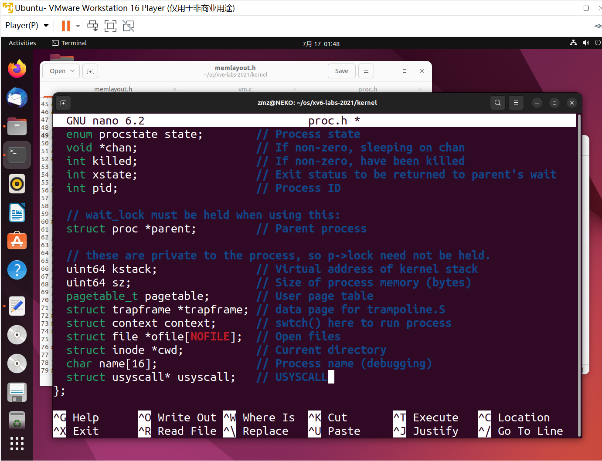

  ```c
  struct usyscall* usyscall;
  ```

* 在`kernel/proc.c`里给`usyscall`分配页表

  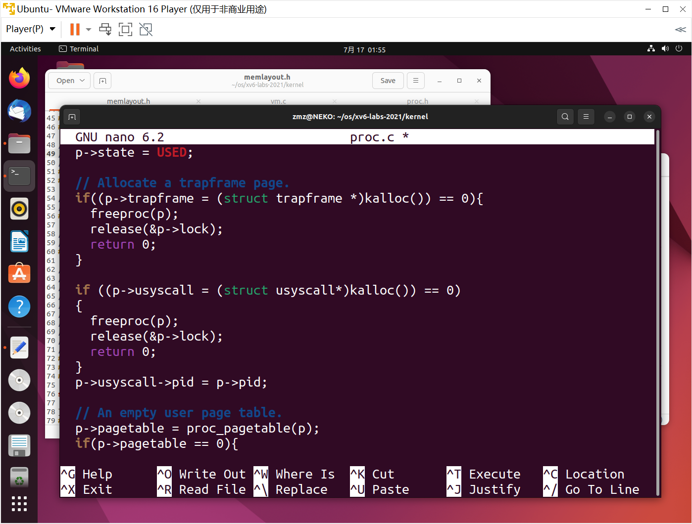

  ```c
  if ((p->usyscall = (struct usyscall*)kalloc()) == 0)
    {
      freeproc(p);
      release(&p->lock);
      return 0;
    }
    p->usyscall->pid = p->pid;
  ```

* 在`kernel/proc.c`里的`proc_pagetable()`里面实现映射

  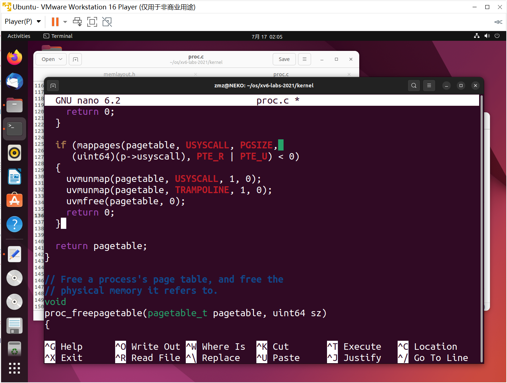

  ```c
  if (mappages(pagetable, USYSCALL, PGSIZE, 
       (uint64)(p->usyscall), PTE_R | PTE_U) < 0)
    {
      uvmunmap(pagetable, USYSCALL, 1, 0);
      uvmunmap(pagetable, TRAMPOLINE, 1, 0);
      uvmfree(pagetable, 0);
      return 0;
    }
  ```

* 在`kernel/proc.c`里的`freeproc()`里面释放分配给`usyscall`的页表，将页表插入空闲页链表中

  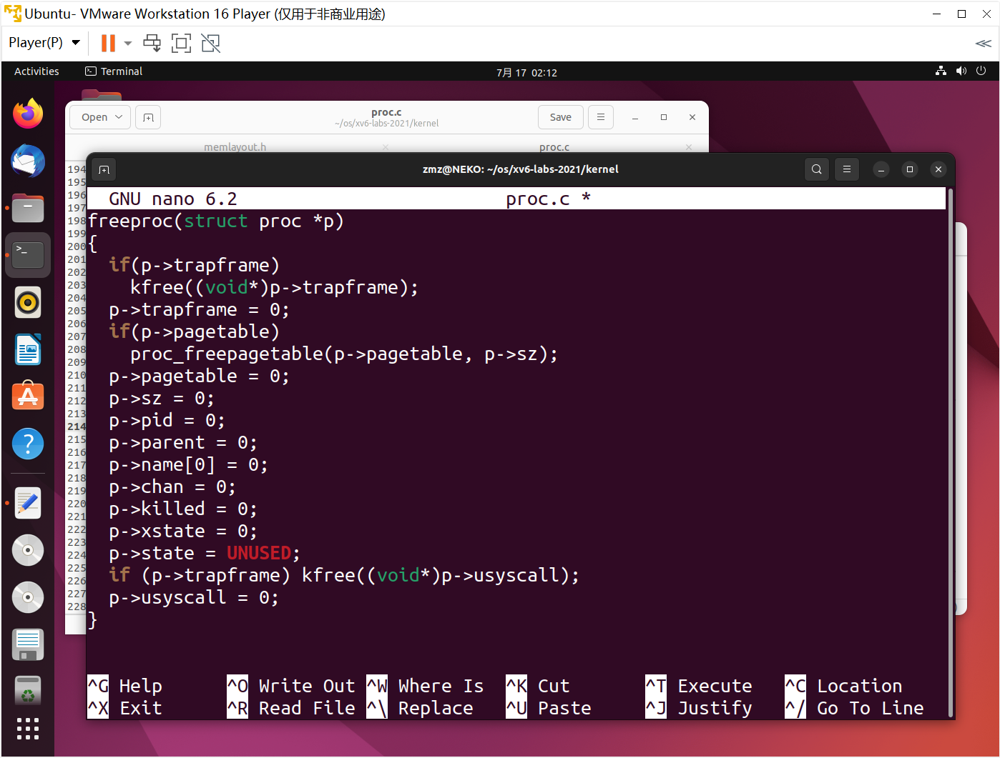

  ```c
    if (p->trapframe) kfree((void*)p->usyscall);
    p->usyscall = 0;
  ```

* 在`kernel/proc.c`里的`proc_freepagetable()`里面解除映射关系

  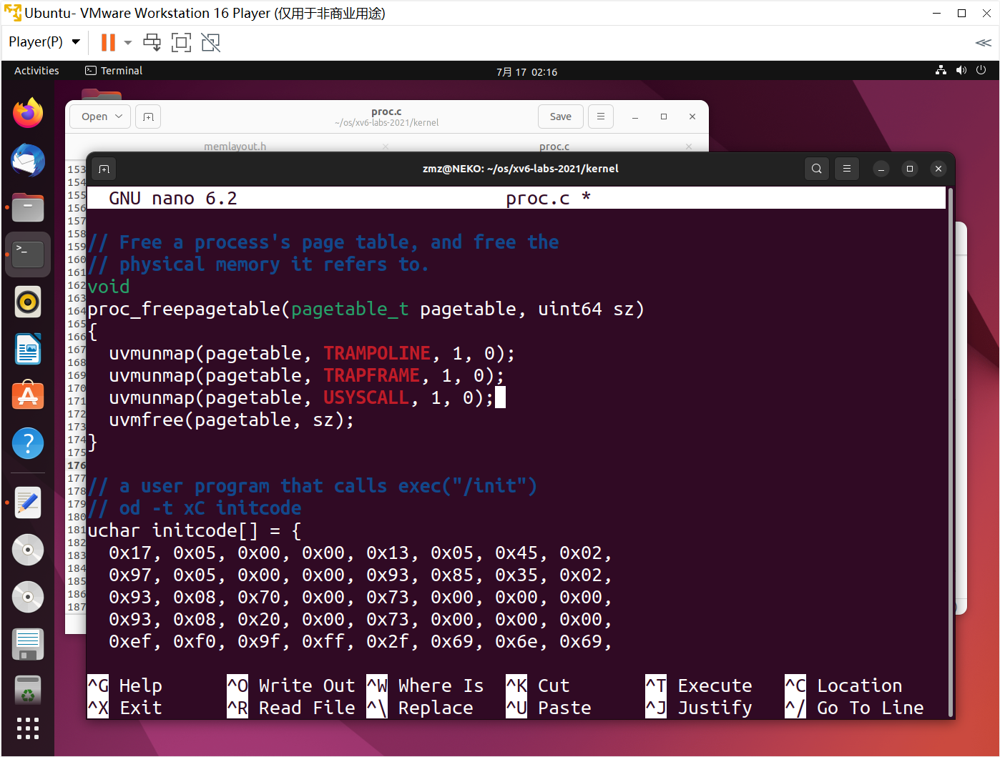

  ```c
  uvmunmap(pagetable, USYSCALL, 1, 0);
  ```

* 测试通过

  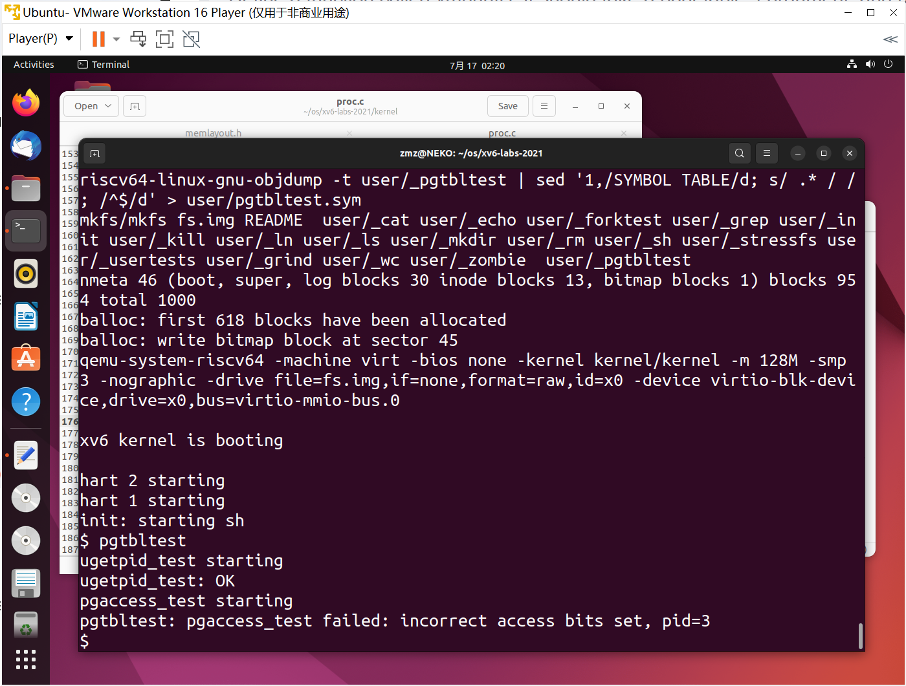

* 哪个其他的 xv6 系统调用可以通过共享页面实现更快速访问？解释原因

  我认为`fork()`系统调用可以通过共享页面实现更快速访问，一些操作系统（例如Linux）通过在用户空间和内核之间共享只读区域中的数据来加快某些系统调用。这就消除了在执行这些系统调用时对内核交叉的需要。`getpid()`在创建进程时系统调用，而`fork()`在创建子进程时系统调用，二者异曲同工

##### 1.3. 实验中遇到的问题和解决办法

* 对映射的概念不熟悉，反复翻阅教材

##### 1.4. 实验心得

* 对研究映射产生浓厚兴趣


#### 2. Print a page table (easy)

##### 2.1. 实验目的

* 定义一个名为`vmprint()`的函数。它应该采用一个`pagetable_t`参数，并以下面描述的格式打印该pagetable

* 在`exec.c`中的`return argc`之前插入

  ```c
  if(p->pid==1)
  vmprint(p->pagetable);
  ```

  以打印第一个进程的页表。如果你通过了合格等级的`pte printout`测试，你将获得实验室这一部分的全部学分

##### 2.2. 实验步骤

* 根据题目要求，在`exec.c`中的`return argc`之前插入一段代码内容

  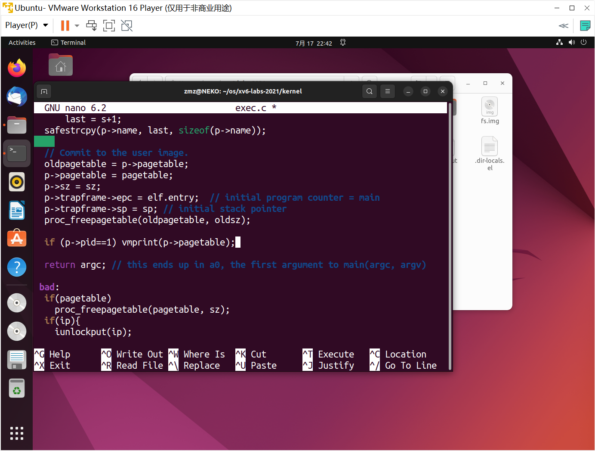

  ```c
  if (p->pid==1) vmprint(p->pagetable);
  ```

* 查看`kernel/vm.c`里的`freewalk()`方法，它首先会遍历整个页表。当遇到有效的页表项并且不在最后一层的时候，它会递归调用。`PTE_V`是用来判断页表项是否有效，而`(pte & (PTE_R|PTE_W|PTE_X)) == 0`则是用来判断是否不在最后一层。因为最后一层页表中页表项中W位，R位，X位起码有一位会被设置为1。注释里面说所有最后一层的页表项已经被释放了，所以遇到不符合的情况就`panic("freewalk: leaf")`

  ```c
  // Recursively free page-table pages.
  // All leaf mappings must already have been removed.
  void
  freewalk(pagetable_t pagetable)
  {
    // there are 2^9 = 512 PTEs in a page table.
    for(int i = 0; i < 512; i++){
      pte_t pte = pagetable[i];
      if((pte & PTE_V) && (pte & (PTE_R|PTE_W|PTE_X)) == 0){
        // this PTE points to a lower-level page table.
        uint64 child = PTE2PA(pte);
        freewalk((pagetable_t)child);
        pagetable[i] = 0;
      } else if(pte & PTE_V){
        panic("freewalk: leaf");
      }
    }
    kfree((void*)pagetable);
  }
  ```

* 根据上面`freewalk()`的代码，写一个递归函数，打印每一个有效页表和它子项的内容，继续递归直到最后一层，通过`level`来控制前缀`..`的数量

  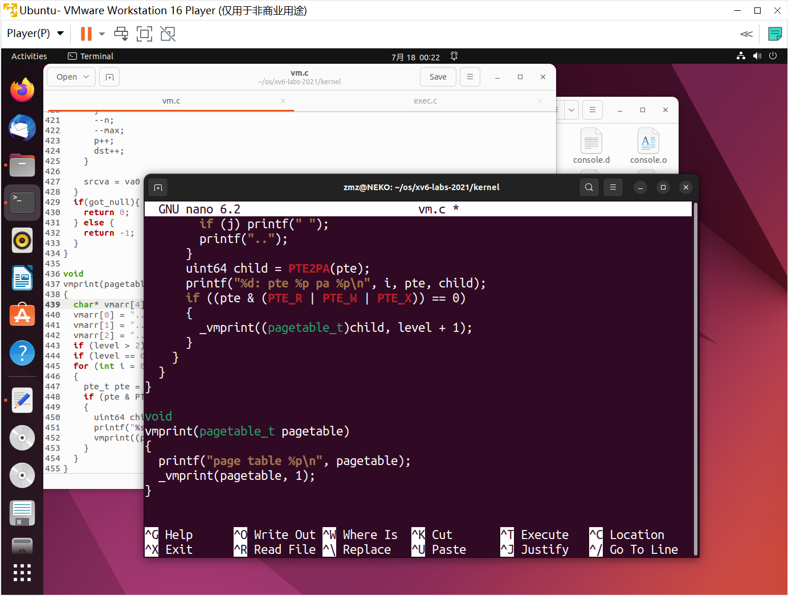

  ```c
  void
  _vmprint(pagetable_t pagetable, int level)
  {
    for (int i = 0; i < 512; i++)
    {
      pte_t pte = pagetable[i];
      if (pte & PTE_V)
      {
        for (int j = 0; j < level; j++)
        {
          if (j) printf(" ");
          printf("..");
        }
        uint64 child = PTE2PA(pte);
        printf("%d: pte %p pa %p\n", i, pte, child);
        if ((pte & (PTE_R | PTE_W | PTE_X)) == 0)
        {
          _vmprint((pagetable_t)child, level + 1);
        }
      }
    }
  }
  
  void
  vmprint(pagetable_t pagetable)
  {
    printf("page table %p\n", pagetable);
    _vmprint(pagetable, 1);
  }
  ```

* 在`kernel/defs.h`中定义`vmprint()`的原型，以便可以从`exec.c`调用它

  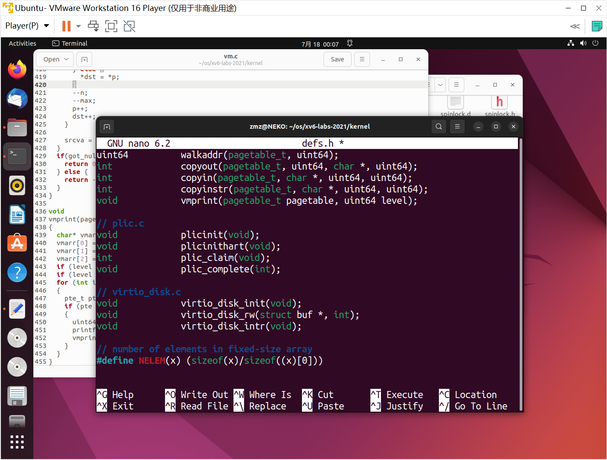

  ```c
  void vmprint(pagetable_t);
  ```

* 正常运行

  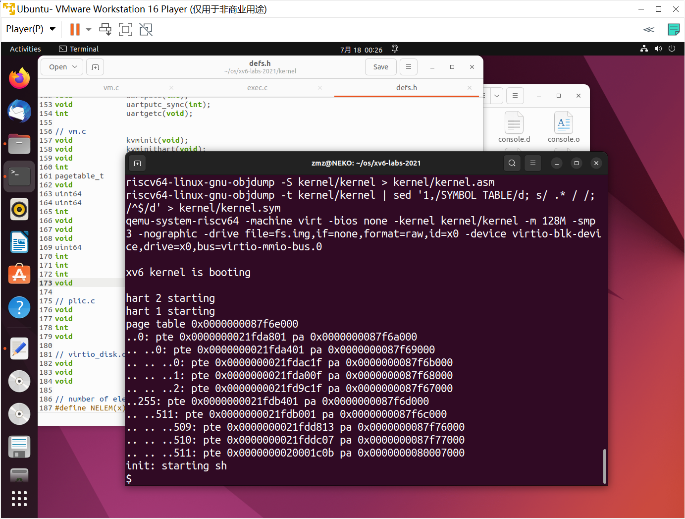

* 测试点AC

  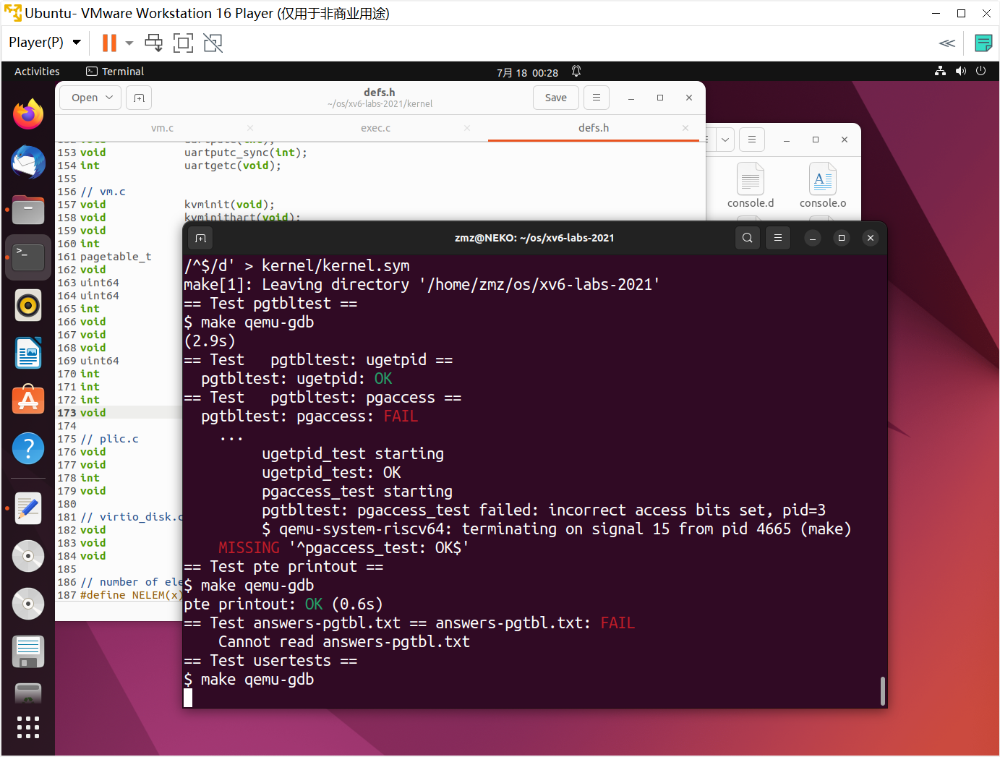

##### 2.3. 实验中遇到的问题和解决办法

* 对递归打印页表不熟悉，仔细阅读手册学习

##### 2.4. 实验心得

* 熟悉了页表


#### 3. Detecting which pages have been accessed (hard)

##### 3.1. 实验目的

* 一些垃圾收集器（自动内存管理的一种形式）可以从有关哪些页面已被访问（读取或写入）的信息中受益
* 向 xv6 添加一个新功能，该功能通过检查 RISC-V 页面表中的访问位来检测并向用户空间报告这些信息。RISC-V 硬件页面助行器在 PTE 中标记这些位，每当它解决 TLB 未命中时
* 实现`pgaccess()`，这是一个报告哪些页面已被访问的系统调用
* 系统调用需要三个参数。首先，检查第一个用户页面的起始虚拟地址。其次，需要检查页数。最后，它将用户地址带到缓冲区，将结果存储到位掩码（一种每页使用一位的数据结构，其中第一页对应于最低有效位）
* 如果在运行`pgtbltest`时`pgaccess`测试用例通过，将获得 lab 这一部分的全部学分

##### 3.2. 实验步骤

* 在`kernel/vm.c`中阅读`walk()`函数，这个函数用于在 RISC-V Sv39 页表中根据虚拟地址找到对应的页表项 (PTE) 的函数。该页表采用三级分页结构，每个页表页包含 512 个 64 位的 PTE

  让我们逐步解释代码的功能和过程：

  1. `walk` 函数的作用：
     - 根据虚拟地址 `va` 在页表 `pagetable` 中查找对应的页表项，并返回该页表项的地址。
     - 如果 `alloc` 参数为非零值，当在页表中找不到对应的页表项时，会创建必要的页表页。

  2. 参数说明：
     - `pagetable_t pagetable`: 表示页表的类型，可以是一个指向页表的指针。
     - `uint64 va`: 表示待查找的虚拟地址。
     - `int alloc`: 表示是否允许创建新的页表页，非零值表示允许。

  3. 虚拟地址格式：
     - RISC-V Sv39 采用三级分页，一个 64 位虚拟地址被划分为五个字段：
       - 39..63：必须为零。
       - 30..38：9位，代表第二级页表的索引。
       - 21..29：9位，代表第一级页表的索引。
       - 12..20：9位，代表第零级页表的索引。
       - 0..11：12位，代表页内偏移量。

  4. `PX` 宏：
     - 代码中使用了宏 `PX(level, va)` 来根据 `level` 和虚拟地址 `va` 计算对应级别的页表索引。

  5. 函数执行过程：
     - 首先，代码检查 `va` 是否大于等于 `MAXVA`，如果是，则调用 `panic("walk")`，这可能是一个错误的虚拟地址，导致程序崩溃。
     - 接着，`walk` 函数使用一个循环从高级页表向低级页表逐级查找虚拟地址 `va` 对应的页表项。
     - 循环从第二级页表开始，一直到第零级页表。
     - 在每一级中，它先根据虚拟地址计算出相应的页表索引，并找到对应的页表项指针 `pte`。
     - 如果该页表项有效(`*pte & PTE_V` 条件成立)，则更新 `pagetable` 为下一级页表的地址，继续向下一级查找。
     - 如果该页表项无效，则根据 `alloc` 参数判断是否需要创建新的页表页。如果 `alloc` 为0或者无法分配新的页表页，则返回0表示查找失败。
     - 如果 `alloc` 不为0并且成功分配了新的页表页，则将该页表页初始化为0，并将当前页表项更新为指向新创建的页表页，并设置页表项为有效状态。
     - 最后，循环完成后，函数返回指向虚拟地址 `va` 对应的页表项的指针。

  ```c
  // Return the address of the PTE in page table pagetable
  // that corresponds to virtual address va.  If alloc!=0,
  // create any required page-table pages.
  //
  // The risc-v Sv39 scheme has three levels of page-table
  // pages. A page-table page contains 512 64-bit PTEs.
  // A 64-bit virtual address is split into five fields:
  //   39..63 -- must be zero.
  //   30..38 -- 9 bits of level-2 index.
  //   21..29 -- 9 bits of level-1 index.
  //   12..20 -- 9 bits of level-0 index.
  //    0..11 -- 12 bits of byte offset within the page.
  pte_t *
  walk(pagetable_t pagetable, uint64 va, int alloc)
  {
    if(va >= MAXVA)
      panic("walk");
  
    for(int level = 2; level > 0; level--) {
      pte_t *pte = &pagetable[PX(level, va)];
      if(*pte & PTE_V) {
        pagetable = (pagetable_t)PTE2PA(*pte);
      } else {
        if(!alloc || (pagetable = (pde_t*)kalloc()) == 0)
          return 0;
        memset(pagetable, 0, PGSIZE);
        *pte = PA2PTE(pagetable) | PTE_V;
      }
    }
    return &pagetable[PX(0, va)];
  }
  ```

* 在`kernel/sysproc.c`中实现`sys_pgaccess()`

  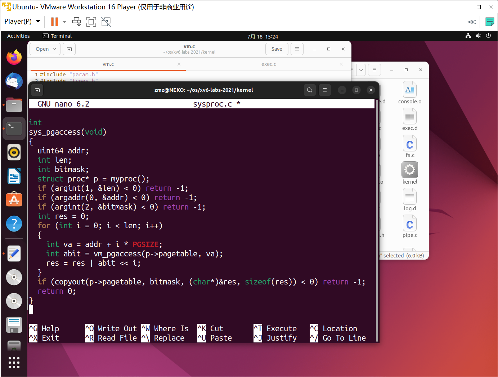

  ```c
  int
  sys_pgaccess(void)
  {
    uint64 addr;
    int len;
    int bitmask;
    struct proc* p = myproc();
    if (argint(1, &len) < 0) return -1;
    if (argaddr(0, &addr) < 0) return -1;
    if (argint(2, &bitmask) < 0) return -1;
    int res = 0;
    for (int i = 0; i < len; i++)
    {
      int va = addr + i * PGSIZE;
      int abit = vm_pgaccess(p->pagetable, va);
      res = res | abit << i;
    }
    if (copyout(p->pagetable, bitmask, (char*)&res, sizeof(res)) < 0) return -1;
    return 0;
  }
  ```

* 实现`vm_pgaccess()`

  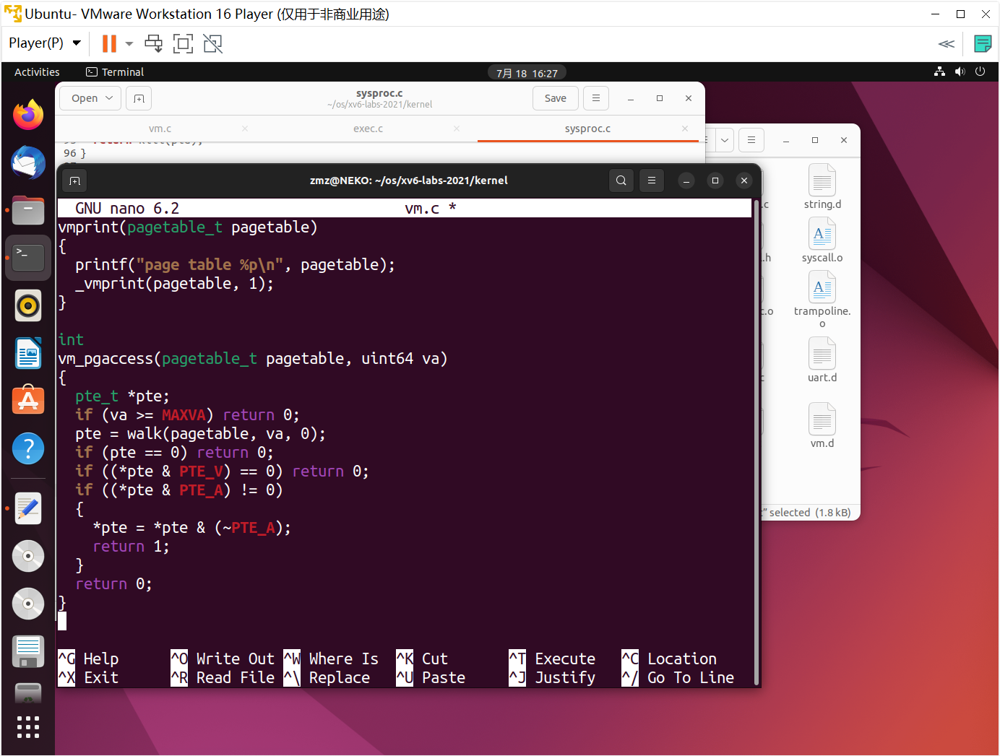

  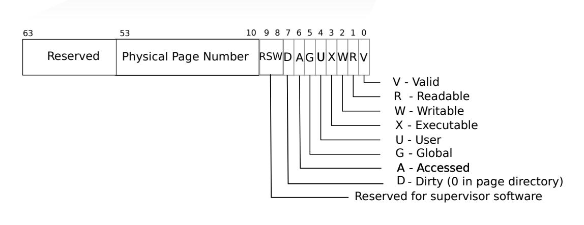

  ```c
  int
  vm_pgaccess(pagetable_t pagetable, uint64 va)
  {
    pte_t *pte;
    if (va >= MAXVA) return 0;
    pte = walk(pagetable, va, 0);
    if (pte == 0) return 0;
    if ((*pte & PTE_V) == 0) return 0;
    if ((*pte & PTE_A) != 0)
    {
      *pte = *pte & (~PTE_A);
      return 1;
    }
    return 0;
  }
  ```

* 测试通过\\(@^0^@)/

  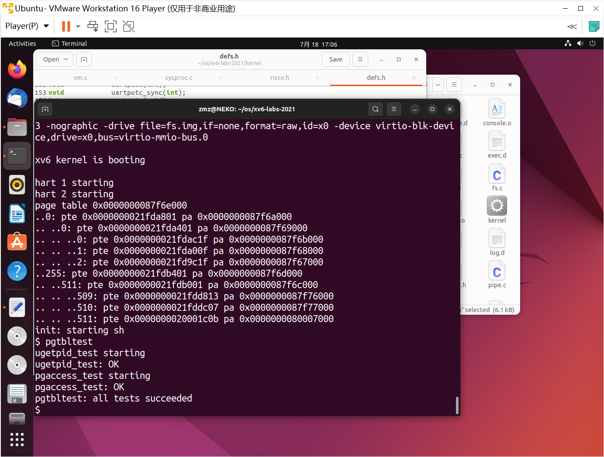

##### 3.3. 实验中遇到的问题和解决办法

* 遇到了函数无法调用的问题，通过在头文件中添加声明解决

##### 3.4. 实验心得

* 进一步理解了页表


#### Submit

通过