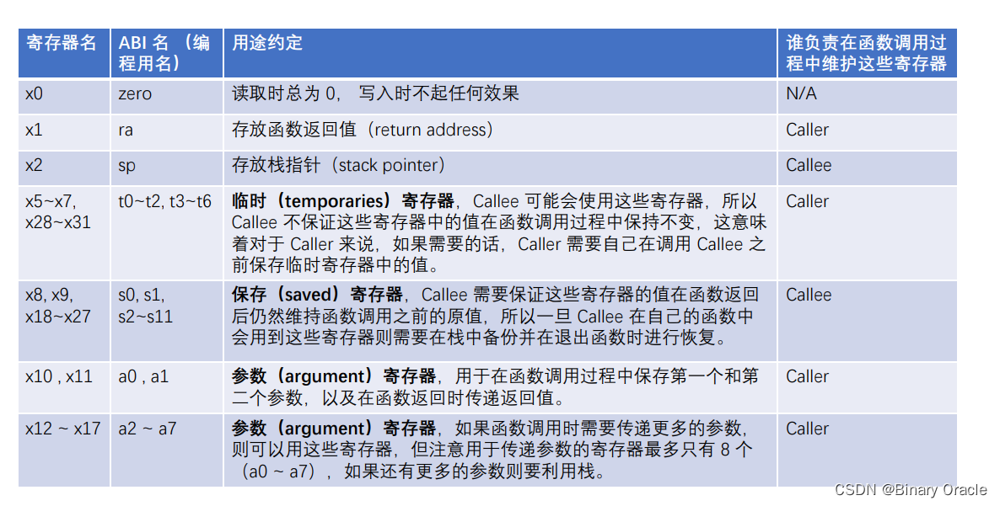
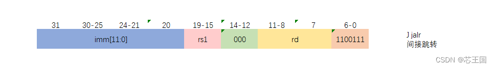

## Lab: traps

#### 0. 目录

[TOC]

#### 1. RISC-V assembly (easy)

##### 1.1. 实验目的

* 了解一些 RISC-V 程序集非常重要，xv6 存储库中有一个文件`user/call.c`，`makefs.img`编译它，并在`user/call.asm`中生成程序的可读汇编版本

  ```c
  #include "kernel/param.h"
  #include "kernel/types.h"
  #include "kernel/stat.h"
  #include "user/user.h"
  
  int g(int x) {
    return x+3;
  }
  
  int f(int x) {
    return g(x);
  }
  
  void main(void) {
    printf("%d %d\n", f(8)+1, 13);
    exit(0);
  }
  ```

  ```basic
  user/_call:     file format elf64-littleriscv
  
  
  Disassembly of section .text:
  
  0000000000000000 <g>:
  #include "kernel/param.h"
  #include "kernel/types.h"
  #include "kernel/stat.h"
  #include "user/user.h"
  
  int g(int x) {
     0:	1141                	addi	sp,sp,-16
     2:	e422                	sd	s0,8(sp)
     4:	0800                	addi	s0,sp,16
    return x+3;
  }
     6:	250d                	addiw	a0,a0,3
     8:	6422                	ld	s0,8(sp)
     a:	0141                	addi	sp,sp,16
     c:	8082                	ret
  
  000000000000000e <f>:
  
  int f(int x) {
     e:	1141                	addi	sp,sp,-16
    10:	e422                	sd	s0,8(sp)
    12:	0800                	addi	s0,sp,16
    return g(x);
  }
    14:	250d                	addiw	a0,a0,3
    16:	6422                	ld	s0,8(sp)
    18:	0141                	addi	sp,sp,16
    1a:	8082                	ret
  
  000000000000001c <main>:
  
  void main(void) {
    1c:	1141                	addi	sp,sp,-16
    1e:	e406                	sd	ra,8(sp)
    20:	e022                	sd	s0,0(sp)
    22:	0800                	addi	s0,sp,16
    printf("%d %d\n", f(8)+1, 13);
    24:	4635                	li	a2,13
    26:	45b1                	li	a1,12
    28:	00000517          	auipc	a0,0x0
    2c:	7a050513          	addi	a0,a0,1952 # 7c8 <malloc+0xe8>
    30:	00000097          	auipc	ra,0x0
    34:	5f8080e7          	jalr	1528(ra) # 628 <printf>
    exit(0);
    38:	4501                	li	a0,0
    3a:	00000097          	auipc	ra,0x0
    3e:	274080e7          	jalr	628(ra) # 2ae <exit>
  ```

* 阅读`call.asm`中函数`g`、`f`和`main`的代码，阅读 RISC-V 的使用说明书见参考页，回答一些问题

##### 1.2. 实验步骤

* 哪些寄存器包含函数的参数？例如，在`main`对`printf`的调用中，哪个寄存器保存 13？

  

  根据图片，寄存器 a0-a7 存放参数

  ```basic
  printf("%d %d\n", f(8)+1, 13);
  24:	4635                	li	a2,13
  ```

  根据这段编译出的汇编代码，13 保存在寄存器 a2 中

* `main`的汇编代码中对函数`f`的调用在哪里？`g`的调用在哪里？（提示：编译器可以内联函数）

  源代码中，函数`f`调用函数`g`，`main`函数调用函数`f`，观察汇编代码中的函数`f`和函数`g`，这两个函数汇编代码相同，说明编译器把它们当成了分开的函数处理

  ```basic
  26:	45b1                	li	a1,12
  ```

  根据以上这段`main`函数的代码，对函数`f`的调用直接算出了结果，编译器对函数进行了内联处理

* 函数`printf`位于哪个地址？

  ```basic
  34:	5f8080e7          	jalr	1528(ra) # 628 <printf>
  ...
  0000000000000628 <printf>:
  ```

  根据上面两句汇编代码，得知`printf`在`0x628`地址处

* `main`函数里的`jalr`在`printf`之后，寄存器`ra`里的值是多少

  * `auipc`指令：将其携带的20位立即数作为32位的高位，低12位置0，然后与当前的PC值相加，将结果写入目标寄存器中

    汇编写法：

    ```basic
    auipc rd, imm
    ```

    

  * `jalr`指令：将其携带的12位立即数与源寄存器1值相加，并将结果的末尾清零，作为跳转的地址；与`jal`指令一样，将其后的指令地址存入目标寄存器中

    汇编写法：

    ```basic
    jalr rd, offset(rs1)
    ```

    

  查看汇编代码：

  ```basic
  30:	00000097          	auipc	ra,0x0
  34:	5f8080e7          	jalr	1528(ra) # 628 <printf>
  ```

  `00000097H=00...0 0000 1001 0111B`，对比指令格式，可见 imm=0，dest=00001，opcode=0010111，对比汇编指令可知，`auipc`的操作码是`0010111`，`ra`寄存器代码是`00001`，第一行代码将`0x0`左移 12 位（还是`0x0`）加到 PC（当前为`0x30`）上并存入`ra`中，即`ra`中保存的是`0x30`

  `5f8080e7H=0101 1111 1000 0000 1000 0000 1110 0111B`，可见 imm=0101 1111 1000，rs1=00001，funct3=000，rd=00001，opcode=1100111，`rs1`和`rd`的操作码都是`00001`，即都为寄存器`ra`，这对比`jalr`的标准格式有所不同，可能是此两处使用寄存器相同时，汇编中可以省略`rd`部分。`ra`中保存的是`0x30`，加上`0x5f8`后为`0x628`，即`printf`的地址，执行此行代码后，将跳转到`printf`函数执行，并将`PC+4=0x34+0x4=0x38`保存到`ra`中，供之后返回使用

* 运行代码后，输出是什么？如果是大端序要把 i 值设为多少？57616 要改变吗？

  代码：

  ```c
  #include <stdio.h>
  int main()
  {unsigned int i = 0x00646c72;printf("H%x Wo%s",57616,&i);return 0;}
  ```

  结果是：`He110 World`

  57616 转换成 16 进制是 0xe110，规定 e 小写；而 0x646c72 转换成 2 进制后是 0110 0100 0110 1100 0111 0010，按照字节大小取对应小端序 ASCII 码是 114，108，100，转换成字符是"r","l","d"

  | 地址     | 大端序   | 小端序   |
  | -------- | -------- | -------- |
  | addr     | 00000000 | 01110010 |
  | addr + 1 | 01100100 | 01101100 |
  | addr + 2 | 01101100 | 01100100 |
  | addr + 3 | 01110010 | 00000000 |

  如果是大端序，则 i 为 0111 0010 0110 1100 0110 0100 0000 0000B，即 0x726c6400

  由于转化成 16 进制后数值不变，所以 57616 不需要改

* 运行代码后，`y=`后面打印了什么？为什么会发生？

  运行代码：

  ```c
  #include<stdio.h>
  int main(){printf("x=%d y=%d",3);return 0;}
  ```

  结果：`y=1821894360`

  原因：原本需要两个参数，却只传入了一个，因此`y=`后面打印的结果取决于之前`a2`中保存的数据

##### 1.3. 实验中遇到的问题和解决办法

* 指令不熟悉，分解成 0 和 1 反复研究

##### 1.4. 实验心得

* 了解了汇编语言


#### 2. Backtrace (moderate)

##### 2.1. 实验目的

* 对于调试来说，有一个回溯通常很有用：在发生错误的点之上的堆栈上的函数调用列表
* 在`kernel/printf.c`中实现一个`backtrace()`函数。在`sys_sleep`中插入对此函数的调用，然后运行`bttest`，它调用`sys_sleep`
* 编译器在每个堆栈帧中放入一个帧指针，该指针保存调用方的帧指针的地址。回溯应该使用这些帧指针向上遍历堆栈，并在每个堆栈帧中打印保存的返回地址

##### 2.2. 实验步骤

* 向`kernel/riscv.h`添加代码

  

  ```c
  static inline uint64
  r_fp()
  {
    uint64 x;
    asm volatile("mv %0, s0" : "=r" (x) );
    return x;
  }
  ```

* 向`kernel/defs.h`添加原型声明

  

  ```c
  void		backtrace(void);
  ```

* 在`kernel/printf.c`中添加`backtrace()`函数

  

  ```c
  void
  backtrace(void)
  {
    printf("backtrace:\n");
    // Read current frame pointer
    uint64 fp = r_fp();
    while (PGROUNDUP(fp) - PGROUNDDOWN(fp) == PGSIZE)
    {
      // Save returned address at shift -8
      uint64 ret_addr = *(uint64*)(fp - 8);
      printf("%p\n", ret_addr);
      // Save last pointer at shift -16
      fp = *(uint64*)(fp - 16);
    }
  }
  ```

* 向`kernel/printf.c`中的`panic()`函数中添加`backtrace()`的函数调用

  

  ```c
  backtrace();
  ```

* 测试通过

  

##### 2.3. 实验中遇到的问题和解决办法

* 没完全搞懂`backtrace()`的作用，反复研究

##### 2.4. 实验心得

* 搞懂了`backtrace()`的作用


#### 3. Alarm (hard)

##### 3.1. 实验目的

* 向 xv6 添加一个功能，该功能在进程使用 CPU 时间时定期提醒进程。这对于想要限制占用 CPU 时间的计算绑定进程，或者对于想要计算但也想要采取一些周期性操作的进程来说可能很有用。更一般地说，实现用户级中断/故障处理程序的原始形式；例如，使用类似的方法来处理应用程序中的页面错误。如果解决方案通过了警报测试和用户测试，那么它就是正确的
* 添加一个新的`sigalarm(interval, handler)`系统调用。如果应用程序调用`sigalarm(n, fn)`，那么在程序消耗的 CPU 时间的每 n 个“滴答”之后，内核应该调用应用程序函数`fn`。当`fn`返回时，应用程序应该从停止的地方恢复。在 xv6 中，tick 是一个相当任意的时间单位，由硬件计时器生成中断的频率决定。如果应用程序调用`sigalarm(0, 0)`，内核应该停止生成周期性的警报调用
* 在 xv6 存储库中找到一个文件`user/armtest.c`。将其添加到`Makefile`中。在添加了`sigalarm`和`sigreturn`系统调用之前，它不会正确编译
* `alarmtest`在`test0`中调用`sigalarm(2, periodic)`，要求内核每隔 2 次强制调用`periodic()`，然后旋转一段时间。可以在`user/armtest.asm`中看到`alarmtest`的汇编代码，这可能对调试很方便。当`alarmtest`生成相应的输出并且用户测试也正确运行时，解决方案是正确的

##### 3.2. 实验步骤

* 在`Makefile`中添加

  

  ```makefile
  $U/_alarmtest\
  ```

* 在`usys.pl`中添加

  

  ```perl
  entry("sigalarm");
  entry("sigreturn");
  ```

* 在`syscall.h`中添加

  

  ```c
  #define SYS_sigalarm 22
  #define SYS_sigreturn 23
  ```

* 在`syscall.c`中添加

  

  

  ```c
  extern uint64 sys_sigalarm(void);
  extern uint64 sys_sigreturn(void);
  ...
  [SYS_sigalarm] sys_sigalarm,
  [SYS_sigreturn] sys_sigreturn,
  ```

* 在`proc.h`中添加

  

  ```c
  uint64 interval;
  void (*handler)();
  uint64 ticks;
  struct trapframe *alarm_trapframe;
  int alarm_goingoff;
  ```

* 编辑`proc.c`中的`allocproc()`函数

  

  ```c
  if ((p->alarm_trapframe = (struct trapframe*)kalloc()) == 0)
    {
      freeproc(p);
      release(&p->lock);
      return 0;
    }
  ```

  

  ```c
  p->ticks = 0;
  p->handler = 0;
  p->interval = 0;
  p->alarm_goingoff = 0;
  ```

* 编辑`proc.c`中的`freeproc()`函数

  

  ```c
  if (p->alarm_trapframe) kfree((void*)p->alarm_trapframe);
  ...
  p->ticks = 0;
  p->handler = 0;
  p->interval = 0;
  p->alarm_goingoff = 0;
  p->state = UNUSED;
  ```

* 在`kernel/sysproc.c`中实现`sys_sigalarm()`和`sig_sigreturn()`函数，用于实现系统调用

  

  ```c
  uint64
  sys_sigalarm(void)
  {
    int n;
    uint64 handler;
    if (argint(0, &n) < 0) return -1;
    if (argaddr(1, &handler) < 0) return -1;
    return sigalarm(n, (void(*)())(handler));
  }
  
  uint64
  sys_sigreturn(void){return sigreturn();}
  ```

* 在`trap.c`中实现`int sigalarm(int ticks, void(*handler)()`以及`int sigreturn()`

  

  ```c
  int
  sigalarm(int ticks, void(*handler)())
  {
    struct proc* p = myproc();
    p->interval = ticks;
    p->handler = handler;
    p->ticks = 0;
    return 0;
  }
  
  int
  sigreturn()
  {
    struct proc* p = myproc();
    *(p->trapframe) = *(p->alarm_trapframe);
    p->alarm_goingoff = 0;
    return 0;
  }
  ```

* 在`trap.c`的`usertrap`函数中添加定时器中断响应

  

  ```c
  else if((which_dev = devintr()) != 0){
      // ok
      if (which_dev == 2)
      {
        if (p->interval != 0)
        {
  	if (p->ticks == p->interval && p->alarm_goingoff == 0)
  	{
  	  p->ticks = 0;
  	  *(p->alarm_trapframe) = *(p->trapframe);
  	  p->trapframe->epc = (uint64)p->handler;
  	  p->alarm_goingoff = 1;
  	}
  	p->ticks++;
        }
      }
    }
  ```

* 修理 bug 😡

  

* 结果正确🤩🤩🤩

  

  

##### 3.3. 实验中遇到的问题和解决办法

* 对时钟的理解不深刻，反复研究

##### 3.4. 实验心得

* 理解了时钟


#### Submit

第一题解答在上面，时间文件没有

