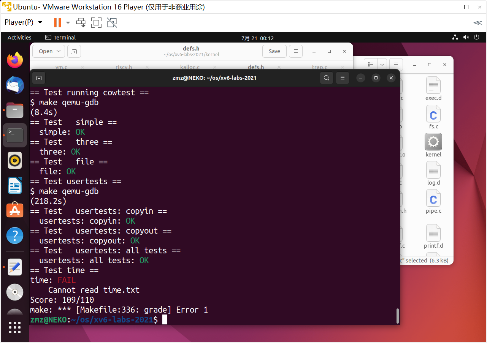

## Lab: Copy-on-Write Fork for xv6

#### 0. 目录

[TOC]

#### 1. Implement copy-on write(hard)

##### 1.1. 实验目的

* 虚拟内存提供了一定程度的间接性：内核可以通过将 PTE 标记为无效或只读来拦截内存引用，从而导致页面错误，并可以通过修改 PTE 来更改地址的含义。在计算机系统中有一种说法，任何系统问题都可以通过一定程度的间接性来解决。lazy allocation lab 提供了一个例子。这个 lab 探索了另一个例子：copy-on write fork
* xv6 中的`fork()`系统调用将父进程的所有用户空间内存复制到子进程中。如果父对象很大，则复制可能需要很长时间。更糟糕的是，这项工作往往被大量浪费；例如，子级中的`fork()`后面跟`exec()`会导致子级丢弃复制的内存，而可能从未使用过大部分内存。另一方面，如果父级和子级都使用一个页面，并且其中一个或两个都写入该页面，则确实需要一个副本
* `copy-on-write (COW) fork()`的目标是推迟为子级分配和复制物理内存页，直到实际需要副本（如果有的话）
* `COW fork()`只为子级创建一个页面表，用户内存的 PTE 指向父级的物理页面。`COW fork()`将父级和子级中的所有用户 PTE 标记为不可写。当任一进程试图写入其中一个 COW 页面时，CPU 将强制执行页面故障。内核页面错误处理程序检测到这种情况，为出错进程分配一页物理内存，将原始页面复制到新页面中，并修改出错进程中的相关 PTE 以引用新页面，这一次 PTE 标记为可写。当页面错误处理程序返回时，用户进程将能够写入页面的副本
* `COW fork()`使得释放实现用户内存的物理页面变得有点棘手。一个给定的物理页面可能被多个进程的页面表引用，并且只有当最后一个引用消失时才应该释放
* 在 xv6 内核中实现写时复制分叉。如果修改后的内核成功地执行了`cowtest`和`usertests`程序，那么就完成了

##### 1.2. 实验步骤

* 为了帮助测试程序的实现，我们提供了一个名为`cowtest`的 xv6 程序（源于`user/cowtest.c`）。`cowtest`运行各种测试，但即使是第一个测试在未修改的 xv6 上也会失败。因此，最初，您将看到：`simple: fork() failed`

  

  “simple” test 分配一半以上的可用物理内存，然后`fork()`s。`fork()`失败是因为没有足够的可用物理内存给子级提供父级内存的完整副本

* 一个可行方案：

  1. 修改`uvmcopy()`以将父级的物理页面映射到子级，而不是分配新页面。清除子项和父项的 PTE 中的`PTE_W`
  2. 修改`usertrap()`以识别页面错误。当 COW 页面出现页面错误时，使用`kalloc()`分配一个新页面，将旧页面复制到新页面，并在`PTE_W`设置的 PTE 中安装新页面
  3. 确保每个物理页在最后一个 PTE 引用消失时（而不是之前）都被释放。实现这一点的一个好方法是，为每个物理页面保留引用该页面的用户页面表数量的“引用计数”。当`kalloc()`分配页面时，将页面的引用计数设置为1。当`fork`导致子级共享页面时，增加页面的引用数，而每当任何进程将页面从其页面表中删除时，减少页面的计数。只有当引用计数为零时，`kfree()`才应将页面放回空闲列表。将这些计数保存在一个固定大小的整数数组中是可以的。您必须制定一个方案，说明如何索引数组以及如何选择其大小。例如，您可以用页面的物理地址除以 4096 对数组进行索引，并通过`kalloc.c`中的`kinit()`为数组指定一个元素数，该元素数等于空闲列表中任何页面的最高物理地址
  4. 当遇到 COW 页面时，修改`copyout()`以使用与页面错误相同的方案

* 在`kernel/riscv.h`里增加 PTE 的 cow 标志

  

  ```c
  #define PTE_F (1L << 8)
  ```

* 在`kernel/vm.c`里修改`uvmcopy()`函数

  

  ```c
  // Given a parent process's page table, copy
  // its memory into a child's page table.
  // Copies both the page table and the
  // physical memory.
  // returns 0 on success, -1 on failure.
  // frees any allocated pages on failure.
  int
  uvmcopy(pagetable_t old, pagetable_t new, uint64 sz)
  {
    pte_t *pte;
    uint64 pa, i;
    uint flags;
    //char *mem;
  
    for(i = 0; i < sz; i += PGSIZE){
      if((pte = walk(old, i, 0)) == 0)
        panic("uvmcopy: pte should exist");
      if((*pte & PTE_V) == 0)
        panic("uvmcopy: page not present");
      pa = PTE2PA(*pte);
      flags = PTE_FLAGS(*pte);
      
      if (flags & PTE_W)
      {
        flags = (flags | PTE_F) & ~PTE_W;
        *pte = PA2PTE(pa) | flags;
      }
      
      if (mappages(new, i, PGSIZE, pa, flags) != 0)
      {
        uvmunmap(new, 0, i / PGSIZE, 1);
        return -1;
      }
      /*if((mem = kalloc()) == 0)
        goto err;
      memmove(mem, (char*)pa, PGSIZE);
      if(mappages(new, i, PGSIZE, (uint64)mem, flags) != 0){
        kfree(mem);
        goto err;
      }*/
    }
    return 0;
  
  /* err:
    uvmunmap(new, 0, i / PGSIZE, 1);
    return -1;*/
  }
  ```

* 增加引用计数，确保每个物理页在最后一个 PTE 对它的引用撤销时被释放——而不是在此之前，修改`kalloc.c`

  

  ```c
  struct ref_stru
  {
    struct spinlock lock;
    int cnt[PHYSTOP / PGSIZE];
  } ref;
  
  int
  krefcnt(void* pa)
  {
    return ref.cnt[(uint64)pa / PGSIZE];
  }
  ```

* 在`kinit`中初始化`ref`的自旋锁

  

  ``````````````c
  initlock(&ref.lock, "ref");
  ``````````````

* 修改`kalloc`（赋内存函数）和`kfree`（销毁内存函数）函数，在`kalloc`中初始化内存引用计数为1，在`kfree`函数中对内存引用计数减1，如果引用计数为0时才真正删除

  

  ```c
  // Free the page of physical memory pointed at by v,
  // which normally should have been returned by a
  // call to kalloc().  (The exception is when
  // initializing the allocator; see kinit above.)
  void
  kfree(void *pa)
  {
    struct run *r;
  
    if(((uint64)pa % PGSIZE) != 0 || (char*)pa < end || (uint64)pa >= PHYSTOP)
      panic("kfree");
  
    acquire(&ref.lock);
    if (--ref.cnt[(uint64)pa / PGSIZE] == 0)
    {
      release(&ref.lock);
      r = (struct run*)pa;
  
      // Fill with junk to catch dangling refs.
      memset(pa, 1, PGSIZE);
  
      acquire(&kmem.lock);
      r->next = kmem.freelist;
      kmem.freelist = r;
      release(&kmem.lock);
    }
    else
    {
      release(&ref.lock);
    }
  }
  
  // Allocate one 4096-byte page of physical memory.
  // Returns a pointer that the kernel can use.
  // Returns 0 if the memory cannot be allocated.
  void *
  kalloc(void)
  {
    struct run *r;
  
    acquire(&kmem.lock);
    r = kmem.freelist;
    if(r)
    {
      kmem.freelist = r->next;
      acquire(&ref.lock);
      ref.cnt[(uint64)r / PGSIZE] = 1;
      release(&ref.lock);
    }
    release(&kmem.lock);
  
    if(r)
      memset((char*)r, 5, PGSIZE); // fill with junk
    return (void*)r;
  }
  ```

* 添加一个`kaddrefcnt()`函数，每次`fork()`的时候都要增加引用次数

  

  ```c
  int
  kaddrefcnt(void* pa)
  {
    if(((uint64)pa % PGSIZE)!= 0 || (char*)pa < end || (uint64)pa >= PHYSTOP) return -1;
    acquire(&ref.lock);
    ++ref.cnt[(uint64)pa / PGSIZE];
    release(&ref.lock);
    return 0;
  }
  ```

* 在函数`uvmcopy()`里面添加引用

  

  ```c
  kaddrefcnt(pa);
  ```

* 修改`usertrap()`，当 COW 页面出现页面错误时，使用`kalloc()`分配一个新页面，并将旧页面复制到新页面，然后将新页面添加到 PTE 中并设置`PTE_W`

  

  ```c
  else if (r_scause() == 13 || r_scause() == 15)
    {
      uint64 fault_va = r_stval();
      if (fault_va >= p->sz || cowpage(p->pagetable, fault_va) != 0 || cowalloc(p->pagetable, PGROUNDDOWN(fault_va)) == 0) p->killed = 1;
    }
  ```

* 添加两个函数

  

  ```c
  int
  cowpage(pagetable_t pagetable, uint64 va)
  {
    if (va >= MAXVA) return -1;
    pte_t* pte = walk(pagetable, va, 0);
    if (pte == 0) return -1;
    if ((*pte & PTE_V) == 0) return -1;
    return (*pte & PTE_F ? 0 : -1);
  }
  
  void*
  cowalloc(pagetable_t pagetable, uint64 va)
  {
    if (va % PGSIZE != 0) return 0;
    uint64 pa = walkaddr(pagetable, va);
    if (pa == 0) return 0;
    pte_t* pte = walk(pagetable, va, 0);
    if (krefcnt((char*)pa) == 1)
    {
      *pte |= PTE_W;
      *pte &= ~PTE_F;
      return (void*)pa;
    }
    else
    {
      char* mem = kalloc();
      if (mem == 0) return 0;
      memmove(mem, (char*)pa, PGSIZE);
      *pte &= ~PTE_V;
      if (mappages(pagetable, va, PGSIZE, (uint64)mem, (PTE_FLAGS(*pte) | PTE_W) & ~PTE_F) != 0)
      {
        kfree(mem);
        *pte |= PTE_V;
        return 0;
      }
      kfree((char*)PGROUNDDOWN(pa));
      return mem;
    }
  }
  ```

* 在`kernel/vm.c`中修改函数`copyout()`，如果是 COW 页面，需要更换`pa0`指向的物理地址

  

  ```c
  if (cowpage(pagetable, va0) == 0) pa0 = (uint64)cowalloc(pagetable, va0);
  ```

* 结果正确

  

  

##### 1.3. 实验中遇到的问题和解决办法

* 对原理不太清晰，反复研读

##### 1.4. 实验心得

* 熟悉了`copy-on-write`


#### Submit

测试点全部AC

