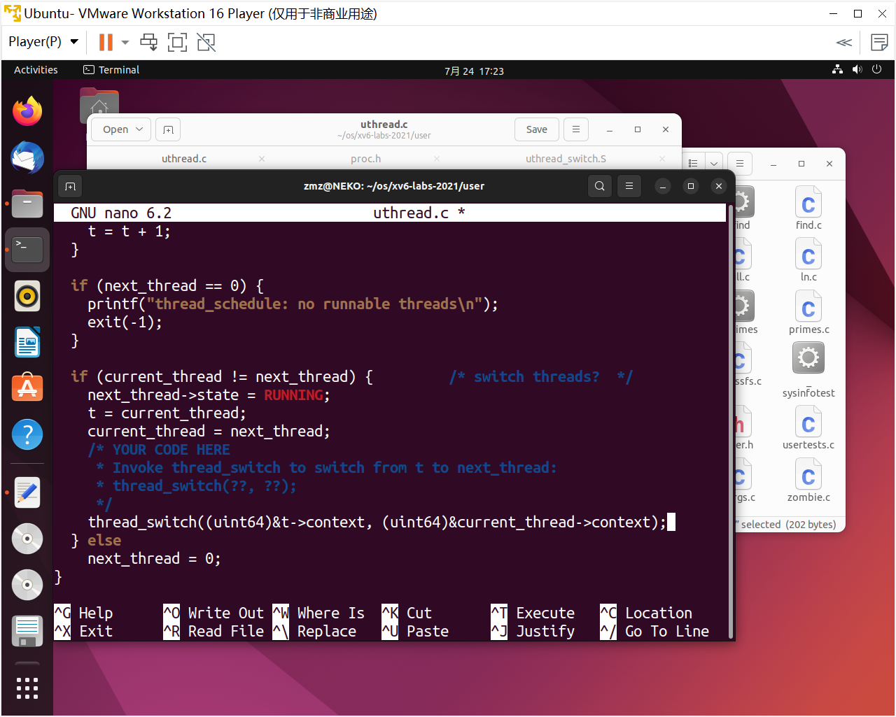

## Lab: Multithreading

#### 0. 目录

[TOC]

#### 1. Uthread: switching between threads (moderate)

##### 1.1. 实验目的

* 为用户级线程系统设计上下文切换机制，然后实现它。首先，xv6 有两个文件`user/uthread.c`和`user/uthread_switch.S`，以及`Makefile`中用于构建`uthread`程序的规则。`uthread.c`包含大部分用户级线程包，以及三个简单测试线程的代码。线程程序包缺少一些用于创建线程和在线程之间切换的代码
* 制定一个创建线程和保存/恢复寄存器以在线程之间切换的计划，并实现该计划。完成后，`make grade`应该表明解决方案通过了`uthread`测试

##### 1.2. 实验步骤

* 参考`user/proc.c`中的`struct context`结构体，定义用户线程上下文结构体

  ```c
  // Saved registers for kernel context switches.
  struct tcontext {
    uint64 ra;
    uint64 sp;
  
    // callee-saved
    uint64 s0;
    uint64 s1;
    uint64 s2;
    uint64 s3;
    uint64 s4;
    uint64 s5;
    uint64 s6;
    uint64 s7;
    uint64 s8;
    uint64 s9;
    uint64 s10;
    uint64 s11;
  };
  ```

* 在`user/uthread.c`中修改`struct thread`结构体

  

  ```c
  struct thread {
    char       stack[STACK_SIZE]; /* the thread's stack */
    int        state;             /* FREE, RUNNING, RUNNABLE */
    struct tcontext context;      /* context of user thread */
  };
  ```

* 为什么这里上下文只保存了`callee-saved`寄存器，而不保存`caller-saved`寄存器？

  * `caller-saved`在函数调用的过程中已经被编译器自动保存了，所以无需再次保存
  * 内核调度器无论是通过时钟中断进入（`usertrap`），还是线程自己主动放弃 CPU（`sleep`、`exit`），最终都会调用到 `yield` 进一步调用 `swtch`。 由于上下文切换永远都发生在函数调用的边界（`swtch` 调用的边界），恢复执行相当于是 `swtch` 的返回过程，会从堆栈中恢复 `caller-saved` 的寄存器， 所以用于保存上下文的 `context` 结构体只需保存 `callee-saved` 寄存器，以及 返回地址 `ra`、栈指针 `sp` 即可。恢复后执行到哪里是通过 `ra` 寄存器来决定的（`swtch` 末尾的 `ret` 转跳到 `ra`）
  * 而 `trapframe` 则不同，一个中断可能在任何地方发生，不仅仅是函数调用边界，也有可能在函数执行中途，所以恢复的时候需要靠 pc 寄存器来定位。 并且由于切换位置不一定是函数调用边界，所以几乎所有的寄存器都要保存（无论 `caller-saved` 还是 `callee-saved`），才能保证正确的恢复执行。 这也是内核代码中 `struct trapframe` 中保存的寄存器比 `struct context` 多得多的原因。
  * 另外，无论是程序主动 `sleep`，还是时钟中断，都是通过 `trampoline` 跳转到内核态 `usertrap`（保存 `trapframe`），然后再到达 `swtch` 保存上下文的。 恢复上下文都是恢复到 `swtch` 返回前（依然是内核态），然后返回跳转回 `usertrap`，再继续运行直到 `usertrapret` 跳转到 `trampoline` 读取 `trapframe`，并返回用户态。 也就是上下文恢复并不是直接恢复到用户态，而是恢复到内核态 `swtch` 刚执行完的状态。负责恢复用户态执行流的其实是 `trampoline` 以及 `trapframe`

* 在`user/uthread.c`中修改`thread_schedule()`函数，添加进程上下文切换的函数调用

  

  ```c
  thread_switch((uint64)&t->context, (uint64)&current_thread->context);
  ```

* 在`user/uthread.c`中修改`thread_create()`函数，添加调度器返回地址以及对应的栈指向

  

  ```c
  t->context.ra = (uint64)func;
  t->context.sp = (uint64)t->stack + STACK_SIZE;
  ```

* 参考`kernel/swtch.S`修改`user/uthread_switch.S`

  

  ```assembly
  	sd ra, 0(a0)
  	sd sp, 8(a0)
  	sd s0, 16(a0)
  	sd s1, 24(a0)
  	sd s2, 32(a0)
  	sd s3, 40(a0)
  	sd s4, 48(a0)
  	sd s5, 56(a0)
  	sd s6, 64(a0)
  	sd s7, 72(a0)
  	sd s8, 80(a0)
  	sd s9, 88(a0)
  	sd s10, 96(a0)
  	sd s11, 104(a0)
  
  	ld ra, 0(a1)
  	ld sp, 8(a1)
  	ld s0, 16(a1)
  	ld s1, 24(a1)
  	ld s2, 32(a1)
  	ld s3, 40(a1)
  	ld s4, 48(a1)
  	ld s5, 56(a1)
  	ld s6, 64(a1)
  	ld s7, 72(a1)
  	ld s8, 80(a1)
  	ld s9, 88(a1)
  	ld s10, 96(a1)
  	ld s11, 104(a1)
  ```

* 测试通过

  

##### 1.3. 实验中遇到的问题和解决办法

* 不熟悉线程原理，反复研究

##### 1.4. 实验心得

* 熟悉了线程


#### 2. Using threads (moderate)

##### 2.1. 实验目的

* 探索使用哈希表使用线程和锁进行并行编程。在具有多个核心的真实 Linux 或 MacOS 计算机（不是 xv6，不是 qemu）上执行此任务。最新的笔记本电脑都有多核处理器
* 修改代码，使一些`put`操作在保持正确性的同时并行运行。当`make grade`表示代码通过了`ph_safe`和`ph_fast`测试时，就完成了。`ph_fast`测试要求两个线程每秒的输出量至少是一个线程的1.25倍

##### 2.2. 实验步骤

* 为什么缺少2个线程的键，而没有1个线程的密钥？

  假设现在有两个线程`T1`和`T2`，两个线程都走到`put()`函数，且假设两个线程中`key%NBUCKET`相等，即要插入同一个散列桶中。两个线程同时调用`insert(key, value, &table[i], table[i])`，`insert()`是通过头插法实现的。如果先`insert()`的线程还未返回另一个线程就开始`insert()`，那么前面的数据会被覆盖

* 在给出的`ph.c`文件中，实现的是多个线程向一个哈希表进行插入，然后对插入结果进行检测。首先要保证多线程执行的安全性。在`ph.c`中定义一个锁，这个锁用于保护哈希表

  

  ```c
  pthread_mutex_t lock;
  ```

* 修改`put()`函数，在插入时先加锁，再遍历哈希表

  

  ```c
  static 
  void put(int key, int value)
  {
    int i = key % NBUCKET;
    pthread_mutex_lock(&lock);
    // is the key already present?
    struct entry *e = 0;
    for (e = table[i]; e != 0; e = e->next) {
      if (e->key == key)
        break;
    }
    if(e){
      // update the existing key.
      e->value = value;
    } else {
      // the new is new.
      insert(key, value, &table[i], table[i]);
    }
    pthread_mutex_unlock(&lock);
  }
  ```

* 修改`main()`函数，初始化锁

  

  ```c
  pthread_mutex_init(&lock, NULL);
  ```

* 可以通过`ph_safe`，但是不能通过`ph_fast`，因为锁的粒度太大，导致多个线程长期相互阻塞，没办法提高性能。所以我们可以降低锁的粒度，让哈希表的每一个桶都具有一个锁，这样只要多个线程不使用同一个桶，就不会被阻塞。修改`ph.c`中锁的定义

  

  ```c
  pthread_mutex_t lock[NKEYS];
  ```

* 修改`ph.c`中的`put()`函数，加锁时只添加对应桶的锁

  

  ```c
  static 
  void put(int key, int value)
  {
    int i = key % NBUCKET;
    pthread_mutex_lock(&lock[i]);
    // is the key already present?
    struct entry *e = 0;
    for (e = table[i]; e != 0; e = e->next) {
      if (e->key == key)
        break;
    }
    if(e){
      // update the existing key.
      e->value = value;
    } else {
      // the new is new.
      insert(key, value, &table[i], table[i]);
    }
    pthread_mutex_unlock(&lock[i]);
  }
  ```

* 修改`ph.c`中的`main()`函数，对数组中每一个锁都进行初始化

  

  ```c
  for (int i = 0; i < NKEYS; i++) {
      keys[i] = random();
      pthread_mutex_init(&lock[i], NULL);
    }
  ```

* 测试成功

  

##### 2.3. 实验中遇到的问题和解决办法

* 对加锁的位置不太清楚，多次尝试

##### 2.4. 实验心得

* 会使用锁


#### 3. Barrier(moderate)

##### 3.1. 实验目的

* 在这项任务中，将实现一个 barrier：应用程序中的一个点，所有参与线程都必须等待，直到所有其他参与线程也到达该点
* 使用`pthread`条件变量，这是一种类似于 xv6 的睡眠和唤醒的序列协调技术
* 2指定了在`barrier.c`中同步的线程数（`nthread`）。每个线程执行一个循环。在每次循环迭代中，一个线程调用`barrier()`，然后休眠随机数微秒。`assert`触发，因为一个线程在另一个线程到达 barrier 之前就离开了 barrier。所需的行为是每个线程在`barrier()`中阻塞，直到所有`nthreads`都调用了`barrier()`
* 目标是实现所需的 barrier 行为

##### 3.2. 实验步骤

* 修改`barrier.c`来实现类似与`sleep`和`wakeup`的功能。每个进程执行到`barrier()`时都会阻塞，当全部进程都被阻塞时，唤醒全部进程，并将阻塞的`round`加一

  

  ```c
  static void 
  barrier()
  {
    // YOUR CODE HERE
    //
    // Block until all threads have called barrier() and
    // then increment bstate.round.
    //
    pthread_mutex_lock(&bstate.barrier_mutex);
    bstate.nthread++;
    if (bstate.nthread < nthread)
    {
      pthread_cond_wait(&bstate.barrier_cond, &bstate.barrier_mutex);
    }
    else
    {
      bstate.nthread = 0;
      bstate.round++;
      pthread_cond_broadcast(&bstate.barrier_cond);
    }
    pthread_mutex_unlock(&bstate.barrier_mutex);
  }
  ```

* 测试通过

  

##### 3.3. 实验中遇到的问题和解决办法

* 原理不清，反复研读

##### 3.4. 实验心得

* 学会了线程之间的控制


#### Submit

测试点AC

