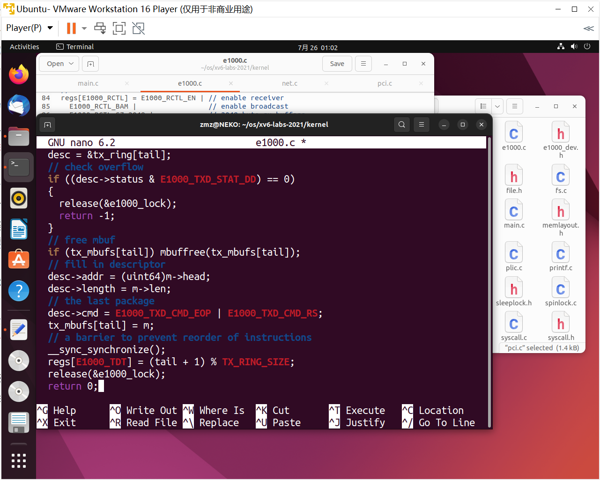
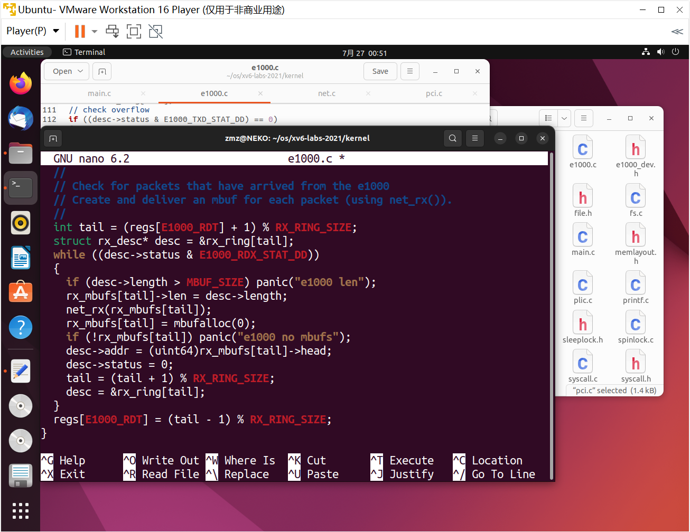
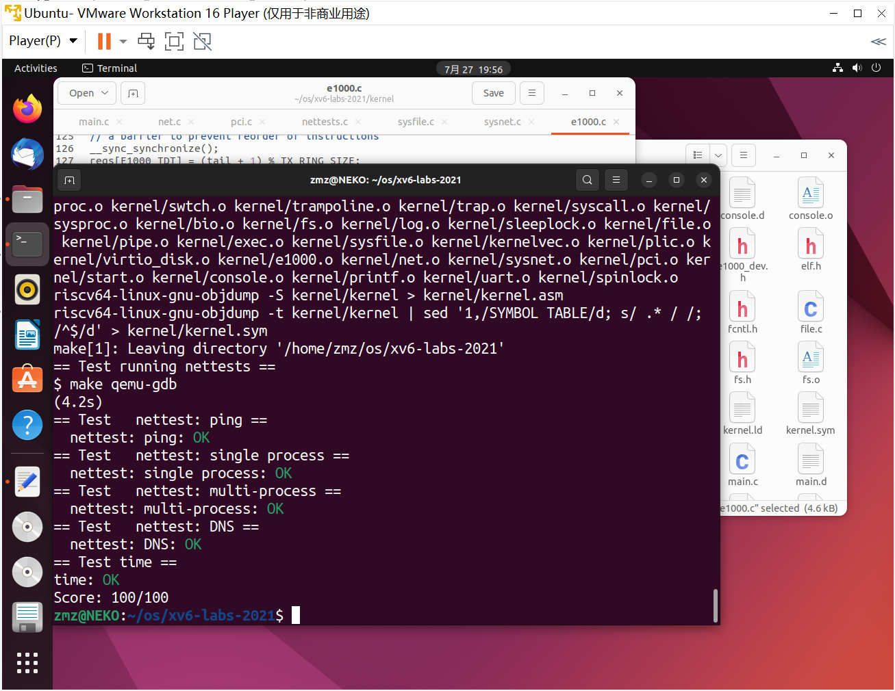

## Lab: networking

#### 0. 目录

[TOC]

#### 1. Your Job (hard)

##### 1.1. 实验目的

* 使用一种名为 E1000 的网络设备来处理网络通信。对于 xv6（以及编写的驱动程序）来说，E1000 看起来像是连接到真实以太网局域网（LAN）的真实硬件。事实上，驱动程序将与之交谈的 E1000 是由 qemu 提供的模拟，连接到一个也由 qemu 模拟的 LAN。在这个模拟局域网上，xv6（“guest”）的 IP 地址为`10.0.2.15`。qemu 还安排运行 qemu 的计算机出现在 IP 地址为`10.0.2.2`的局域网上。当 xv6 使用 E1000 向`10.0.2.2`发送数据包时，qemu 会将数据包传递到运行 qemu 的（真实）计算机（“host”）上的相应应用程序
* 在`kernel/e1000.c`中完成`e1000_transmit()`和`e1000_recv()`，以便驱动程序可以发送和接收数据包。当成绩表明解决方案通过了所有测试时，就完成了

##### 1.2. 实验步骤

* 学习。参考资料：[中文笔记](https://cjdhy.blog.csdn.net/article/details/131677375)、[原版手册](https://pdos.csail.mit.edu/6.828/2021/readings/8254x_GBe_SDM.pdf)

* 本实验的关键在于理解 E1000 网卡硬件与驱动软件的交互逻辑以及相关的数据结构，实验要求实现的两个函数：

  * 一个对于网卡驱动发送数据
  * 一个对于驱动接收数据

  在驱动的数据结构中, 主要为发送和接收数据的两个循环队列。其中每个队列实际上又分为描述符队列和缓冲区指针队列, 缓冲区队列依附于描述符队列, 同时有网卡寄存器记录着队列的首尾指针, 这种设计遵循传统的驱动设计方案, 首指针由硬件管理, 尾指针有软件管理, 二者通过队列满足并发的需要

* 待实现的 `e1000_transmit()` 函数用于将要发送的数据放入循环队列尾部, 后续由网卡硬件将数据包进行发送：
  * 根据函数调用关系, 最上层是通过文件描述符的 `filewrite()` 函数调用到写套接字函数 `sockwrite()`
  * 在该函数中会通过 `mbufalloc()` 函数分配一个缓冲区用于写入数据
  * 接着会嵌套调用 `net_tx_udp(), net_tx_ip()` 以及 `net_tx_eth()` 函数, 依次进行 UDP 报文, IP 数据包以及以太网帧的封装
  * 最终在 `net_tx_eth()` 中调用 `e1000_transmit()` 发送数据到网卡的发送队列, 后续再由网卡硬件完成发送

* 待实现的 `e1000_recv()` 函数则是由网卡的中断处理程序 `e1000_intr()` 调用:
  * 即网卡硬件收到数据（以太网帧）后会触发中断, 由中断处理程序对数据进行处理
  * 在 `e1000_recv()` 中会调用 `net_rx()` 对收到的数据帧进行解封装
  * 之后会根据数据包类型分别调用 `net_rx_ip()` 或 `net_rx_arp()` 进行 IP 数据包或 ARP 数据包的解封装
  * 对于 IP 数据包, 会进一步调用 `net_rx_udp()` 解封装 UDP 报文, 然后调用 `sockrecvudp()` 函数
  * 其中会调用 `mbufq_pushtail()` 函数将报文放入一个队列, 在使用 `sockread()` 读取报文时, 实际上就是通过 `mbufq_pophead()` 函数从该队列中取出一个报文内容
  * 而若队列为空, 则会将线程休眠直至队列有数据时被唤醒. 而对于 ARP 报文, 其本身不再有传输层报文, 而是会调用 `net_tx_arp()` 进行一个 ARP 报文的回复

* 待实现的两个函数的作用即驱动程序将以太网帧写入驱动的发送队列, 或是将以太网帧从驱动的接收队列取出并解封装

* 实现 `e1000_transmit` 的一些提示：

  * 首先，通过读取 `E1000_TDT` 控制寄存器，向 E1000 询问其期望下一个数据包的 TX 环索引
  * 然后检查环是否溢出。如果 `E1000_TDT` 索引的描述符中没有设置 `E1000_TXD_STAT_DD`，则 E1000 没有完成相应的先前传输请求，因此返回错误
  * 否则，使用 `mbuffree()` 释放从该描述符传输的最后一个 mbuf（如果有的话）
  * 然后填写描述符。`m->head` 指向内存中数据包的内容，`m->len` 是数据包的长度。设置必要的 cmd 标志（请参阅 E1000 手册中的第3.3节），并隐藏一个指向 mbuf 的指针，以便稍后释放
  * 最后，通过在 `E1000_TDT` 模 `TX_ring_SIZE` 上加一来更新环位置
  * 如果 `e1000_transmit()` 将 mbuf 成功添加到环中，则返回0。失败时（例如，没有描述符可用于传输 mbuf），返回-1，以便调用者知道释放 mbuf

  

  ```c
  int
  e1000_transmit(struct mbuf *m)
  {
    //
    // Your code here.
    //
    // the mbuf contains an ethernet frame; program it into
    // the TX descriptor ring so that the e1000 sends it. Stash
    // a pointer so that it can be freed after sending.
    //
    uint32 tail;
    struct tx_desc* desc;
  
    acquire(&e1000_lock);
    tail = regs[E1000_TDT];
    desc = &tx_ring[tail];
    // check overflow
    if ((desc->status & E1000_TXD_STAT_DD) == 0)
    {
      release(&e1000_lock);
      return -1;
    }
    // free mbuf
    if (tx_mbufs[tail]) mbuffree(tx_mbufs[tail]);
    // fill in descriptor
    desc->addr = (uint64)m->head;
    desc->length = m->len;
    // the last package
    desc->cmd = E1000_TXD_CMD_EOP | E1000_TXD_CMD_RS;
    tx_mbufs[tail] = m;
    // a barrier to prevent reorder of instructions
    __sync_synchronize();
    regs[E1000_TDT] = (tail + 1) % TX_RING_SIZE;
    release(&e1000_lock);
    return 0;
  }
  ```

* 实现 `e1000_recv` 的一些提示：

  * 首先，通过获取 `E1000_RDT` 控制寄存器并加一个模 `RX_ring_SIZE`，向 E1000 询问下一个等待接收的数据包（如果有的话）所在的环索引
  * 然后通过检查描述符的 `status` 部分中的 `E1000_RXD_STAT_DD` 比特来检查新分组是否可用。如果没有，请停止
  * 否则，将 mbuf 的 `m->len` 更新为描述符中报告的长度。使用 `net_rx()` 将 mbuf 传递到网络堆栈
  * 然后使用 `mbufalloc()` 分配一个新的 mbuf，以替换刚刚给 `net_rx()` 的 mbuf。将其数据指针（`m->head`）编程到描述符中。将描述符的状态位清除为零
  * 最后，将 `E1000_RDT` 寄存器更新为处理的最后一个环形描述符的索引
  * `e1000_init()` 使用 mbufs 初始化 RX 环，需要了解它是如何做到这一点的，也许还需要借用代码
  * 在某个时刻，曾经到达的分组的总数将超过环大小（16）；请确保代码能够处理此问题

  

  ```c
  static void
  e1000_recv(void)
  {
    //
    // Your code here.
    //
    // Check for packets that have arrived from the e1000
    // Create and deliver an mbuf for each packet (using net_rx()).
    //
    int tail = (regs[E1000_RDT] + 1) % RX_RING_SIZE;
    struct rx_desc* desc = &rx_ring[tail];
    while ((desc->status & E1000_RDX_STAT_DD))
    {
      if (desc->length > MBUF_SIZE) panic("e1000 len");
      rx_mbufs[tail]->len = desc->length;
      net_rx(rx_mbufs[tail]);
      rx_mbufs[tail] = mbufalloc(0);
      if (!rx_mbufs[tail]) panic("e1000 no mbufs");
      desc->addr = (uint64)rx_mbufs[tail]->head;
      desc->status = 0;
      tail = (tail + 1) % RX_RING_SIZE;
      desc = &rx_ring[tail];
    }
    regs[E1000_RDT] = (tail - 1) % RX_RING_SIZE;
  }
  ```

##### 1.3. 实验中遇到的问题和解决办法

* 基础知识不牢，自学计算机网络

##### 1.4. 实验心得

* 学习了计算机网络


#### Submit

测试点AC



