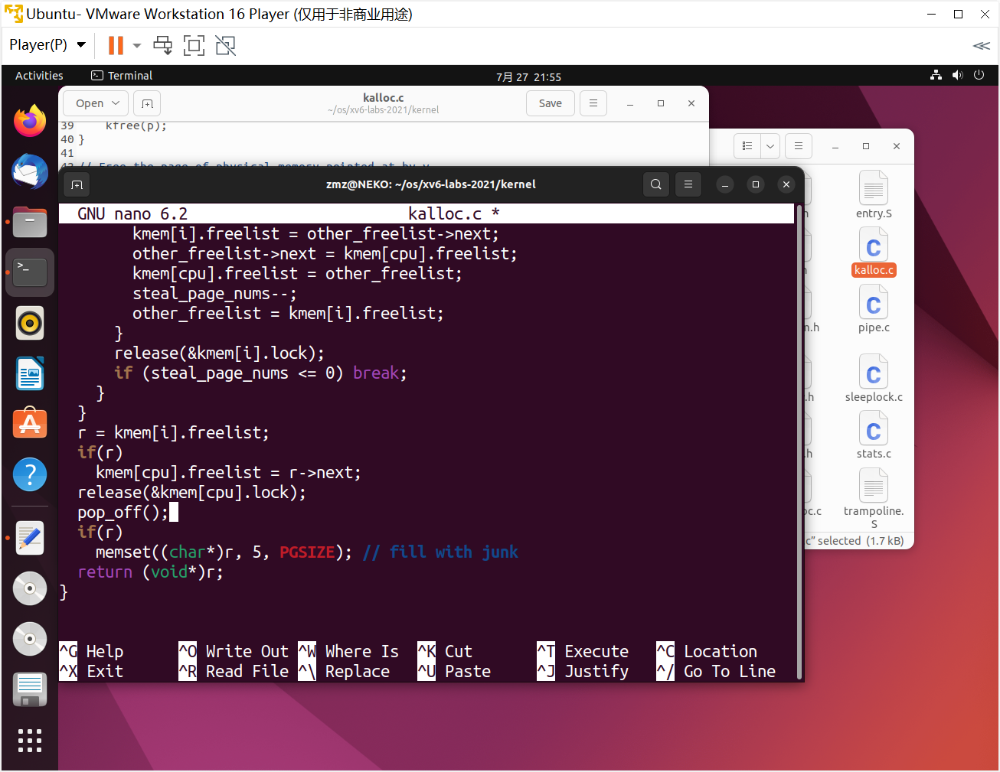
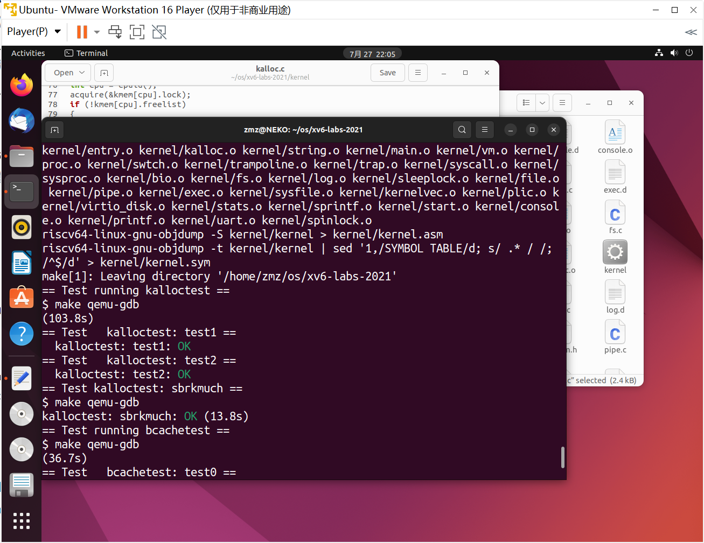
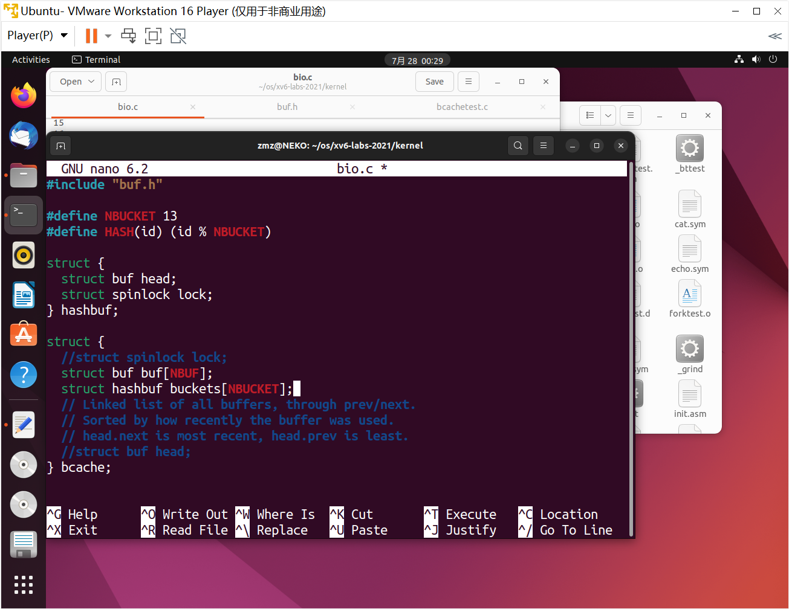
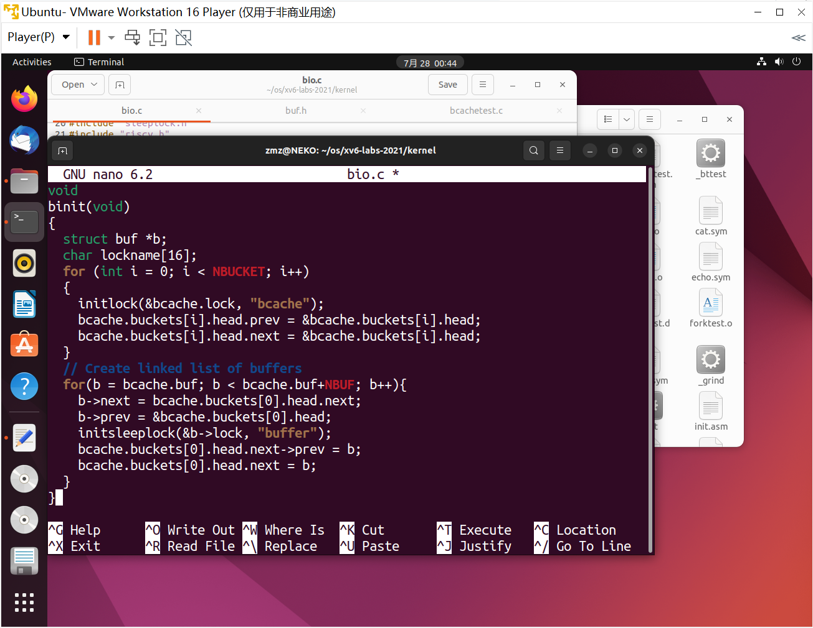
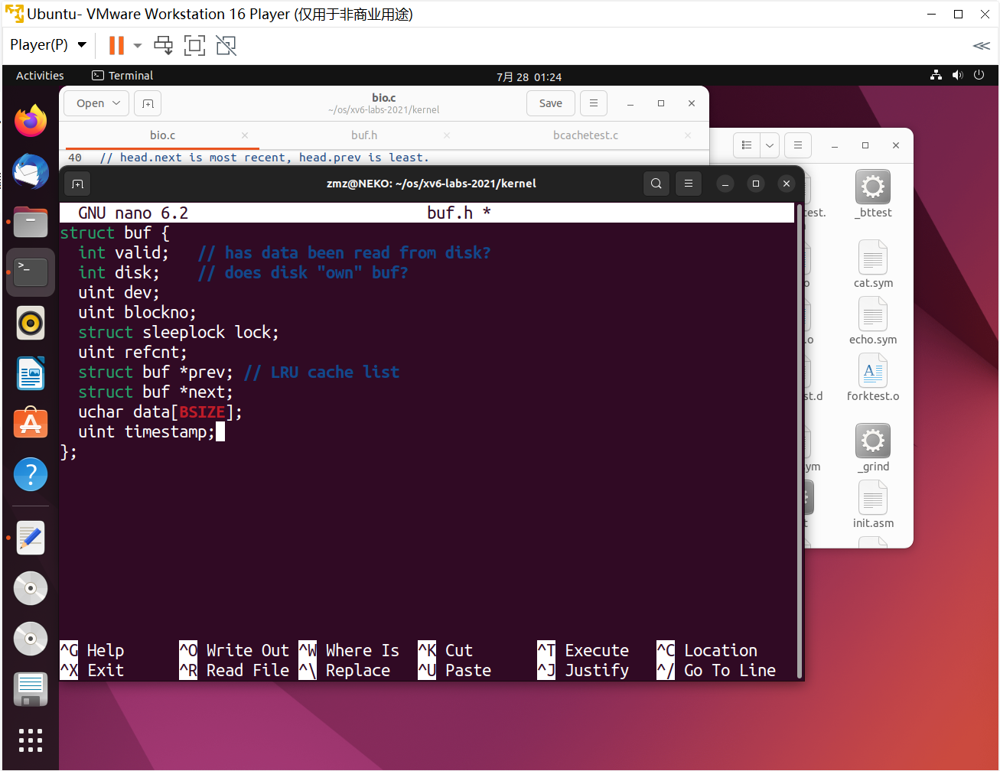
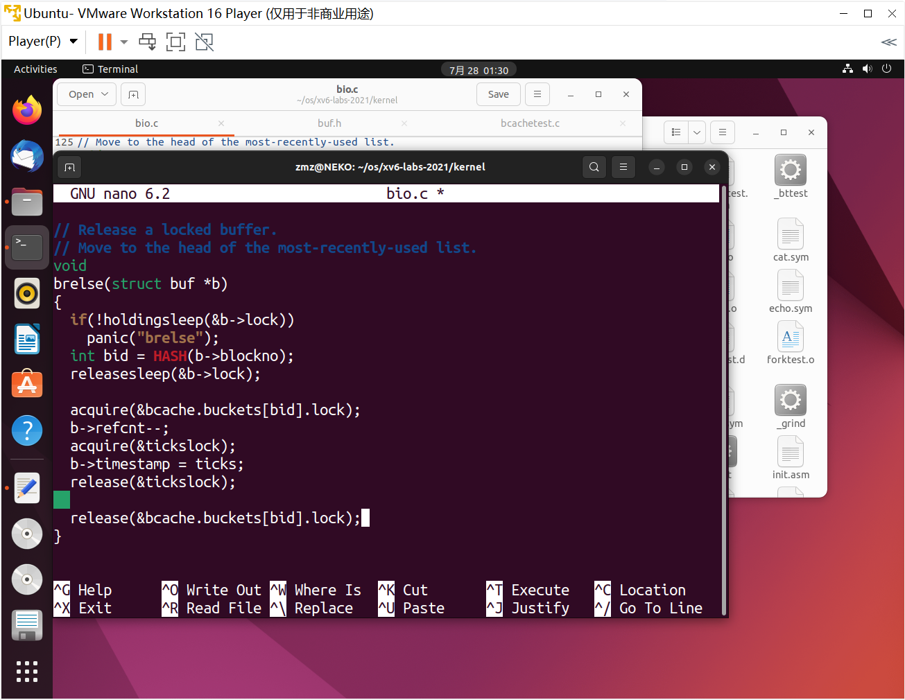
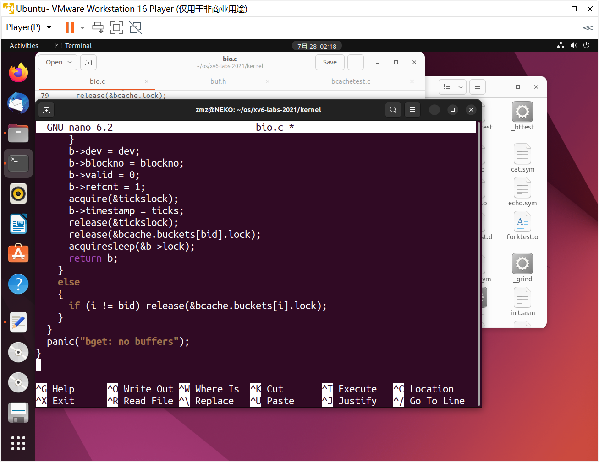
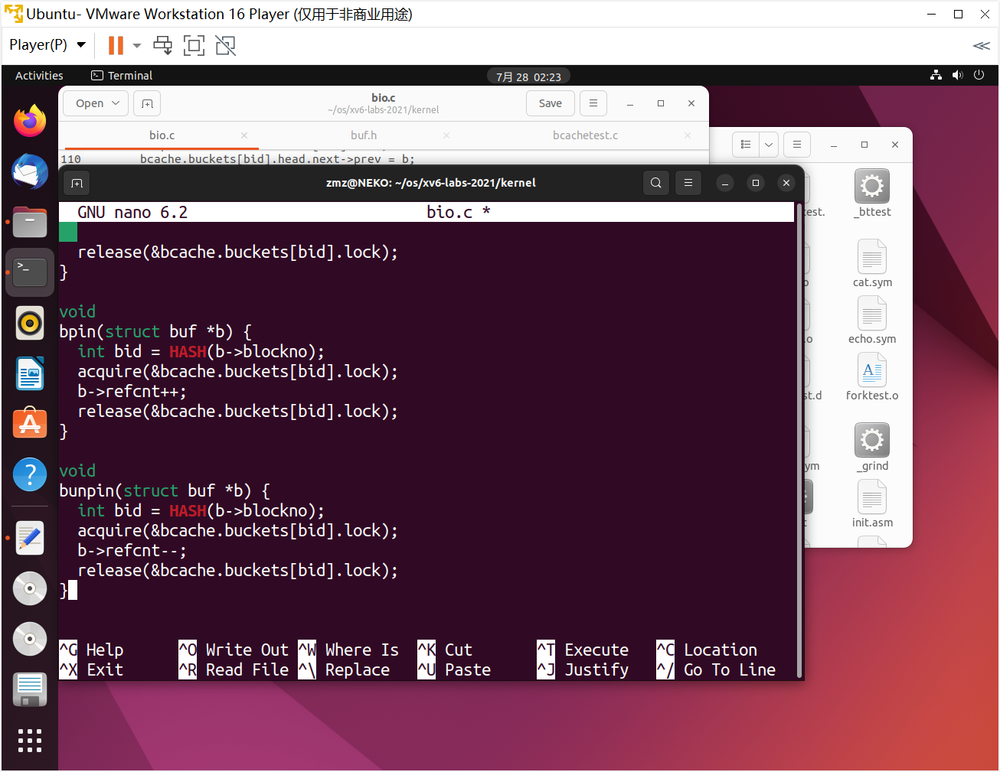
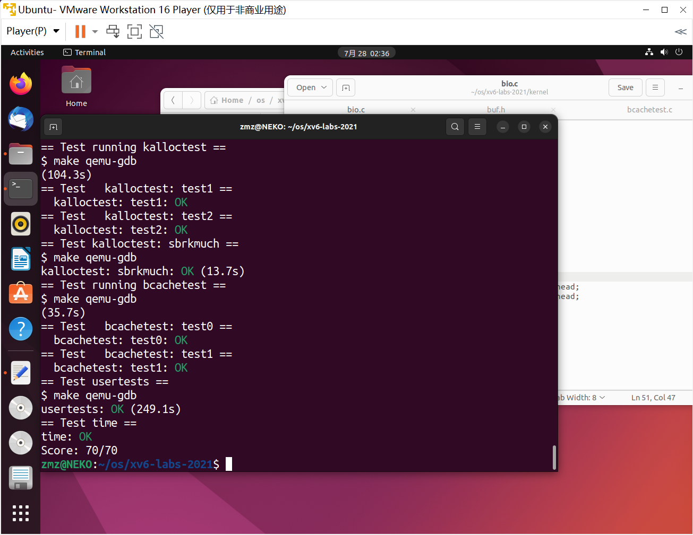

## Lab: locks

#### 0. 目录

[TOC]

#### 1. Memory allocator (moderate)

##### 1.1. 实验目的

* 程序 `user/kaloctest` 强调 xv6 的内存分配器：三个进程的地址空间不断增加和缩小，导致对 `kalloc` 和 `kfree` 的多次调用。`kalloc` 和 `kfree` 获得 `kmem.lock`。`kalloctest` 打印（作为“`#fetch and add`”）由于试图获取另一个核心已经持有的锁而导致的获取中的循环迭代次数，用于 `kmem` 锁和其他一些锁。`acquire` 中的循环迭代次数是锁争用的粗略度量
* `acquire` 为每个锁维护要为该锁 `acquire` 的调用计数，以及 `acquire` 中的循环尝试但未能设置锁的次数。`kalloctest` 调用一个系统调用，使内核打印 `kmem` 和 `bcache` 锁（这是本 lab 的重点）以及5个争用最多的锁的计数。如果存在锁争用，则 `acquire` 循环迭代的次数将很大。系统调用返回 `kmem` 和 `bcache` 锁的循环迭代次数之和
* 对于这个 lab，必须使用一台带有多个核心的专用空载机器。如果使用一台正在做其他事情的机器，`kalloctest` 打印的计数将是无稽之谈。可以使用专用的 Athena 工作站，或者自己的笔记本电脑，但不要使用拨号机
* `kalloctest` 中锁争用的根本原因是 `kalloc()` 有一个单独的空闲列表，由一个锁保护。要消除锁争用，必须重新设计内存分配器，以避免出现单个锁和列表。基本思想是为每个 CPU 维护一个空闲列表，每个列表都有自己的锁。不同 CPU 上的分配和释放可以并行运行，因为每个 CPU 将在不同的列表上运行。主要的挑战将是处理这样的情况：一个 CPU 的空闲列表是空的，但另一个 CPU 列表有空闲内存；在这种情况下，一个 CPU 必须“窃取”另一个 CPU 空闲列表的一部分。窃取可能会引入锁争用，但希望这种情况不会发生
* 实现每个 CPU 的空闲列表，并在 CPU 的空闲清单为空时进行窃取。必须提供所有以“`kmem`”开头的锁名称。也就是说，应该为每个锁调用 `initlock`，并传递一个以“`kmem`”开头的名称。运行 `kalloctest` 查看您的实现是否减少了锁争用。要检查它是否仍然可以分配所有内存，请运行 `usertests-sbrkmuch`。确保 `usertests` 中的所有测试都通过。`make grade` 应该表示 `kalloctests` 通过

##### 1.2. 实验步骤

* 修改 `kernel/kalloc.c`，提高内存分配的性能，为每个 CPU 分配空闲列表，需要分配内存时，若当前 CPU 空闲列表存在可用内存，则只需要对当前 CPU 列表进行加锁，不会影响其他 CPU 的执行，提高并行性能

  

  ```c
  struct {
    struct spinlock lock;
    struct run *freelist;
  } kmem[NCPU];
  
  void
  kinit()
  {
    for (int i = 0; i < NCPU; i++) initlock(&kmem[i].lock, "kmem");
    freerange(end, (void*)PHYSTOP);
  }
  
  // Free the page of physical memory pointed at by v,
  // which normally should have been returned by a
  // call to kalloc().  (The exception is when
  // initializing the allocator; see kinit above.)
  void
  kfree(void *pa)
  {
    struct run *r;
  
    if(((uint64)pa % PGSIZE) != 0 || (char*)pa < end || (uint64)pa >= PHYSTOP)
      panic("kfree");
  
    // Fill with junk to catch dangling refs.
    memset(pa, 1, PGSIZE);
  
    r = (struct run*)pa;
  
    push_off();
    int cpu = cpuid();
    acquire(&kmem[cpu].lock);
    r->next = kmem[cpu].freelist;
    kmem[cpu].freelist = r;
    release(&kmem[cpu].lock);
    pop_off();
  }
  
  // Allocate one 4096-byte page of physical memory.
  // Returns a pointer that the kernel can use.
  // Returns 0 if the memory cannot be allocated.
  void *
  kalloc(void)
  {
    struct run *r;
    push_off();
    int cpu = cpuid();
    acquire(&kmem[cpu].lock);
    if (!kmem[cpu].freelist)
    {
      int steal_page_nums = 64;
      for (int i = 0; i < NCPU; i++)
      {
        if (i == cpu) continue;
        acquire(&kmem[i].lock);
        struct run* other_freelist = kmem[i].freelist;
        while (other_freelist && steal_page_nums > 0)
        {
  	kmem[i].freelist = other_freelist->next;
  	other_freelist->next = kmem[cpu].freelist;
  	kmem[cpu].freelist = other_freelist;
  	steal_page_nums--;
  	other_freelist = kmem[i].freelist;
        }
        release(&kmem[i].lock);
        if (steal_page_nums <= 0) break;
      }
    }
    r = kmem[i].freelist;
    if(r)
      kmem[cpu].freelist = r->next;
    release(&kmem[cpu].lock);
    pop_off();
    if(r)
      memset((char*)r, 5, PGSIZE); // fill with junk
    return (void*)r;
  }
  ```

* 测试成功

  

##### 1.3. 实验中遇到的问题和解决办法

* 理解不全面，仔细思考

##### 1.4. 实验心得

* 学习了锁的知识


#### 2. Buffer cache (hard)

##### 2.1. 实验目的

* 这一半任务独立于前一半任务；无论是否完成了前半部分，都可以在这半部分工作（并通过测试）
* 如果多个进程密集使用文件系统，它们可能会争夺 `bcache.lock`，后者保护 `kernel/bio.c` 中的磁盘块缓存。`bcachetest` 创建了多个进程，这些进程重复读取不同的文件，以在 `bcache.lock` 上产生争用
* 可能会看到不同的输出，但 `bcache` 锁的 `acquire` 循环迭代次数会很高。如果查看 `kernel/bio.c` 中的代码，会发现 `bcache.lock` 保护缓存的块缓冲区列表、每个块缓冲区中的引用计数（`b->refcnt`）以及缓存块的标识（`b->dev` 和 `b->blockno`）
* 修改块缓存，以便在运行 `bcachetest` 时，bcache 中所有锁的 `acquire` 循环迭代次数接近于零。理想情况下，块缓存中涉及的所有锁的计数之和应该为零，但如果总和小于500也可以。修改 `bget` 和 `brelse`，使 `bcache` 中不同块的并发查找和释放不太可能在锁上发生冲突（例如，不必全部等待 `bcache.lock`）。必须保持不变，即每个块最多缓存一个副本。确保 `usertests` 仍然通过。当完成所有测试时，`make grade` 应该通过所有测试
* 请给出所有以“`bcache`”开头的锁名。也就是说，应该为每个锁调用 `initlock`，并传递一个以“`bcache`”开头的名称
* 减少块缓存中的争用比 `kalloc` 更为棘手，因为 `bcache` 缓冲区在进程（以及 CPU）之间是真正共享的。对于 `kalloc`，可以通过给每个 CPU 自己的分配器来消除大多数争用；这对块缓存不起作用。我们建议使用每个哈希桶都有锁的哈希表在缓存中查找块号
* 在某些情况下，如果解决方案存在锁冲突，也可以：
  * 当两个进程同时使用相同的块号时。`bcachetest test0` 从不执行此操作
  * 当两个进程同时在缓存中未命中，并且需要找到一个未使用的块来替换时。`bcachetest test0` 从不执行此操作
  * 当两个进程同时使用冲突的块时，无论使用什么方案来划分块和锁；例如，如果两个进程使用的块的块号哈希到哈希表中的同一个槽。`bcachetest test0` 可能会这样做，这取决于设计，但应该尝试调整方案的详细信息以避免冲突（例如，更改哈希表的大小）

* `bcachetest` 的 `test1` 使用了比缓冲区更多的不同块，并练习了许多文件系统代码路径

##### 2.2. 实验步骤

* 在 `kernel/bio.c` 中定义哈希桶结构，并在`bcache`中删除全局缓冲区链表，改为使用素数个散列桶

  

  ```c
  #define NBUCKET 13
  #define HASH(id) (id % NBUCKET)
  
  struct hashbuf {
    struct buf head;
    struct spinlock lock;
  };
  
  struct {
    //struct spinlock lock;
    struct buf buf[NBUF];
    struct hashbuf buckets[NBUCKET];
    // Linked list of all buffers, through prev/next.
    // Sorted by how recently the buffer was used.
    // head.next is most recent, head.prev is least.
    //struct buf head;
  } bcache;
  ```

* 在 `kernel/bio.c` 中的 `binit` 中，初始化散列桶的锁，将所有散列桶的 `head->prev`、`head->next` 都指向自身表示为空，将所有的缓冲区挂载到 `bucket[0]` 桶上

  

  ```c
  void
  binit(void)
  {
    struct buf *b;
    char lockname[16];
    for (int i = 0; i < NBUCKET; i++)
    {
      initlock(&bcache.buckets[i].lock, lockname);
      bcache.buckets[i].head.prev = &bcache.buckets[i].head;
      bcache.buckets[i].head.next = &bcache.buckets[i].head;
    }
    // Create linked list of buffers
    for(b = bcache.buf; b < bcache.buf+NBUF; b++){
      b->next = bcache.buckets[0].head.next;
      b->prev = &bcache.buckets[0].head;
      initsleeplock(&b->lock, "buffer");
      bcache.buckets[0].head.next->prev = b;
      bcache.buckets[0].head.next = b;
    }
  }
  ```

* 在 `buf.h` 中增加新字段 `timestamp`，这里来理解一下这个字段的用途：在原始方案中，每次 `brelse` 都将被释放的缓冲区挂载到链表头，表明这个缓冲区最近刚刚被使用过，在 `bget` 中分配时从链表尾向前查找，这样符合条件的第一个就是最久未使用的。而在提示中建议使用时间戳作为 LRU 判定的法则，这样我们就无需在 `brelse` 中进行头插法更改结点位置

  

  ```c
  struct buf {
    int valid;   // has data been read from disk?
    int disk;    // does disk "own" buf?
    uint dev;
    uint blockno;
    struct sleeplock lock;
    uint refcnt;
    struct buf *prev; // LRU cache list
    struct buf *next;
    uchar data[BSIZE];
    uint timestamp;
  };
  ```

* 在 `kernel/bio.c` 中更改 `brelse`，不再获取全局锁

  

  ```c
  // Release a locked buffer.
  // Move to the head of the most-recently-used list.
  void
  brelse(struct buf *b)
  {
    if(!holdingsleep(&b->lock))
      panic("brelse");
    int bid = HASH(b->blockno);
    releasesleep(&b->lock);
  
    acquire(&bcache.buckets[bid].lock);
    b->refcnt--;
    acquire(&tickslock);
    b->timestamp = ticks;
    release(&tickslock);
    
    release(&bcache.buckets[bid].lock);
  }
  ```

* 在 `kernel/bio.c` 中更改 `bget`，当没有找到指定的缓冲区时进行分配，分配方式是优先从当前列表遍历，找到一个没有引用且 `timestamp` 最小的缓冲区，如果没有就申请下一个桶的锁，并遍历该桶，找到后将该缓冲区从原来的桶移动到当前桶中，最多将所有桶都遍历完。在代码中要注意锁的释放

  

  ```c
  // Look through buffer cache for block on device dev.
  // If not found, allocate a buffer.
  // In either case, return locked buffer.
  static struct buf*
  bget(uint dev, uint blockno)
  {
    struct buf *b;
    int bid = HASH(blockno);
    acquire(&bcache.buckets[bid].lock);
  
    // Is the block already cached?
    for(b = bcache.buckets[bid].head.next; b != &bcache.buckets[bid].head; b = b->next){
      if(b->dev == dev && b->blockno == blockno){
        b->refcnt++;
        acquire(&tickslock);
        b->timestamp = ticks;
        release(&tickslock);
        release(&bcache.buckets[bid].lock);
        acquiresleep(&b->lock);
        return b;
      }
    }
  
    // Not cached.
    b = 0;
    struct buf* tmp;
    // Recycle the least recently used (LRU) unused buffer.
    for (int i = bid, cycle = 0; cycle != NBUCKET; i = (i + 1) % NBUCKET)
    {
      cycle++;
      if (i != bid)
      {
        if (!holding(&bcache.buckets[i].lock)) acquire(&bcache.buckets[i].lock);
        else continue;
      }
      for (tmp = bcache.buckets[i].head.next; tmp != &bcache.buckets[i].head; tmp = tmp->next) if (tmp->refcnt == 0 && (b == 0 || tmp->timestamp < b->timestamp)) b = tmp;
      if (b)
      {
        if (i != bid)
        {
  	b->next->prev = b->prev;
  	b->prev->next = b->next;
  	release(&bcache.buckets[i].lock);
  	b->next = bcache.buckets[bid].head.next;
  	b->prev = &bcache.buckets[bid].head;
  	bcache.buckets[bid].head.next->prev = b;
  	bcache.buckets[bid].head.next = b;
        }
        b->dev = dev;
        b->blockno = blockno;
        b->valid = 0;
        b->refcnt = 1;
        acquire(&tickslock);
        b->timestamp = ticks;
        release(&tickslock);
        release(&bcache.buckets[bid].lock);
        acquiresleep(&b->lock);
        return b;
      }
      else
      {
        if (i != bid) release(&bcache.buckets[i].lock);
      }
    }
    panic("bget: no buffers");
  }
  ```

* 在 `kernel/bio.c` 中修改 `bpin()` 和 `bunpin()` 函数

  

  ```c
  void
  bpin(struct buf *b) {
    int bid = HASH(b->blockno);
    acquire(&bcache.buckets[bid].lock);
    b->refcnt++;
    release(&bcache.buckets[bid].lock);
  }
  
  void
  bunpin(struct buf *b) {
    int bid = HASH(b->blockno);
    acquire(&bcache.buckets[bid].lock);
    b->refcnt--;
    release(&bcache.buckets[bid].lock);
  }
  ```

* 测试成功

  

##### 2.3. 实验中遇到的问题和解决办法

* 对死锁的认识不够深刻，重读教材

##### 2.4. 实验心得

* 深刻认识了死锁


#### Submit

测试点AC

