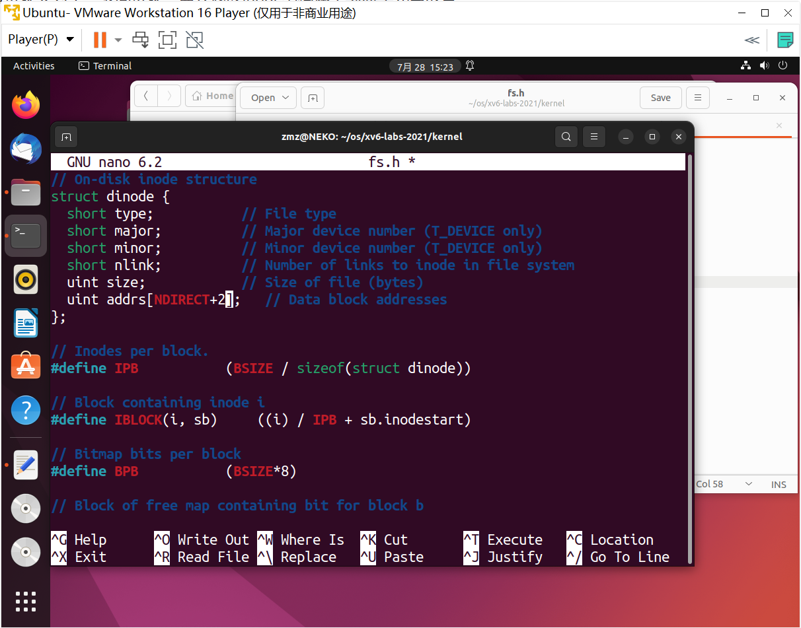

## Lab: file system

#### 0. 目录

[TOC]

#### 1. Large files (moderate)

##### 1.1. 实验目的

* 增加 xv6 文件的最大大小。当前，xv6 文件被限制为 268 个块或 268*BSIZE 字节（在 xv6 中，BSIZE 为 1024）。这个限制来自于这样一个事实，即 xv6 inode 包含 12 个“直接”块号和一个“单间接”块号，即一个最多可容纳 256 个块号的块，总共 12+256=268 个块
* 更改 xv6 文件系统代码，以便在每个 inode 中支持一个“双间接”块，该块包含 256 个单间接块地址，每个单间接块最多可以包含 256 个数据块地址。结果是，一个文件将能够由多达 65803 个块组成，或 256*256+256+11 个块（11 个而不是 12 个，因为我们将为双间接块牺牲一个直接块号）
* 磁盘上 inode 的格式由 `fs.h` 中的 `struct-dinode` 定义。对 `NDIRECT`、`NINDDIRECT`、`MAXFILE` 和 `struct-danode` 的 `addrs[]` 元素特别感兴趣。请参阅 xv6 文本中的图8.3，以获取标准 xv6 索引节点的关系图
* 在磁盘上查找文件数据的代码位于 `fs.c` 中的 `bmap()` 中。请查看它并确保了解它在做什么。在读取和写入文件时都会调用 `bmap()`。写入时，`bmap()` 会根据需要分配新的块来保存文件内容，如果需要，还会分配一个间接块来保存块地址
* `bmap()` 处理两种块号。`bn` 参数是一个“逻辑块号”，即文件中相对于文件开头的块号。`ip->addrs[]` 中的块号和 `bread()` 的参数都是磁盘块号。可以将 `bmap()` 视为将文件的逻辑块号映射到磁盘块号
* 修改 `bmap()`，使其除了实现直接块和单间接块外，还实现双间接块。必须只有 11 个直接区块，而不是 12 个，才能为新的双重间接区块腾出空间；不允许更改磁盘上 inode 的大小。`ip->addrs[]` 的前 11 个元素应该是直接块；第 12 个应该是一个单独的间接块（就像当前的块一样）；13 号应该是新的双间接挡。当 `bigfile` 写入 65803 个块并且用户测试成功运行时，就完成了此练习

##### 1.2. 实验步骤

* 在 `kernel/fs.h` 中添加宏定义

  

  ```c
  #define NDIRECT 11
  #define NINDIRECT (BSIZE / sizeof(uint))
  #define NDINDIRECT ((BSIZE / sizeof(uint)) * (BSIZE / sizeof(uint)))
  #define MAXFILE (NDIRECT + NINDIRECT + NDINDIRECT)
  #define NADDR_PER_BLOCK (BSIZE / sizeof(uint))
  ```

* 由于 `NDIRECT` 定义改变，其中一个直接块变为了二级间接块，需要修改 inode 结构体中 `addrs` 元素数量。在 `kernel/fs.h` 和 `kernel/file.h` 中修改

  

  ```c
  // On-disk inode structure
  struct dinode {
    short type;           // File type
    short major;          // Major device number (T_DEVICE only)
    short minor;          // Minor device number (T_DEVICE only)
    short nlink;          // Number of links to inode in file system
    uint size;            // Size of file (bytes)
    uint addrs[NDIRECT+2];   // Data block addresses
  };
  ```

  

  ```c
  // in-memory copy of an inode
  struct inode {
    uint dev;           // Device number
    uint inum;          // Inode number
    int ref;            // Reference count
    struct sleeplock lock; // protects everything below here
    int valid;          // inode has been read from disk?
  
    short type;         // copy of disk inode
    short major;
    short minor;
    short nlink;
    uint size;
    uint addrs[NDIRECT+2];
  };
  ```

* 在 `kernel/fs.c` 中修改 `bmap()` 支持二级索引

  

  ```c
  // Return the disk block address of the nth block in inode ip.
  // If there is no such block, bmap allocates one.
  static uint
  bmap(struct inode *ip, uint bn)
  {
    uint addr, *a;
    struct buf *bp;
  
    if(bn < NDIRECT){
      if((addr = ip->addrs[bn]) == 0)
        ip->addrs[bn] = addr = balloc(ip->dev);
      return addr;
    }
    bn -= NDIRECT;
  
    if(bn < NINDIRECT){
      // Load indirect block, allocating if necessary.
      if((addr = ip->addrs[NDIRECT]) == 0)
        ip->addrs[NDIRECT] = addr = balloc(ip->dev);
      bp = bread(ip->dev, addr);
      a = (uint*)bp->data;
      if((addr = a[bn]) == 0){
        a[bn] = addr = balloc(ip->dev);
        log_write(bp);
      }
      brelse(bp);
      return addr;
    }
    bn -= NINDIRECT;
  
    if (bn < NDINDIRECT)
    {
      int level2_idx = bn / NADDR_PER_BLOCK;
      int level1_idx = bn % NADDR_PER_BLOCK;
      if ((addr = ip->addrs[NDIRECT + 1]) == 0) ip->addrs[NDIRECT + 1] = addr = balloc(ip->dev);
      bp = bread(ip->dev, addr);
      a = (uint*)bp->data;
  
      if ((addr = a[level2_idx]) == 0)
      {
        a[level2_idx] = addr = balloc(ip->dev);
        log_write(bp);
      }
      brelse(bp);
  
      bp = bread(ip->dev, addr);
      a = (uint*)bp->data;
      if ((addr = a[level1_idx]) == 0)
      {
        a[level1_idx] = addr = balloc(ip->dev);
        log_write(bp);
      }
      brelse(bp);
      return addr;
    }
    panic("bmap: out of range");
  }
  ```

* 在 `kernel/fs.c` 中修改 `itrunc()` 释放所有块

  

  ```c
  // Truncate inode (discard contents).
  // Caller must hold ip->lock.
  void
  itrunc(struct inode *ip)
  {
    int i, j;
    struct buf *bp;
    uint *a;
  
    for(i = 0; i < NDIRECT; i++){
      if(ip->addrs[i]){
        bfree(ip->dev, ip->addrs[i]);
        ip->addrs[i] = 0;
      }
    }
  
    if(ip->addrs[NDIRECT]){
      bp = bread(ip->dev, ip->addrs[NDIRECT]);
      a = (uint*)bp->data;
      for(j = 0; j < NINDIRECT; j++){
        if(a[j])
          bfree(ip->dev, a[j]);
      }
      brelse(bp);
      bfree(ip->dev, ip->addrs[NDIRECT]);
      ip->addrs[NDIRECT] = 0;
    }
  
    struct buf* bp1;
    uint* a1;
    if (ip->addrs[NDIRECT + 1])
    {
      bp = bread(ip->dev, ip->addrs[NDIRECT + 1]);
      a = (uint*)bp->data;
      for (i = 0; i < NADDR_PER_BLOCK; i++)
      {
        if (a[i])
        {
  	bp1 = bread(ip->dev, a[i]);
  	a1 = (uint*)bp1->data;
  	for (j = 0; j < NADDR_PER_BLOCK; j++) if (a1[j]) bfree(ip->dev, a1[j]);
  	brelse(bp1);
  	bfree(ip->dev, a[i]);
        }
      }
      brelse(bp);
      bfree(ip->dev, ip->addrs[NDIRECT + 1]);
      ip->addrs[NDIRECT + 1] = 0;
    }
  
    ip->size = 0;
    iupdate(ip);
  }
  ```

* 测试成功

  

  

##### 1.3. 实验中遇到的问题和解决办法

* 不太了解原理，反复研究

##### 1.4. 实验心得

* 熟悉了大文件


#### 2. Symbolic links (moderate)

##### 2.1. 实验目的

* 向 xv6 添加符号链接。符号链接（或软链接）是指按路径名链接的文件；当打开一个符号链接时，内核会跟随该链接指向引用的文件。符号链接类似于硬链接，但硬链接仅限于指向同一磁盘上的文件，而符号链接可以跨磁盘设备。尽管 xv6 不支持多个设备，但实现此系统调用是了解路径名查找工作原理的一个很好的练习
* 实现 `symlink(char *target, char *path)` 系统调用，该调用在引用由 target 命名的文件的路径上创建一个新的符号链接。有关更多信息，请参阅手册页符号链接。要进行测试，请将 `symlinktest` 添加到 `Makefile` 中并运行它

##### 2.2. 实验步骤

* 为 `symlink` 创建一个新的系统调用号，在 `user/usys.pl`、`user/user.h` 中添加一个条目

  

  

  

  

* 在 `kernel/stat.h` 中添加一个新的文件类型（`T_SYMLINK`）来表示符号链接

  

  ```c
  #define T_SYMLINK 4
  ```

* 向 `kernel/fcntl.h` 添加一个新标志（`O_NOFOLLOW`），该标志可用于 `open` 系统调用。请注意，传递给 `open` 的标志是使用逐位 OR 运算符组合的，因此新标志不应与任何现有标志重叠。这将允许在将 `user/symlinktest.c` 添加到Makefile后编译它

  

  ```c
  #define O_NOFOLLOW 0x004
  ```

* 在 `kernel/sysfile.c` 中实现一个空的 `sys_symlink`。实现 `symlink(target, path)` 系统调用，在引用 target 的路径上创建一个新的符号链接。请注意，系统调用成功不需要存在目标。需要选择存储符号链接的目标路径的位置，例如，在 inode 的数据块中。`symlink` 应该返回一个整数，表示成功（0）或失败（-1），类似于 `link` 和 `unlink`

  

  ```c
  uint64
  sys_symlink(void)
  {
    char target[MAXPATH], path[MAXPATH];
    struct inode* ip_path;
    if (argstr(0, target, MAXPATH) < 0 || argstr(1, path, MAXPATH) < 0) return -1;
    begin_op();
    ip_path = create(path, T_SYMLINK, 0, 0);
    if (ip_path == 0)
    {
      end_op();
      return -1;
    }
    if (writei(ip_path, 0, (uint64)target, 0, MAXPATH) < MAXPATH)
    {
      iunlockput(ip_path);
      end_op();
      return -1;
    }
    iunlockput(ip_path);
    end_op();
    return 0;
  }
  ```

* 修改 `open` 系统调用以处理路径引用符号链接的情况。如果文件不存在，则 `open` 必须失败。当进程在要 `open` 的标志中指定 `O_NOFOLLOW` 时，`open` 应该打开 symlink（而不是跟随符号链接）

  

  ```c
  uint64
  sys_open(void)
  {
    char path[MAXPATH];
    int fd, omode;
    struct file *f;
    struct inode *ip;
    int n;
  
    if((n = argstr(0, path, MAXPATH)) < 0 || argint(1, &omode) < 0)
      return -1;
  
    begin_op();
  
    if(omode & O_CREATE){
      ip = create(path, T_FILE, 0, 0);
      if(ip == 0){
        end_op();
        return -1;
      }
    } else {
      if((ip = namei(path)) == 0){
        end_op();
        return -1;
      }
      ilock(ip);
      if(ip->type == T_DIR && omode != O_RDONLY){
        iunlockput(ip);
        end_op();
        return -1;
      }
    }
  
    if(ip->type == T_DEVICE && (ip->major < 0 || ip->major >= NDEV)){
      iunlockput(ip);
      end_op();
      return -1;
    }
  
    if (ip->type == T_SYMLINK && !(omode & O_NOFOLLOW))
    {
      for (int i = 0; i < MAX_SYMLINK_DEPTH; i++)
      {
        if (readi(ip, 0, (uint64)path, 0, MAXPATH) != MAXPATH)
        {
  	iunlockput(ip);
  	end_op();
  	return -1;
        }
        iunlockput(ip);
        ip = namei(path);
        if (ip == 0)
        {
  	end_op();
  	return -1;
        }
        ilock(ip);
        if (ip->type != T_SYMLINK) break;
      }
      if (ip->type == T_SYMLINK)
      {
        iunlockput(ip);
        end_op();
        return -1;
      }
    }
  
    if((f = filealloc()) == 0 || (fd = fdalloc(f)) < 0){
      if(f)
        fileclose(f);
      iunlockput(ip);
      end_op();
      return -1;
    }
  
    if(ip->type == T_DEVICE){
      f->type = FD_DEVICE;
      f->major = ip->major;
    } else {
      f->type = FD_INODE;
      f->off = 0;
    }
    f->ip = ip;
    f->readable = !(omode & O_WRONLY);
    f->writable = (omode & O_WRONLY) || (omode & O_RDWR);
  
    if((omode & O_TRUNC) && ip->type == T_FILE){
      itrunc(ip);
    }
  
    iunlock(ip);
    end_op();
  
    return fd;
  }
  ```

* 测试成功

  

  

##### 2.3. 实验中遇到的问题和解决办法

* 传入参数错误，参考已实现的用户函数参数

##### 2.4. 实验心得

* 深入理解了文件系统


#### Submit

测试点AC

