## Lab: mmap (hard)

#### 0. 目录

[TOC]

#### 1. 实验目的

* `mmap` 和 `munmap` 系统调用允许 UNIX 程序对其地址空间进行详细控制。它们可以用于在进程之间共享内存，将文件映射到进程地址空间，并作为用户级页面错误方案的一部分，如讲座中讨论的垃圾收集算法。在这个 lab 中，向 xv6 添加 `mmap` 和 `munmap`，重点关注内存映射文件
* `mmap` 可以通过多种方式调用，但这个 lab 只需要其与内存映射文件相关的特性的子集。可以假设 `addr` 始终为零，这意味着内核应该决定映射文件的虚拟地址。`mmap` 返回该地址，如果失败则返回 `0xffffffffff`。`length` 是要映射的字节数；它可能与文件的长度不同。`prot` 指示存储器是否应该被映射为可读的、可写的和/或可执行的；可以假设 `prot` 是 `prot_READ` 或 `prot_WRITE`，或者两者都是。`flags` 将是 `MAP_SHARED`，意味着对映射内存的修改应写回文件，或者是 `MAP_PRIVATE`，意味着它们不应写回。不必在 `flags` 中实现任何其他位。`fd` 是要映射的文件的打开文件描述符。可以假设 `offset` 为零（它是文件中映射的起点）
* 如果映射同一个 `map_SHARED` 文件的进程不共享物理页面，也可以
* `munmap(addr, length)` 应该删除指示地址范围内的 `mmap` 映射。如果进程已修改内存并将其映射到 `MAP_SHARED`，则应首先将修改写入文件。`munmap` 调用可能只覆盖 `mmap-ed` 区域的一部分，但可以假设它将在开始、结束或整个区域取消映射（但不能在区域中间打孔）
* 应该实现足够的 `mmap` 和 `munmap` 功能，以使 `mmaptest` 测试程序正常工作。如果 `mmaptest` 不使用 `mmap` 功能，则不需要实现该功能

#### 2. 实验步骤

* 首先，将 `_mmaptest` 添加到 `UPROGS`，以及 `mmap` 和 `munmap` 系统调用，以便让 `user/maptest.c` 进行编译。现在，只返回 `mmap` 和 `munmap` 中的错误。我们在 `kernel/fcntl.h` 中定义了 `PROT_READ` 等。运行 `mmaptest`，它将在第一次 `mmap` 调用时失败

  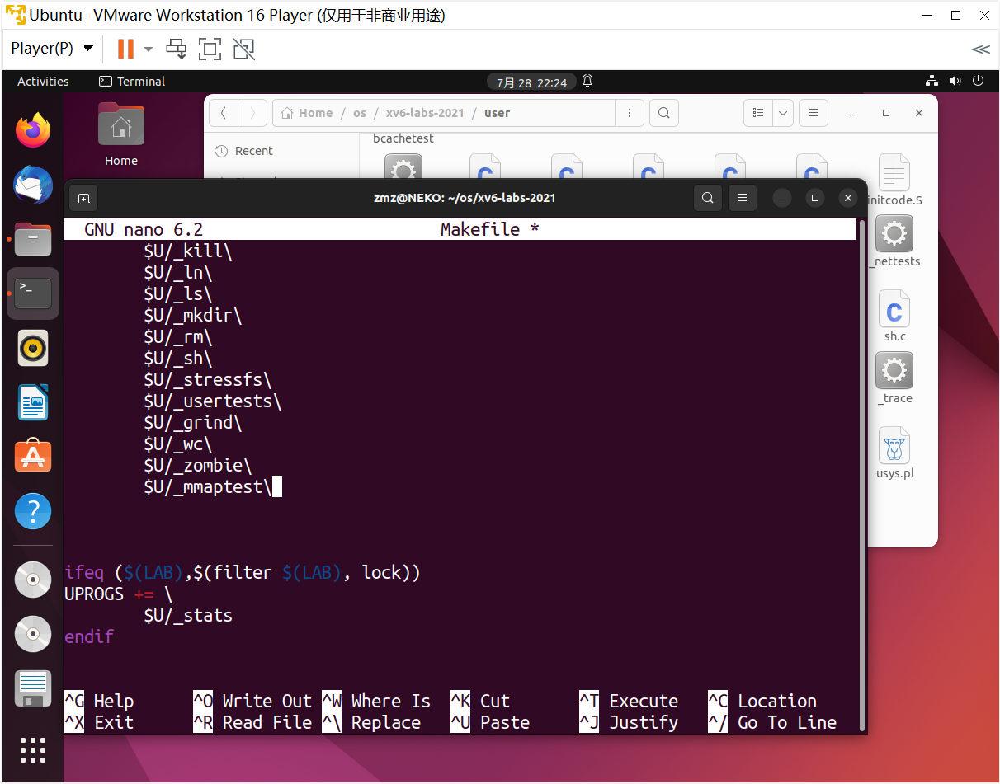

  ```perl
  $U/_mmaptest\
  ```

  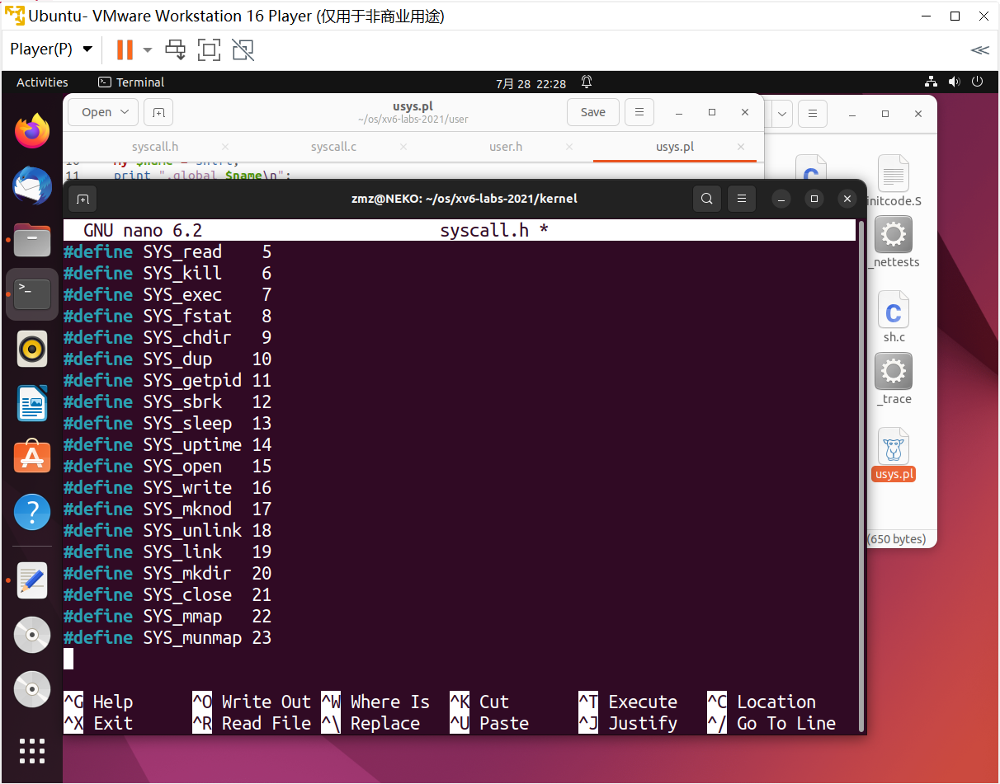

  ```c
  #define SYS_mmap   22
  #define SYS_munmap 23
  ```

  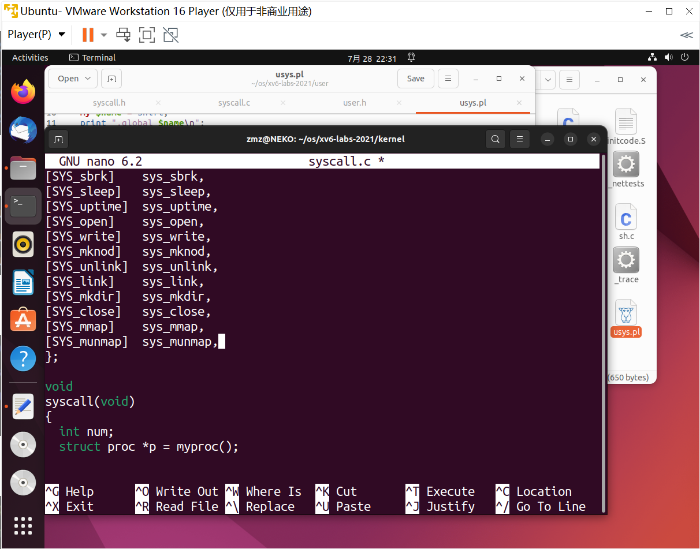

  ```c
  [SYS_mmap]   sys_mmap,
  [SYS_munmap] sys_munmap,
  ```

  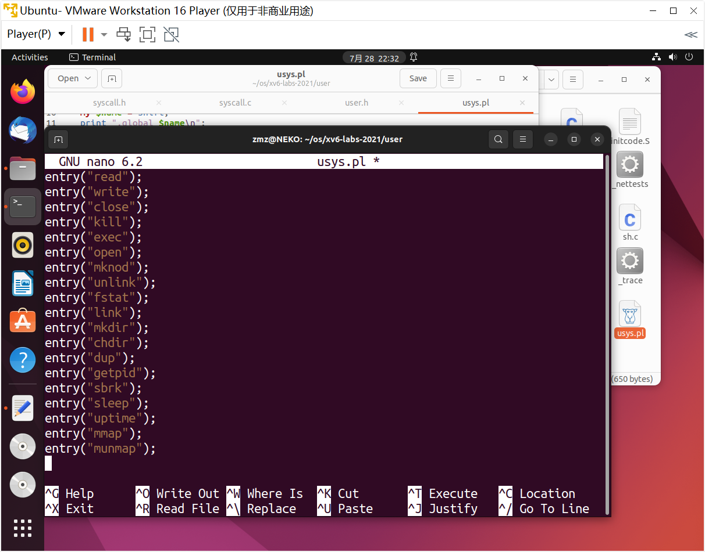

  ```perl
  entry("mmap");
  entry("munmap");
  ```

  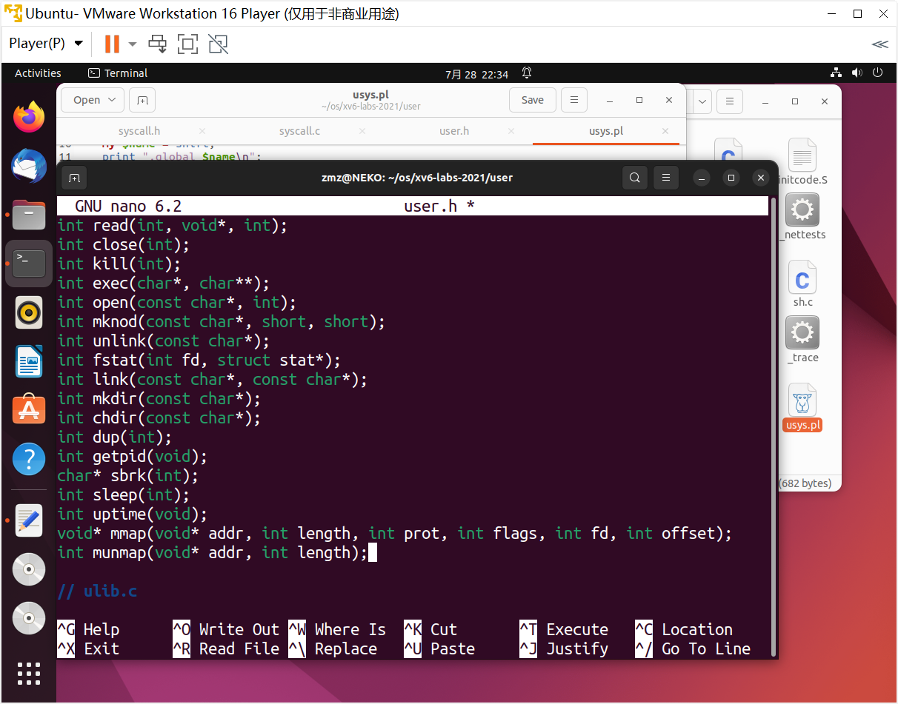

  ```c
  void* mmap(void* addr, int length, int prot, int flags, int fd, int offset);
  int munmap(void* addr, int length);
  ```

* 跟踪 `mmap` 为每个流程映射了什么。定义与第15讲中描述的 VMA（虚拟内存区域）相对应的结构，记录 `mmap` 创建的虚拟内存范围的地址、长度、权限、文件等。由于 xv6 内核中没有内存分配器，因此可以声明一个固定大小的 VMA 数组，并根据需要从该数组中进行分配。大小16应该足够了

  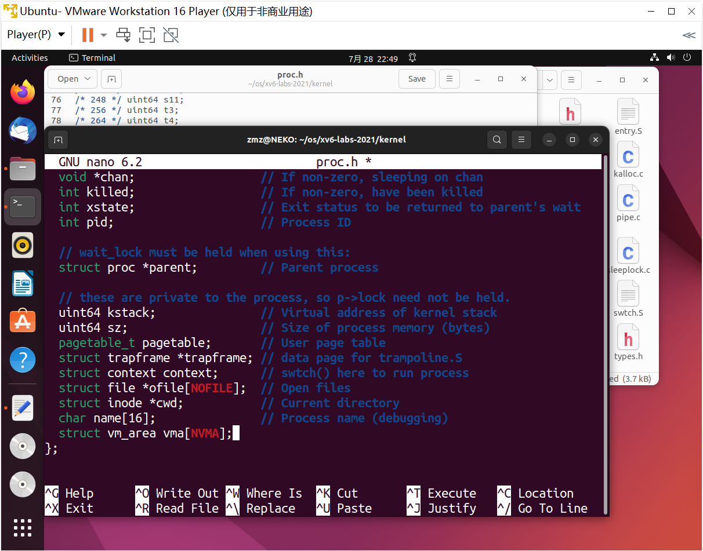

  ```c
  #define NVMA 16
  struct vm_area {
    int used;
    uint64 addr;
    int len;
    int prot;
    int flags;
    int vfd;
    struct file* vfile;
    int offset;
  };
  
  // Per-process state
  struct proc {
    struct spinlock lock;
  
    // p->lock must be held when using these:
    enum procstate state;        // Process state
    void *chan;                  // If non-zero, sleeping on chan
    int killed;                  // If non-zero, have been killed
    int xstate;                  // Exit status to be returned to parent's wait
    int pid;                     // Process ID
  
    // wait_lock must be held when using this:
    struct proc *parent;         // Parent process
  
    // these are private to the process, so p->lock need not be held.
    uint64 kstack;               // Virtual address of kernel stack
    uint64 sz;                   // Size of process memory (bytes)
    pagetable_t pagetable;       // User page table
    struct trapframe *trapframe; // data page for trampoline.S
    struct context context;      // swtch() here to run process
    struct file *ofile[NOFILE];  // Open files
    struct inode *cwd;           // Current directory
    char name[16];               // Process name (debugging)
    struct vm_area vma[NVMA];
  };
  ```

* 修改 `kernel/proc.c` 中的 `allocproc()` 函数将 VMA 数组全部初始化为0

  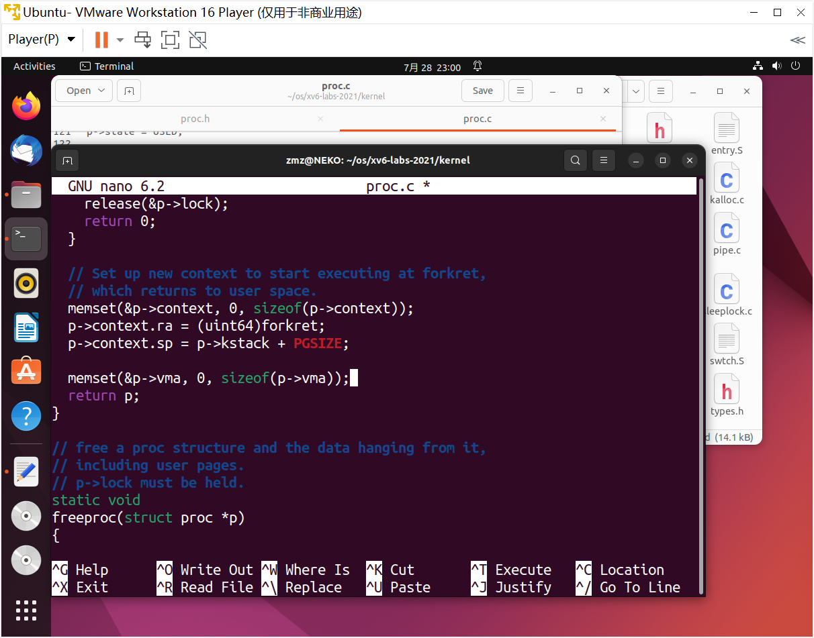

  ```c
  // Look in the process table for an UNUSED proc.
  // If found, initialize state required to run in the kernel,
  // and return with p->lock held.
  // If there are no free procs, or a memory allocation fails, return 0.
  static struct proc*
  allocproc(void)
  {
    struct proc *p;
  
    for(p = proc; p < &proc[NPROC]; p++) {
      acquire(&p->lock);
      if(p->state == UNUSED) {
        goto found;
      } else {
        release(&p->lock);
      }
    }
    return 0;
  
  found:
    p->pid = allocpid();
    p->state = USED;
  
    // Allocate a trapframe page.
    if((p->trapframe = (struct trapframe *)kalloc()) == 0){
      freeproc(p);
      release(&p->lock);
      return 0;
    }
  
    // An empty user page table.
    p->pagetable = proc_pagetable(p);
    if(p->pagetable == 0){
      freeproc(p);
      release(&p->lock);
      return 0;
    }
  
    // Set up new context to start executing at forkret,
    // which returns to user space.
    memset(&p->context, 0, sizeof(p->context));
    p->context.ra = (uint64)forkret;
    p->context.sp = p->kstack + PGSIZE;
  
    memset(&p->vma, 0, sizeof(p->vma));
    return p;
  }
  ```

* 填写页面表 lazily，以应对页面错误。也就是说，`mmap` 不应该分配物理内存或读取文件。相反，在 `usertrap` 中（或由 `usertrap` 调用）的页面错误处理代码中这样做，就像在懒页面分配 lab 中一样。懒的原因是确保大文件的 `mmap` 很快，并且文件的 `mmap` 大于物理内存是可能的。实现 `mmap`：在进程的地址空间中找到一个未使用的区域来映射文件，并将 VMA 添加到进程的映射区域表中。VMA 应包含指向要映射的文件的结构文件的指针；`mmap` 应该增加文件的引用计数，这样当文件关闭时结构就不会消失（提示：请参阅 `filedup`）。运行 `mmaptest`：第一个 `mmap` 应该成功，但第一次访问 `mmap-ed` 内存将导致页面错误并终止 `mmaptest`

  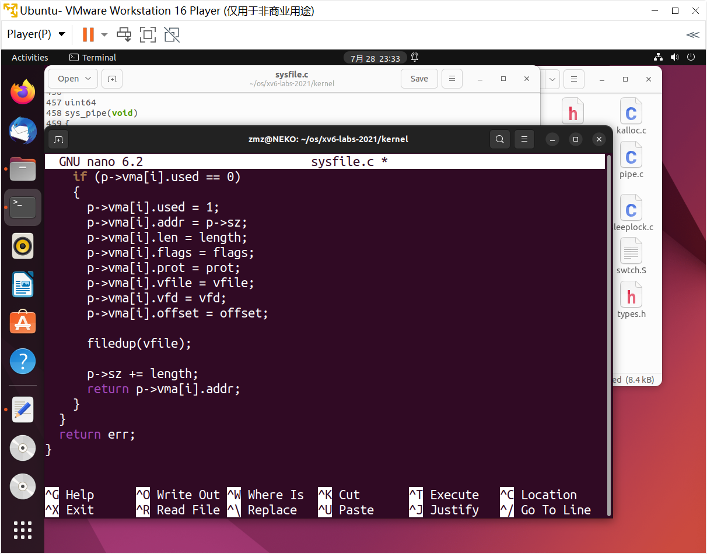

  ```c
  uint64
  sys_mmap(void)
  {
    uint64 addr;
    int length;
    int prot;
    int flags;
    int vfd;
    struct file* vfile;
    int offset;
    uint64 err = 0xffffffffffffffff;
  
    if (argaddr(0, &addr) < 0 || argint(1, &length) < 0 || argint(2, &prot) < 0 || argint(3, &flags) < 0 || argfd(4, &vfd, &vfile) < 0 || argint(5, &offset) < 0) return err;
    if (addr != 0 || offset != 0 || length < 0) return err;
    if (vfile->writable == 0 && (prot & PROT_WRITE) != 0 && flags == MAP_SHARED) return err;
  
    struct proc* p = myproc();
    if (p->sz + length > MAXVA) return err;
    for (int i = 0; i < NVMA; i++)
    {
      if (p->vma[i].used == 0)
      {
        p->vma[i].used = 1;
        p->vma[i].addr = p->sz;
        p->vma[i].len = length;
        p->vma[i].flags = flags;
        p->vma[i].prot = prot;
        p->vma[i].vfile = vfile;
        p->vma[i].vfd = vfd;
        p->vma[i].offset = offset;
  
        filedup(vfile);
  
        p->sz += length;
        return p->vma[i].addr;
      }
    }
    return err;
  }
  ```

* 在 `mmap-ed` 区域中添加导致页面错误的代码，以分配一页物理内存，将相关文件的4096字节读取到该页面中，并将其映射到用户地址空间中。使用 `readi` 读取文件，它采用一个偏移量参数来读取文件（但您必须锁定/解锁传递给 `readi` 的 inode）。别忘了在页面上正确设置权限。运行 `mmaptest`；它应该到达第一个 `munmap`

  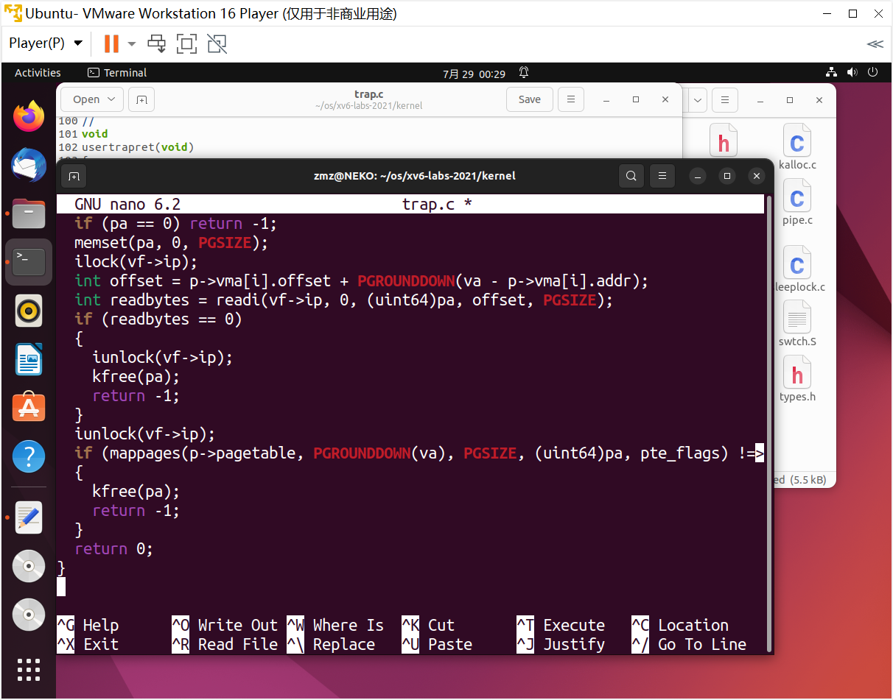

  ```c
  int
  mmap_handler(int va, int cause)
  {
    int i;
    struct proc* p = myproc();
    for (i = 0; i < NVMA; i++) if (p->vma[i].used && p->vma[i].addr <= va && va <= p->vma[i].addr + p->vma[i].len - 1) break;
    if (i == NVMA) return -1;
    int pte_flags = PTE_U;
    if (p->vma[i].prot & PROT_READ) pte_flags |= PTE_R;
    if (p->vma[i].prot & PROT_WRITE) pte_flags |= PTE_W;
    if (p->vma[i].prot & PROT_EXEC) pte_flags |= PTE_X;
    struct file* vf = p->vma[i].vfile;
    if (cause == 13 && vf->readable == 0) return -1;
    if (cause == 15 && vf->writable == 0) return -1;
    void* pa = kalloc();
    if (pa == 0) return -1;
    memset(pa, 0, PGSIZE);
    ilock(vf->ip);
    int offset = p->vma[i].offset + PGROUNDDOWN(va - p->vma[i].addr);
    int readbytes = readi(vf->ip, 0, (uint64)pa, offset, PGSIZE);
    if (readbytes == 0)
    {
      iunlock(vf->ip);
      kfree(pa);
      return -1;
    }
    iunlock(vf->ip);
    if (mappages(p->pagetable, PGROUNDDOWN(va), PGSIZE, (uint64)pa, pte_flags) != 0)
    {
      kfree(pa);
      return -1;
    }
    return 0;
  }
  ```

* 实现 `munmap`：找到地址范围的 VMA 并取消映射指定的页面（提示：使用 `uvmunmap`）。如果 `munmap` 删除了前一个 `mmap` 的所有页面，那么它应该减少相应结构文件的引用计数。如果未映射的页面已被修改，并且文件已映射为 `MAP_SHARED`，请将页面写回该文件。从 `filewrite` 中寻找灵感

  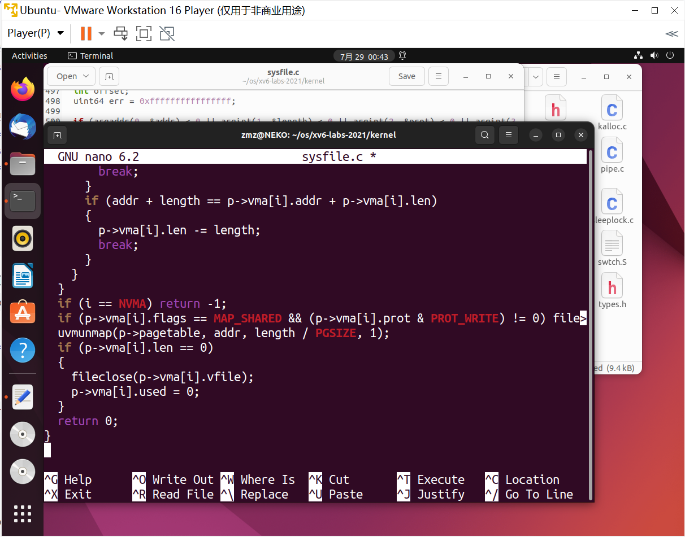

  ```c
  uint64
  sys_munmap(void)
  {
    uint64 addr;
    int length;
    if (argaddr(0, &addr) < 0 || argint(1, &length) < 0) return -1;
    int i;
    struct proc* p = myproc();
    for (i = 0; i < NVMA; i++)
    {
      if (p->vma[i].used && p->vma[i].len >= length)
      {
        if (p->vma[i].addr == addr)
        {
  	p->vma[i].addr += length;
  	p->vma[i].len -= length;
  	break;
        }
        if (addr + length == p->vma[i].addr + p->vma[i].len)
        {
  	p->vma[i].len -= length;
  	break;
        }
      }
    }
    if (i == NVMA) return -1;
    if (p->vma[i].flags == MAP_SHARED && (p->vma[i].prot & PROT_WRITE) != 0) filewrite(p->vma[i].vfile, addr, length);
    uvmunmap(p->pagetable, addr, length / PGSIZE, 1);
    if (p->vma[i].len == 0)
    {
      fileclose(p->vma[i].vfile);
      p->vma[i].used = 0;
    }
    return 0;
  }
  ```

*  在 lazy lab 中，如果对惰性分配的页面调用了 `uvmunmap`，或者子进程在 `fork` 中调用 `uvmcopy` 复制了父进程惰性分配的页面都会导致 `panic`，因此需要修改 `uvmunmap` 和 `uvmcopy` 检查 `PTE_V` 后不再 `panic`

  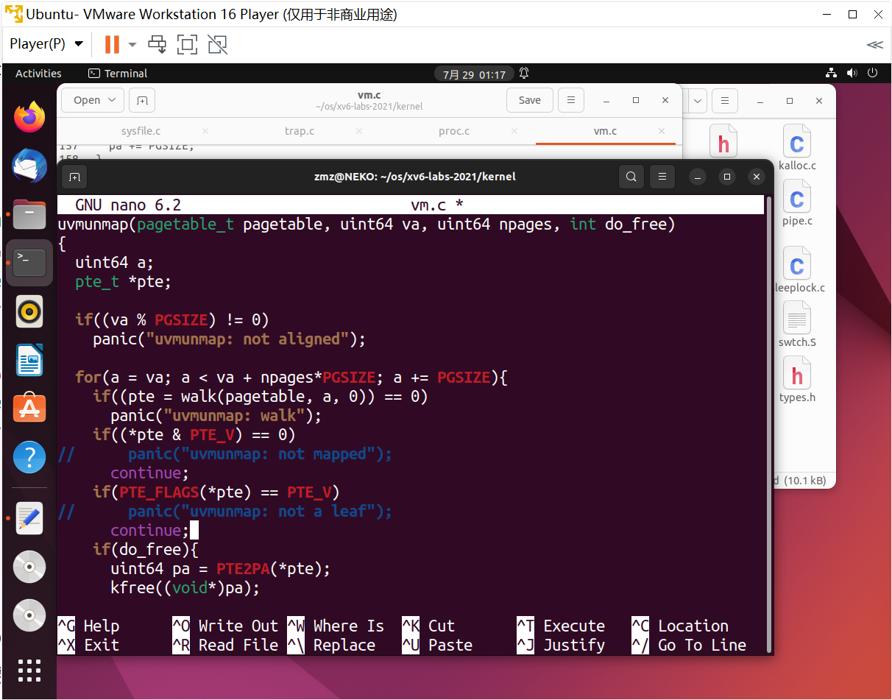

  ```c
  // Remove npages of mappings starting from va. va must be
  // page-aligned. The mappings must exist.
  // Optionally free the physical memory.
  void
  uvmunmap(pagetable_t pagetable, uint64 va, uint64 npages, int do_free)
  {
    uint64 a;
    pte_t *pte;
  
    if((va % PGSIZE) != 0)
      panic("uvmunmap: not aligned");
  
    for(a = va; a < va + npages*PGSIZE; a += PGSIZE){
      if((pte = walk(pagetable, a, 0)) == 0)
        panic("uvmunmap: walk");
      if((*pte & PTE_V) == 0)
  //      panic("uvmunmap: not mapped");
        continue;
      if(PTE_FLAGS(*pte) == PTE_V)
  //      panic("uvmunmap: not a leaf");
        continue;
      if(do_free){
        uint64 pa = PTE2PA(*pte);
        kfree((void*)pa);
      }
      *pte = 0;
    }
  }
  ```

  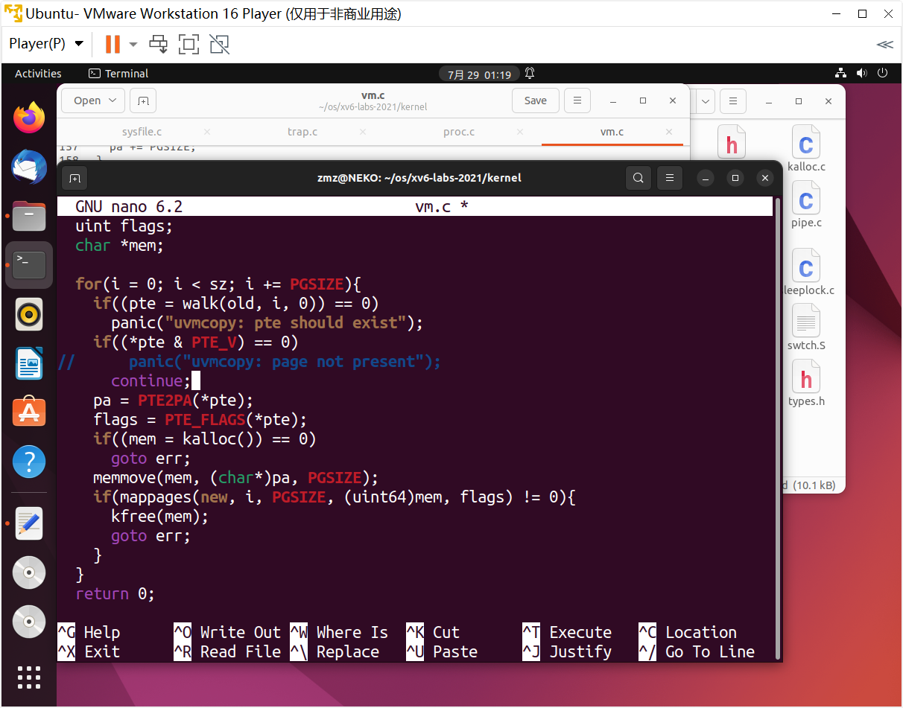

  ```c
  // Given a parent process's page table, copy
  // its memory into a child's page table.
  // Copies both the page table and the
  // physical memory.
  // returns 0 on success, -1 on failure.
  // frees any allocated pages on failure.
  int
  uvmcopy(pagetable_t old, pagetable_t new, uint64 sz)
  {
    pte_t *pte;
    uint64 pa, i;
    uint flags;
    char *mem;
  
    for(i = 0; i < sz; i += PGSIZE){
      if((pte = walk(old, i, 0)) == 0)
        panic("uvmcopy: pte should exist");
      if((*pte & PTE_V) == 0)
  //      panic("uvmcopy: page not present");
        continue;
      pa = PTE2PA(*pte);
      flags = PTE_FLAGS(*pte);
      if((mem = kalloc()) == 0)
        goto err;
      memmove(mem, (char*)pa, PGSIZE);
      if(mappages(new, i, PGSIZE, (uint64)mem, flags) != 0){
        kfree(mem);
        goto err;
      }
    }
    return 0;
  
   err:
    uvmunmap(new, 0, i / PGSIZE, 1);
    return -1;
  }
  ```

* 修改 `exit` 以取消映射进程的映射区域，就好像调用了 `munmap` 一样。运行 `mmaptest`；`mmap_test` 应该通过，但可能不会通过 `fork_test`

  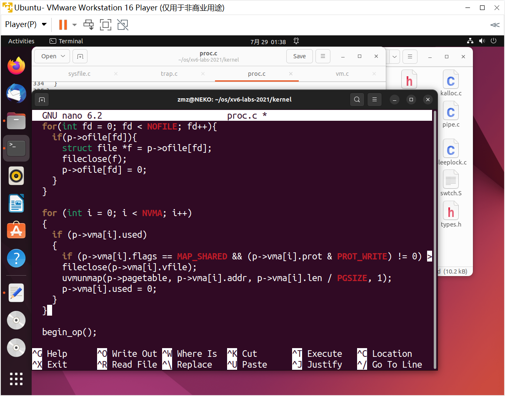

  ```c
  // Exit the current process.  Does not return.
  // An exited process remains in the zombie state
  // until its parent calls wait().
  void
  exit(int status)
  {
    struct proc *p = myproc();
  
    if(p == initproc)
      panic("init exiting");
  
    // Close all open files.
    for(int fd = 0; fd < NOFILE; fd++){
      if(p->ofile[fd]){
        struct file *f = p->ofile[fd];
        fileclose(f);
        p->ofile[fd] = 0;
      }
    }
  
    for (int i = 0; i < NVMA; i++)
    {
      if (p->vma[i].used)
      {
        if (p->vma[i].flags == MAP_SHARED && (p->vma[i].prot & PROT_WRITE) != 0) filewrite(p->vma[i].vfile, p->vma[i].addr, p->vma[i].len);
        fileclose(p->vma[i].vfile);
        uvmunmap(p->pagetable, p->vma[i].addr, p->vma[i].len / PGSIZE, 1);
        p->vma[i].used = 0;
      }
    }
  
    begin_op();
    iput(p->cwd);
    end_op();
    p->cwd = 0;
  
    acquire(&wait_lock);
  
    // Give any children to init.
    reparent(p);
  
    // Parent might be sleeping in wait().
    wakeup(p->parent);
    
    acquire(&p->lock);
  
    p->xstate = status;
    p->state = ZOMBIE;
  
    release(&wait_lock);
  
    // Jump into the scheduler, never to return.
    sched();
    panic("zombie exit");
  }
  ```

* 修改 `fork` 以确保子对象具有与父对象相同的映射区域。不要忘记增加 VMA 结构文件的引用计数。在子级的页面错误处理程序中，可以分配一个新的物理页面，而不是与父级共享页面。后者会更酷，但需要更多的实施工作。运行 `mmaptest`；它应该同时通过 `mmaptest` 和 `forktest`

  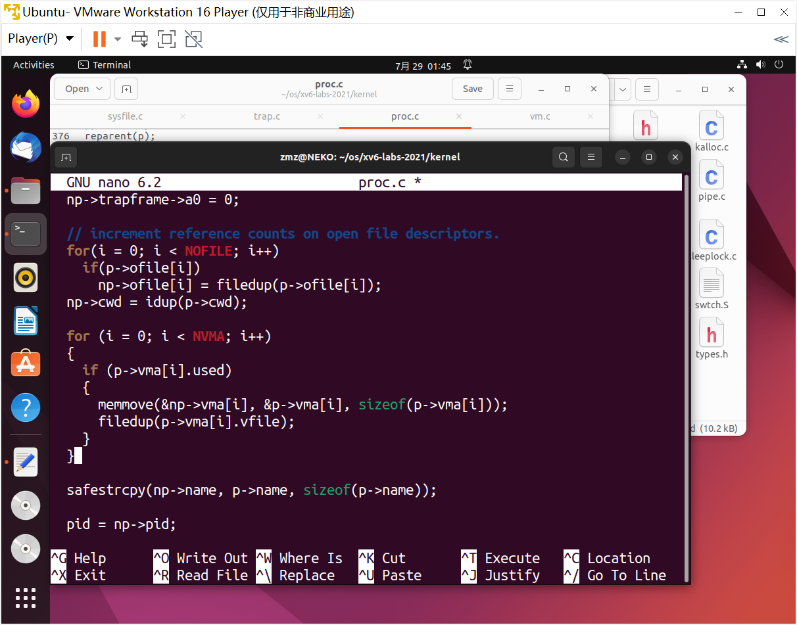

  ```c
  // Create a new process, copying the parent.
  // Sets up child kernel stack to return as if from fork() system call.
  int
  fork(void)
  {
    int i, pid;
    struct proc *np;
    struct proc *p = myproc();
  
    // Allocate process.
    if((np = allocproc()) == 0){
      return -1;
    }
  
    // Copy user memory from parent to child.
    if(uvmcopy(p->pagetable, np->pagetable, p->sz) < 0){
      freeproc(np);
      release(&np->lock);
      return -1;
    }
    np->sz = p->sz;
  
    // copy saved user registers.
    *(np->trapframe) = *(p->trapframe);
  
    // Cause fork to return 0 in the child.
    np->trapframe->a0 = 0;
  
    // increment reference counts on open file descriptors.
    for(i = 0; i < NOFILE; i++)
      if(p->ofile[i])
        np->ofile[i] = filedup(p->ofile[i]);
    np->cwd = idup(p->cwd);
  
    for (i = 0; i < NVMA; i++)
    {
      if (p->vma[i].used)
      {
        memmove(&np->vma[i], &p->vma[i], sizeof(p->vma[i]));
        filedup(p->vma[i].vfile);
      }
    }
  
    safestrcpy(np->name, p->name, sizeof(p->name));
  
    pid = np->pid;
  
    release(&np->lock);
  
    acquire(&wait_lock);
    np->parent = p;
    release(&wait_lock);
  
    acquire(&np->lock);
    np->state = RUNNABLE;
    release(&np->lock);
  
    return pid;
  }
  ```

* 测试成功

  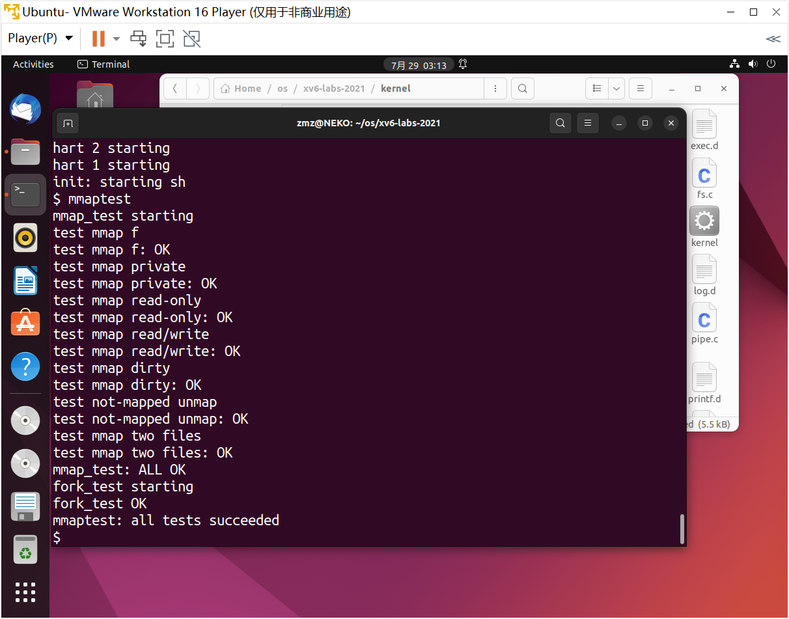

  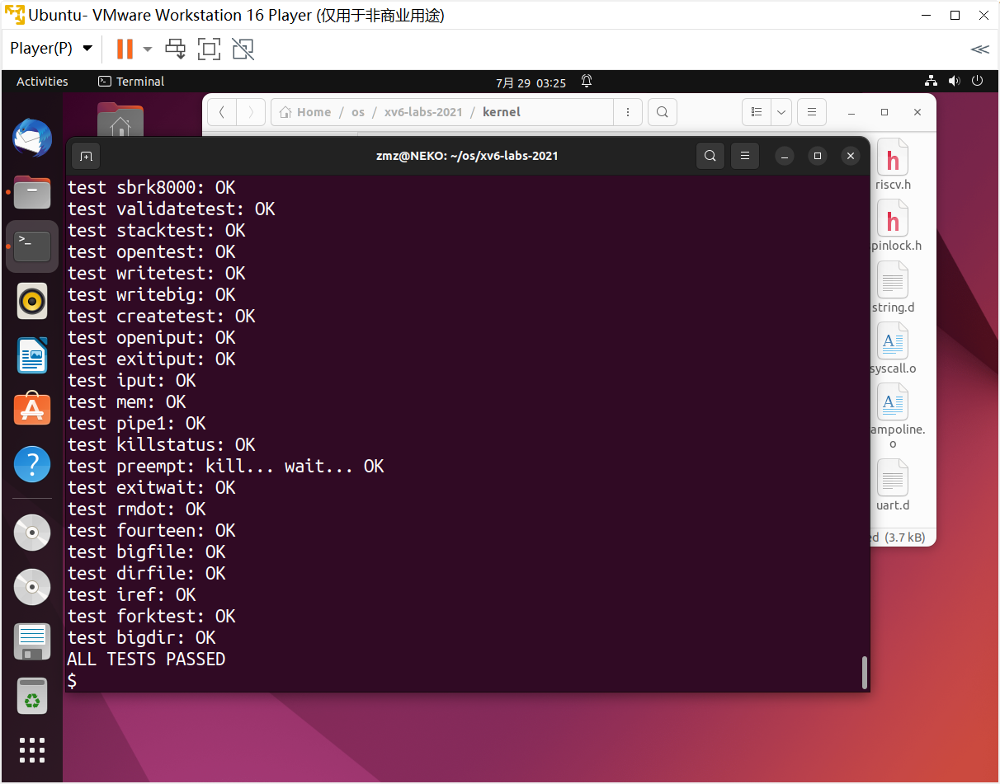

#### 3. 实验中遇到的问题和解决办法

对虚拟内存概念理解不够透彻，反复钻研

#### 4. 实验心得

对 mmap 有了全新理解

#### Submit

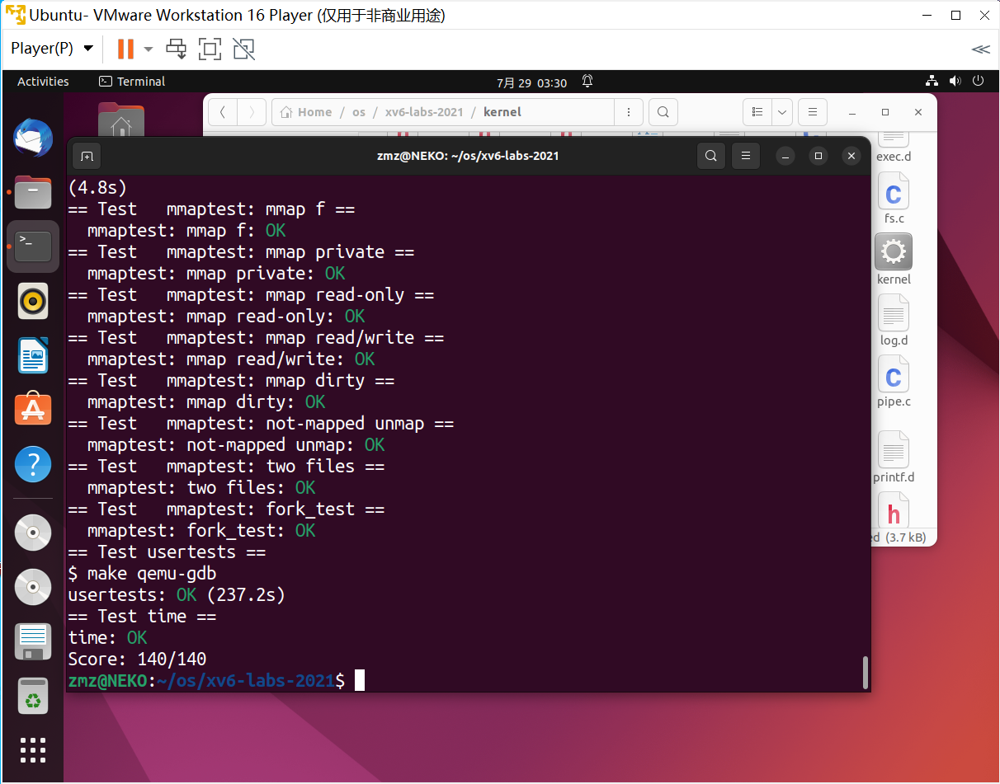